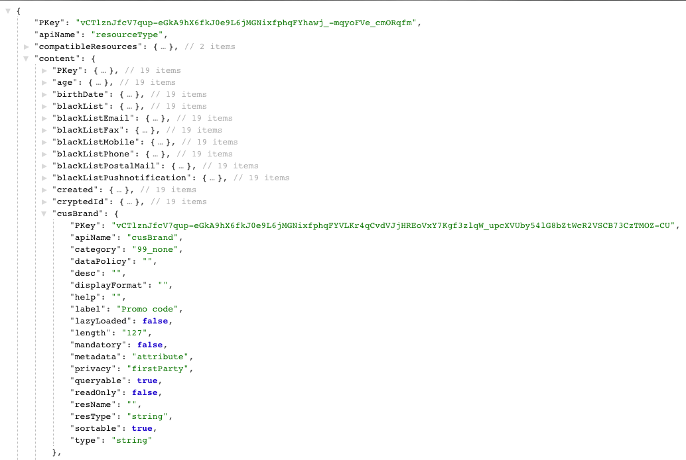

# Etapa 3: verificar a extensão{#step-verify-the-extension}

1. Faça uma operação GET nos metadados da API de extensão de perfis e serviços para verificar se o campo adicionado ao recurso personalizado Perfis está disponível.

   ```
   GET profileAndServicesExt/resourceType/profile
   ```

1. Ele retorna:

   

   O campo está agora disponível para novos desenvolvimentos e integrações.

