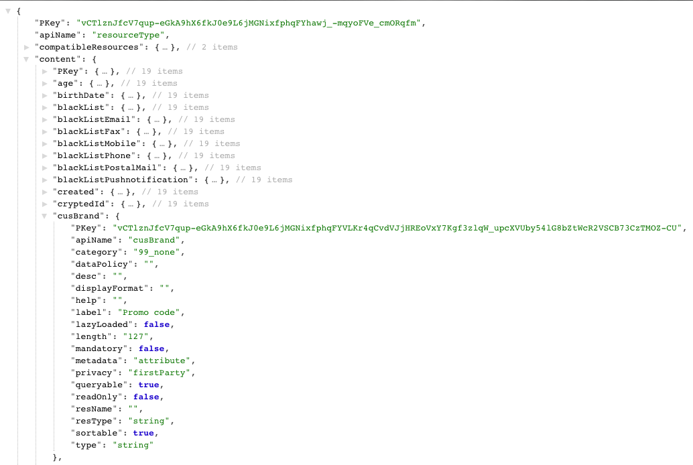

# Etapa 3: verificar a extensão{#step-verify-the-extension}

1. Faça uma operação do GET nos metadados da API de extensão de Perfis e serviços para verificar se o campo adicionado no recurso personalizado Perfis agora está disponível.

   ```
   GET profileAndServicesExt/resourceType/profile
   ```

1. Ele retorna:

   

   O campo agora está disponível para novos desenvolvimentos e integrações.
