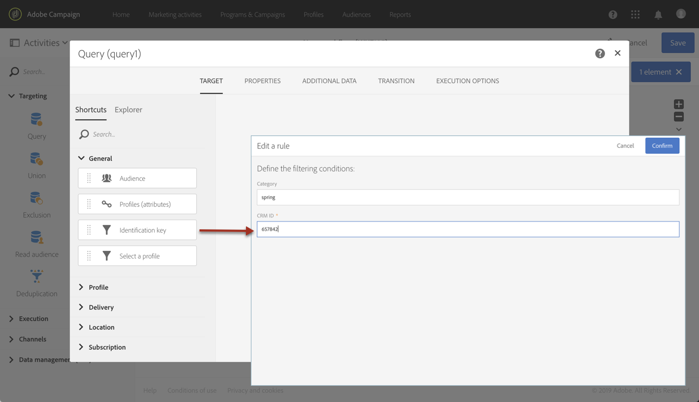

# Chamada de um recurso usando uma chave de identificação composta{#calling-a-resource-using-a-composite-identification-key}

Em alguns casos, pode ser necessário definir para um recurso uma chave de identificação composta por dois campos. Depois que a chave de identificação é configurada, é necessário configurar uma definição de filtro para poder chamar o recurso com essa chave de identificação, seja da interface do Campaign Standard ou das APIs.

Nesse caso de uso, o recurso **Perfil** foi estendido com os campos personalizados **&quot;ID do CRM&quot;** e **&quot;categoria&quot;**. Criaremos uma chave de identificação para o recurso do Perfil, que será composta desses dois campos. Em seguida, configuraremos uma definição de filtro, para que possamos acessar o recurso de Perfil usando a chave de identificação.

As principais etapas para este caso de uso são:

1. Configure a chave de identificação do recurso do Perfil, com base nos dois campos.
1. Configure a definição do filtro para poder chamar o recurso do Perfil usando sua chave de identificação.
1. Chame o recurso de Perfil da interface ou do APis.

Tópicos relacionados:

* [Criação ou extensão do recurso](../../developing/using/creating-or-extending-the-resource.md)
* [Definição de chaves de identificação](../../developing/using/configuring-the-resource-s-data-structure.md#defining-identification-keys)
* [APIs Campaign Standard REST](../../api/using/get-started-apis.md)

## Etapa 1: Configurar a chave de identificação{#step-1-configure-the-identification-key}

>[!NOTE]
> Os conceitos globais ao configurar as chaves de identificação são detalhados em [nesta seção](../../developing/using/configuring-the-resource-s-data-structure.md#defining-identification-keys).

1. Antes de configurar a chave de identificação, verifique se o recurso foi estendido com os campos desejados e se foi publicado. Para obter mais informações, consulte [esta seção](../../developing/using/creating-or-extending-the-resource.md).

1. Vá para o menu **[!UICONTROL Administration]** / **[!UICONTROL Development]** / **[!UICONTROL Custom resources]** e abra o recurso **[!UICONTROL Profile]**.

   

1. Na seção **[!UICONTROL Identification keys]**, clique no botão **[!UICONTROL Create element]**.

   

1. Adicione os dois campos personalizados &quot;ID do CRM&quot; e &quot;Categoria&quot; e clique em **[!UICONTROL Confirm]**.

   

   >[!NOTE]
   > Se quiser exibir os dois campos personalizados na interface do perfil, configure a guia **[!UICONTROL Screen definition]**. Para obter mais informações, consulte [esta seção](../../developing/using/configuring-the-screen-definition.md).

1. Agora você pode configurar a definição do filtro para poder chamar o recurso usando sua chave de identificação.

## Etapa 2: Configurar a definição do filtro{#step-2-configure-the-filter-definition}

>[!NOTE]
> Os conceitos globais ao configurar definições de filtro são detalhados em [nesta seção](../../developing/using/configuring-filter-definition.md).

1. Na guia **[!UICONTROL Filter definition]**, clique em **[!UICONTROL Add an element]** e insira o rótulo e a ID da definição de filtro.

1. Edite as propriedades da definição de filtro para configurar suas regras.

   

1. Arraste e solte no espaço de trabalho a tabela que contém os campos usados na chave de identificação.

   

1. Selecione o primeiro campo usado na chave de identificação (&quot;ID do CRM&quot;) e, em seguida, ative a opção **[!UICONTROL Switch to parameters]**.

   

1. Na seção **[!UICONTROL Filter conditions]**, mantenha o operador **[!UICONTROL Equal]**, defina o nome do parâmetro e clique no sinal de mais para criá-lo.

   

   >[!NOTE]
   > Depois de clicar no botão **+**, o nome do parâmetro é gerado automaticamente. Observe essas informações, pois será necessário usar o filtro das APIs.

1. Repita as etapas acima com todos os campos que compõem a chave de identificação (&quot;categoria&quot;) e salve as alterações.

   

1. A definição do filtro agora está configurada. Você pode publicar o recurso para que o filtro esteja disponível.

## Etapa 3: Chame o recurso com base em sua chave de identificação{#step-3-call-the-resource-based-on-its-identification-key}

Depois que a chave de identificação e sua definição de filtro estiverem configuradas, você poderá usá-las para chamar o recurso, seja da interface padrão da Campanha ou das APIs REST.

Para usar a definição de filtro da interface, use uma atividade **[!UICONTROL Query]** em um fluxo de trabalho (consulte [esta seção](../../automating/using/query.md)). O filtro fica disponível no painel esquerdo.



Para usar a definição de filtro das APIs REST do Campaign Standard, use a sintaxe abaixo:

```
GET /profileAndServicesExt/<resourceName>/by<filterName>?<param1_parameter>=<value>&<param2_parameter>=<value>
```

>[!NOTE]
>Para chamar um filtro personalizado, use o prefixo &quot;by&quot; seguido do nome do filtro definido ao configurar a definição do filtro na [etapa 2](../../developing/using/uc-calling-resource-id-key.md#step-2-configure-the-filter-definition).

Em nosso caso, a sintaxe para recuperar um perfil da categoria &quot;spring&quot; com a ID do CRM &quot;123456&quot; seria:

```
GET https://mc.adobe.io/<ORGANIZATION>/campaign/profileAndServicesExt/profile/byidentification_key?category_parameter=spring&crm_id_parameter=123456
```

Para obter mais detalhes, consulte [documentação das APIs REST do Campaign Standard](../../api/using/filtering.md).