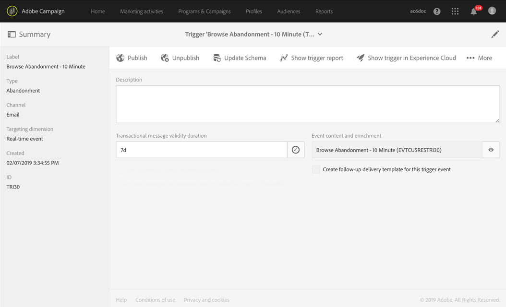

# Casos de uso de acionadores de abandonos{#abandonment-triggers-use-cases}

Esta seção apresenta casos de uso diferentes que podem ser implementados usando a integração entre o Adobe Campaign e os Acionadores da Experience Cloud. Você encontrará dois exemplos de casos de uso:

* [Acionador de abandono de navegação](#browse-abandonment-trigger): envie uma comunicação para os clientes que abandonaram a visita em seu site.
* [Acionador de abandono de pesquisa](#search-abandonment-trigger): promova o reengajamento dos visitantes que fizeram uma pesquisa em seu site, mas não fizeram uma compra.

>[!NOTE]
>
>Os casos de uso descritos nesta seção dependem da ID de visitante da Experience Cloud. Também é possível implementá-los com a ID declarada da Experience Cloud. IDs declaradas em hash e criptografadas também são compatíveis. Você pode enviar emails/SMS para um perfil que não existe no Campaign descriptografando diretamente o endereço de email/número de celular criptografado. Nesse caso, não é possível personalizar usando os dados do perfil.

## Pré-requisitos {#pre-requisites}

Para implementar esses casos de uso, é necessário ter acesso às seguintes soluções/principais serviços:

* Adobe Campaign
* Adobe Analytics Select, Prime, Ultimate, Premium, Foundation, OD, Aplicativos para dispositivos móveis ou Standard.
* Serviço principal de acionadores da Experience Cloud
* Serviço principal de DTM da Experience Cloud
* ID de visitante da Experience Cloud e Serviço principal de Pessoas da Experience Cloud

Também é necessário ter um site de trabalho.

Para mais informações, consulte [Configuração de soluções e serviços](../../integrating/using/configuring-triggers-in-experience-cloud.md#configuring-solutions-and-services).

## Acionador de abandono de navegação {#browse-abandonment-trigger}

Nesse caso de uso, criaremos um acionador simples que será acionado toda vez que um cliente abandonar uma visita no site. Esse exemplo supõe que o DTM já está coletando e enviando dados para o Adobe Analytics e que todos os eventos já foram criados.

### Criar um Acionador da Experience Cloud {#creating-an-experience-cloud-trigger}

1. Selecione **[!UICONTROL Manage Triggers]** no menu do Serviço principal de ativação da Experience Cloud.

   

1. Escolha um tipo de acionador ( **[!UICONTROL Abandonment]**, no nosso caso de uso).

   

1. Para esse caso de uso, precisamos de um acionador de abandono simples. O objetivo comercial é identificar visitantes que navegam pelo nosso site de reservas de viagem e olham a página &quot;Ofertas&quot;, mas não reservam nenhuma viagem. Após identificar esse público, queremos contatá-lo dentro de um curto período de tempo. Neste exemplo, optamos por enviar o acionador após um período de 10 minutos.

   

### Uso do acionador no Adobe Campaign {#using-the-trigger-in-adobe-campaign}

Agora que criamos um Acionador da Experience Cloud, vamos usá-lo no Adobe Campaign.

No Adobe Campaign, é necessário criar um Acionador vinculado ao que você criou na Experience Cloud.

1. Para criar o Acionador no Adobe Campaign, clique no logotipo da **[!UICONTROL Adobe Campaign]**, no canto superior esquerdo, depois selecione **[!UICONTROL Marketing plans]** > **[!UICONTROL Transactional messages]** > **[!UICONTROL Experience Cloud triggers]**.

   

1. Clique em **[!UICONTROL Create]**.
1. Selecione o acionador criado anteriormente e clique em **[!UICONTROL Next]**.

   

1. Selecione o canal **[!UICONTROL Email]** e o targeting dimension **[!UICONTROL Real-time event]** e clique em **[!UICONTROL Create]**.

   

1. Publique o Acionador no Adobe Campaign. Esse processo criará automaticamente um modelo de mensagem transacional.

   

1. Para exibir o modelo da mensagem, clique no botão **[!UICONTROL More]**, na parte superior direita, e clique em **[!UICONTROL Trigger Transactional Template]**.

1. Personalize o conteúdo da mensagem e os detalhes do remetente.

   

1. Publique o template da mensagem. Agora o acionador está ativo e funcional.

   

### Execução do cenário {#running-the-scenario}

1. Este caso de uso começa com um email inicial enviado para o seu público com o Adobe Campaign.

   

1. O recipient abre o email.

   

1. Ele clica em um link que o traz até o seu site. Neste exemplo, o banner traz o recipient para a página inicial do site de reservas de viagem.

   

1. O recipient vai para a página &quot;Offers&quot; mas, de repente, interrompe a visita. Após um período de 10 minutos, o Adobe Campaign aciona o envio da mensagem transacional.

   

1. A qualquer momento, você pode verificar os registros da Experience Cloud para ver quantas vezes o acionador foi usado.

   

1. Você também pode exibir o relatório do acionador do Adobe Campaign.

   

## Acionador de abandono de pesquisa {#search-abandonment-trigger}

Nesse caso de uso, vamos criar um acionador para reengajamento com visitantes que foram ao site de reservas de viagem, procuraram um destino, não encontraram resultados que queriam e não fizeram nenhuma reserva depois disso. O processo geral é o mesmo do caso de uso anterior (consulte [Acionador de abandono de navegação](#browse-abandonment-trigger)). Aqui, o foco será em como personalizar a mensagem de email de remarketing.

### Criar um acionador da Experience Cloud {#creating-an-experience-cloud-trigger-1}

Siga as etapas descritas no caso de uso anterior para criar o acionador da Experience Cloud. Consulte [Criar um acionador da Experience Cloud](#creating-an-experience-cloud-trigger). A principal diferença é a definição do acionador.

Na seção **[!UICONTROL Include Meta Data]** você pode passar quaisquer dados coletados do Analytics para o payload do acionador. Neste exemplo, criamos uma eVar personalizada (por exemplo, eVar 3) para coletar o termo de pesquisa digitado pelo visitante. Esse termo será usado na mensagem de email transacional enviada para o mesmo visitante.

### Uso do acionador no Adobe Campaign {#using-the-trigger-in-adobe-campaign-1}

1. Siga as etapas descritas no caso de uso anterior para criar o acionador no Adobe Campaign. Consulte [Uso do acionador no Adobe Campaign](#using-the-trigger-in-adobe-campaign). A principal diferença é como acessamos e usamos, no Adobe Campaign, os metadados carregados no payload do Acionador.
1. No acionador de Abandono de pesquisa criado no Adobe Campaign, clique no ícone **[!UICONTROL Event content and enrichment]** para exibir o payload carregado no Adobe Campaign.

   

1. É possível ver que a eVar personalizada é transmitida no payload do acionador e mapeada para a tabela **Contexto do evento** (ctx). Agora podemos acessá-la para personalizar a mensagem transacional.

   

1. Neste exemplo, optamos por incluir o termo de pesquisa de destino na linha de assunto, bem como no corpo do email.

   

1. Ao selecionar um campo personalizado, procure seus metadados de payload na tabela **Evento transactional** (rtEvent), e depois na subtabela **Contexto de evento** (ctx).

   

### Execução do cenário {#running-the-scenario-1}

1. O visitante vai ao site de reservas de viagem e procura um destino. Neste exemplo, o visitante está procurando uma viagem para o Japão, mas não encontra nenhum resultado. Esta é uma oportunidade para contatar este visitante e recomendar um plano de viagem alternativo.

   

   >[!NOTE]
   >
   >Nesse caso de uso, supomos que o visitante/recipient já tenha aberto e clicado em um email originário do mesmo site. Isso nos permite usar e coletar a ID de visitante e mapeá-la para o recipient. Só precisamos fazer isso uma vez.

1. Momentos depois, o mesmo visitante/recipient recebe uma mensagem de remarketing. A mensagem inclui o destino pesquisado recentemente.

   

