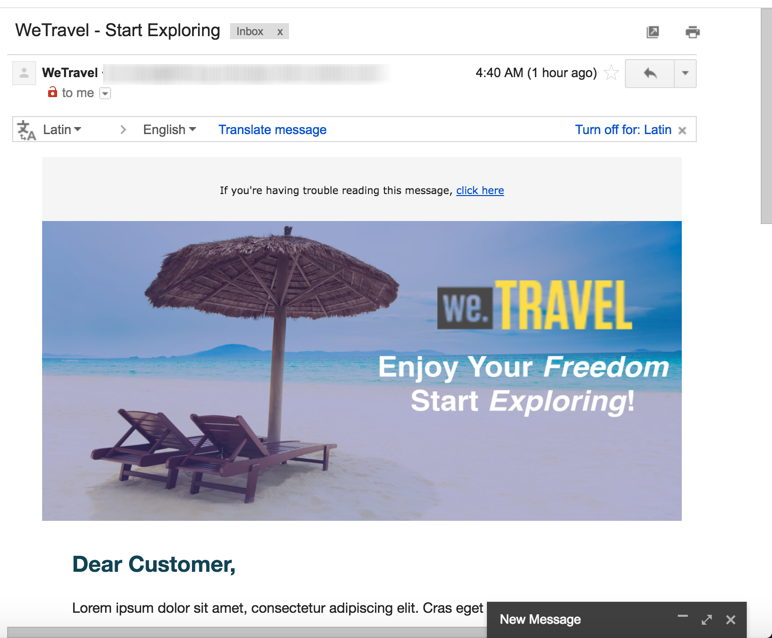

# Abandonment Triggers use cases{#abandonment-triggers-use-cases}

Esta seção apresenta casos de uso diferentes que podem ser implementados com a integração entre o Adobe Campaign e os Acionadores da Experience Cloud. Você encontrará dois exemplos de casos de uso:

* [Acionador de abandono de navegação](../../integrating/using/abandonment-triggers-use-cases.md#browse-abandonment-trigger): enviar uma comunicação para clientes que abandonaram sua visita em seu site.
* [Acionador de abandono de pesquisa](../../integrating/using/abandonment-triggers-use-cases.md#search-abandonment-trigger): interagir com visitantes que fizeram uma pesquisa em seu site, mas não fizeram uma compra.

>[!NOTE]
>
>Os casos de uso descritos nesta seção dependem da ID de visitante da Experience Cloud. Também é possível implementá-los com a ID declarada da Experience Cloud. IDs declaradas com hash e criptografadas também são suportadas. É possível enviar emails/SMS para um perfil que não existe no Campaign, descriptografando diretamente o endereço de email criptografado/número móvel. Nesse caso, não é possível usar a personalização usando dados de perfil.

## Pre-requisites {#pre-requisites}

Para que esses casos de uso sejam implementados, é necessário ter acesso às seguintes soluções/serviços principais:

* Adobe Campaign
* Adobe Analytics Ultimate, Premium, Foundation, OD, Select, Prime, Mobile Apps, Select ou Standard.
* Serviço principal do Experience Cloud Triggers
* Serviço principal do DTM da Experience Cloud
* ID de visitante da Experience Cloud e Experience Cloud People Core Service

Você também precisa ter um site de trabalho.

For more information, refer to [Configuring solutions and services](../../integrating/using/configuring-triggers-in-experience-cloud.md#configuring-solutions-and-services).

## Browse abandonment Trigger {#browse-abandonment-trigger}

Nesse caso de uso, nós criaremos um acionador simples que será acionado toda vez que um cliente abandonar uma visita no site. Este exemplo considera que você já tem o DTM coleta e envia dados para o Adobe Analytics e tem todos os eventos criados.

### Creating an Experience Cloud Trigger {#creating-an-experience-cloud-trigger}

1. Select **[!UICONTROL Manage Triggers]** from the Experience Cloud Activation Core Service menu.

   

1. Choose a trigger type ( **[!UICONTROL Abandonment]** in our use case).

   

1. Para esse caso de uso, precisamos de um acionador de abandono simples. A finalidade comercial é identificar os visitantes que navegam em nosso site de reserva de viagem, consultem a página «Ofertas», mas não fazem um livro. Depois de identificar esse público, queremos retornar a eles em um curto período de tempo. Neste exemplo, nós escolhemos enviar o acionador após um período de 10 minutos.

   

### Using the trigger in Adobe Campaign {#using-the-trigger-in-adobe-campaign}

Agora que criamos um Acionador da Experience Cloud, vamos usá-lo no Adobe Campaign.

No Adobe Campaign, é necessário criar um Acionador vinculado ao que você criou na Experience Cloud.

1. To create the Trigger in Adobe Campaign, click the **[!UICONTROL Adobe Campaign]** logo, in the top left corner, then select **[!UICONTROL Marketing plans]** &gt; **[!UICONTROL Transactional messages]** &gt; **[!UICONTROL Experience Cloud triggers]**.

   

1. Click **[!UICONTROL Create]**.
1. Select the Trigger you created earlier and click **[!UICONTROL Next]**.

   

1. Select the **[!UICONTROL Email]** channel and the **[!UICONTROL Real-time event]** targeting dimension and click **[!UICONTROL Create]**.

   

1. Publique o Acionador no Adobe Campaign. Esse processo criará automaticamente um modelo de mensagem transacional.

   

1. To display the message template, click the **[!UICONTROL More]** button, on the top right, then click **[!UICONTROL Trigger Transactional Template]** .

1. Personalize seu conteúdo e detalhes do remetente.

   

1. Publique o modelo de mensagem. O acionador agora está ativo e funcional.

   

### Running the scenario {#running-the-scenario}

1. Esse caso de uso começa com um e-mail inicial enviado para o seu público-alvo com o Adobe Campaign.

   

1. O destinatário abre o email.

   

1. Ele clica em um link que o leva para o site. Neste exemplo, o banner traz o destinatário para a página inicial do site de reserva de viagem.

   

1. O destinatário vai para a página "Conversões", mas, repentinamente, interrompe sua visita. Após um período de 10 minutos, o Adobe Campaign aciona o envio da mensagem transacional.

   

1. A qualquer momento, você pode verificar os logs da Experience Cloud para ver quantas vezes o acionador foi disparado.

   

1. Você também pode exibir o relatório de acionamento do Adobe Campaign.

   

## Search abandonment Trigger {#search-abandonment-trigger}

Neste caso de uso, nós criaremos um disparador para reinteragir com visitantes que entraram no nosso site de reserva de viagem, pesquisados por um destino, não encontraram resultados satisfatórios e não fizeram nada depois disso. The general process is the same as in the previous use case (see [Browse abandonment Trigger](../../integrating/using/abandonment-triggers-use-cases.md#browse-abandonment-trigger)). Vamos focar aqui sobre como personalizar a mensagem de e-mail de recomercialização.

### Creating an Experience Cloud Trigger {#creating-an-experience-cloud-trigger-1}

Siga as etapas descritas no caso de uso anterior para criar o acionador da Experience Cloud. See [Creating an Experience Cloud Trigger](../../integrating/using/abandonment-triggers-use-cases.md#creating-an-experience-cloud-trigger). A principal diferença é a definição do acionador.

The **[!UICONTROL Include Meta Data]** section allows you to pass any data collected from Analytics to the Trigger payload. Neste exemplo, criamos uma evar personalizada (por exemplo, evar 3) para coletar o termo de pesquisa digitado pelo visitante. Esse termo será usado na mensagem de e-mail transacional enviada para o mesmo visitante.

### Using the trigger in Adobe Campaign {#using-the-trigger-in-adobe-campaign-1}

1. Siga as etapas descritas no caso de uso anterior para criar o acionador no Adobe Campaign. See [Using the trigger in Adobe Campaign](../../integrating/using/abandonment-triggers-use-cases.md#using-the-trigger-in-adobe-campaign). A principal diferença é como acessamos e usamos, no Adobe Campaign, os metadados enviados na carga Acionador.
1. In the Search Abandonment trigger you created in Adobe Campaign, click on the **[!UICONTROL Event content and enrichment]** icon to view the payload pushed to Adobe Campaign.

   

1. As you can see, the custom eVar is passed in the Trigger payload and mapped to the **Event Context** table (ctx). Agora podemos acessá-la para personalizar a mensagem transacional.

   

1. Neste exemplo, nós escolhemos incluir o termo de pesquisa de destino na linha de assunto, bem como no corpo do e-mail.

   

1. When selecting a personalized field, look for your payload meta data in the **Transactional event** (rtEvent) table then in the **Event context** (ctx) sub table.

   

### Running the scenario {#running-the-scenario-1}

1. O visitante vai no site de reserva da jornada e pesquisa por um destino. Neste exemplo, o visitante procura uma viagem no Japão, mas não encontra resultado. Essa é uma oportunidade para retornarmos ao visitante e recomendar um plano de viagem alternativo.

   

   >[!NOTE]
   >
   >Nesse caso de uso, suponha que o visitante/destinatário já tenha aberto e clicado em um e-mail originário do mesmo site. Isso nos permite usar e coletar a visitorid e mapeá-la para o destinatário. Só precisamos fazer isso uma vez.

1. Alguns minutos depois, o mesmo visitante/destinatário recebe uma mensagem de recomercialização. A mensagem inclui o destino pesquisado recentemente.

   

