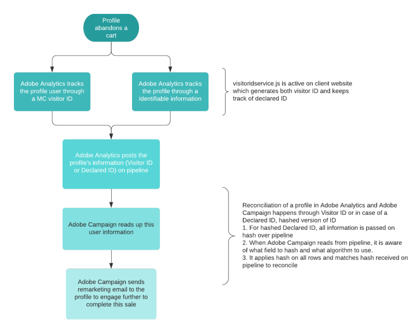

# Sobre os acionadores da Adobe Experience Cloud{#about-adobe-experience-cloud-triggers}

A integração entre o serviço principal **[!UICONTROL Triggers]** da Ativação da Experience Cloud e o Adobe Campaign permite enviar emails personalizados para os clientes como uma reação a comportamentos específicos que são rastreados no site pelo Adobe Analytics (em 15 minutos).

Na Adobe Experience Cloud, você define os diferentes acionadores, ou seja, os comportamentos dos clientes que gostaria de monitorar, por exemplo, todos os clientes que abandonaram a visita no site, fizeram uma pesquisa, mas não fizeram uma compra no site ou até mesmo os clientes cuja sessão expirou. Ao criar um acionador, você define a condição dele e os dados que serão enviados no evento (upload) para o Adobe Campaign.

No Adobe Campaign, você seleciona o acionador que foi criado, aprimora os dados do evento com dados do datamart e define um template de mensagem transacional vinculado a esse acionador. Por exemplo, quando um cliente abandona a visita no site, um evento é enviado ao Adobe Campaign, que pode aproveitá-lo por meio de um email de remarketing para o cliente em 15 minutos.

O diagrama a seguir detalha o funcionamento dessa integração.

**Tópicos relacionados:**

* Saiba mais sobre os diferentes tipos de acionadores: [documentação da Adobe Experience Cloud](https://docs.adobe.com/content/help/pt-BR/core-services/interface/activation/triggers.html).
* Assista ao vídeo [Trigger Remarketing Messages based on Site Activity](https://helpx.adobe.com/marketing-cloud/how-to/email-marketing.html#step-two).
* Veja nossos dois [Casos de uso de acionadores de abandono](../../integrating/using/abandonment-triggers-use-cases.md).

## Processo do usuário para acionadores {#triggers-user-process}

>[!CAUTION]
>
>Antes de executar as etapas principais do usuário, a funcionalidade precisa ser configurada. Para saber mais, consulte [Ativação da funcionalidade](../../integrating/using/configuring-triggers-in-experience-cloud.md#activating-the-functionality), [Configuração de soluções e serviços](../../integrating/using/configuring-triggers-in-experience-cloud.md#configuring-solutions-and-services) e [Criação de um acionador mapeado no Campaign](../../integrating/using/using-triggers-in-campaign.md#creating-a-mapped-trigger-in-campaign).

No Adobe Campaign, as principais etapas do processo do usuário são:

1. Criar um evento de acionador vinculado a um acionador da Adobe Experience Cloud.
1. Publicar o evento de acionador.
1. Definir o conteúdo do template de mensagem transacional.
1. Testar o template (crie um perfil de teste e envie uma prova).
1. Publicar o template de mensagem transacional.

Os casos de uso completos estão descritos [nesta seção](../../integrating/using/abandonment-triggers-use-cases.md).

## Observações importantes {#important-notes}

Estas são algumas observações importantes a serem consideradas antes de usar a integração entre os acionadores e o Campaign:

* Os acionadores não são compatíveis com notificações por push. Só há compatibilidade com email e SMS.
* Você pode aprimorar o acionador com metadados capturados pelo Analytics, como ID de email, nome de página etc.
* É possível reconciliar o acionador em um perfil armazenado no Campaign Standard e usar os campos do perfil para personalizar a mensagem.
* Assim que um acionador é recebido, ele é processado, reconciliado e enviado. O procedimento completo leva de 5 a 15 minutos, dependendo do volume de acionadores recebidos e do número de campos de personalização usados no template.

>[!NOTE]
>
>Para saber mais sobre práticas recomendadas e limitações técnicas, consulte [Práticas recomendadas e limitações dos acionadores](../../integrating/using/configuring-triggers-in-experience-cloud.md#triggers-best-practices-and-limitations).

