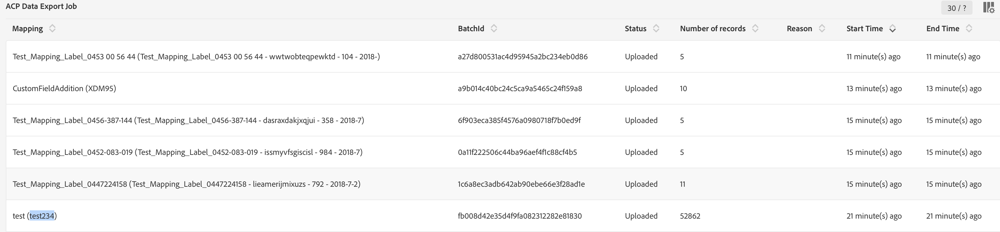

# Ativação de mapeamento {#mapping-activation}

>[!IMPORTANT]
>
>O Conector de dados do Adobe Experience Platform está atualmente na versão beta, que pode estar sujeita a atualizações frequentes sem aviso prévio. Os clientes precisam ser hospedados no Azure (atualmente na versão beta somente para a América do Norte) para acessar esses recursos. Entre em contato com o Atendimento ao cliente do Adobe se desejar obter acesso.

Quando a definição de mapeamento for concluída, você poderá publicar o mapeamento. Após a etapa de implantação, a replicação de dados entre o Campaign Standard e o Adobe Experience Platform é iniciada automaticamente. A qualquer momento, você pode interromper a replicação clicando no link **[!UICONTROL Stop]** botão.

Dependendo das modificações de mapeamento, você pode optar por reenviar todos os registros para o Adobe Experience Platform.

No bloco de implantação, você pode acessar o log de publicação e os logs de exportação.

No **[!UICONTROL Export jobs]** é possível monitorar o trabalho de exportação para o mapeamento publicado.

Se quiser monitorar todos os trabalhos de exportação de dados, vá para **[!UICONTROL Administration]** > **[!UICONTROL Development]** > **[!UICONTROL Platform]** > **[!UICONTROL Status of data export to platform]** menu.

Os status do trabalho de assimilação de dados são:

* **[!UICONTROL Created]**: um trabalho de assimilação de dados é criado e a assimilação de dados está em andamento.
* **[!UICONTROL Failed]**: um trabalho de assimilação de dados falhou. O campo reason descreve o motivo da falha. A falha pode ser transitória ou permanente. Em caso de falhas transitórias, um novo trabalho de assimilação é criado após um intervalo configurado. Como primeira etapa na solução de problemas, o usuário pode verificar o campo de motivo da falha. Se o motivo redirecionar um usuário para a interface do usuário do Adobe Experience Platform, o usuário poderá fazer logon no Adobe Experience Platform e verificar o status do lote no conjunto de dados para determinar o motivo exato da falha.
* **[!UICONTROL Uploaded]**: um lote é criado primeiro no Adobe Experience Platform e os dados são assimilados no lote. O campo ID do lote mostra a ID do lote no Adobe Experience Platform. O Adobe Experience Platform também executa uma pós-validação no lote. O lote é marcado primeiro como carregado até que o Adobe Experience Platform conclua a etapa de pós-validação. Uma tarefa continua pesquisando no Adobe Experience Platform o status do lote após o upload. Um lote pode entrar no estado Falha ou Sucesso após a validação no Adobe Experience Platform.
* **[!UICONTROL Success]**: depois que um lote é carregado para o Adobe Experience Platform, o status do processo (pós-validação na plataforma) é verificado após um intervalo configurado. O status &quot;Sucesso&quot; identificou uma assimilação de dados bem-sucedida no Adobe Experience Platform.

Em alguns casos, você pode receber o erro de validação abaixo ao publicar seu mapeamento.

Isso ocorre quando o esquema XDM que você está usando não foi atualizado com o campo XDM mais recente relacionado ao gerenciamento de privacidade e ainda contém o campo XDM &quot;ccpa&quot; obsoleto.

Para atualizar o esquema XDM, siga estas etapas:

1. Vá para o conjunto de dados no Adobe Experience Platform usando o link presente na página de mapeamento XDM.

1. Navegue até o esquema XDM.

1. Adicione o **[!UICONTROL Profile Privacy]** mixin no esquema.

   

1. Salve o esquema e tente publicar o mapeamento novamente. A publicação agora deve passar.

   
