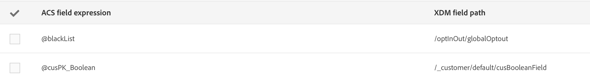

# Definição de mapeamento {#mapping-definition}

>[!IMPORTANT]
>
>No momento, o Adobe Experience Platform Data Connector está em beta, o que pode estar sujeito a atualizações frequentes sem aviso prévio. Os clientes precisam ser hospedados no Azure (atualmente em beta somente para a América do Norte) para acessar esses recursos. Entre em contato com o Atendimento ao cliente do Adobe se desejar acesso.

Nesta seção, você descobrirá como mapear um campo Campaign Standard com um campo do Experience Data Model (XDM).

Para executar essa tarefa, os pré-requisitos são:

* uma definição de Esquema XDM por meio da interface ou usando a API REST associada ao XDM
* uma criação de conjunto de dados com base na definição do esquema XDM

1. Vá para **[!UICONTROL Administration]** > **[!UICONTROL Development]** > **[!UICONTROL Platform]** e escolha a entrada **[!UICONTROL Data mappings]**.

1. Clique em **[!UICONTROL Create]** para iniciar um novo mapeamento XDM.

   

1. Preencha os campos obrigatórios e selecione:

   * a **targeting dimension**: este é o schema Campaign Standard para mapear
   * a **conjunto de dados**: esse é o pacote de dados associado a um esquema XDM no Adobe Experience Platform.

>[!NOTE]
>
>Para que um lote seja assimilado no Perfil do cliente em tempo real ou no Serviço de identidade, o conjunto de dados deve estar [ativado para o Perfil do cliente em tempo real](https://docs.adobe.com/content/help/en/experience-platform/rtcdp/intro/get-started.html).
>
>Se o conjunto de dados selecionado já estiver sendo usado em um mapeamento de dados existente, um aviso será exibido para informá-lo de que seus dados podem ser substituídos no Adobe Experience Platform. Isso pode acontecer quando há alguns recipients comuns em mapeamentos de dados usando um mesmo conjunto de dados.

A tela a seguir apresenta a seção **[!UICONTROL Field mappings]** onde você pode criar um novo mapeamento para cada campo no schema Campaign Standard.

O botão **[!UICONTROL Create new field mapping]** permite selecionar o campo Campaign Standard e a expressão do caminho do campo correspondente no esquema XDM.

Se não conseguir localizar um campo do Adobe Campaign Standard, você poderá usar o campo de pesquisa para pesquisar pelo campo. Atualmente, a pesquisa só funciona para campos que estão abertos na hierarquia.

Os recursos estendidos definidos no Campaign Standard são mapeados como todos os campos nativos. Eles são definidos na extensão _customer/padrão no XDM.

Você pode personalizar a extensão XDM por meio da API e definir sua própria extensão, permitindo um melhor controle do mapeamento.

Consulte [Tutorial da API do Registro de Schema](https://docs.adobe.com/content/help/pt-BR/experience-platform/xdm/api/getting-started.html) para obter mais detalhes sobre a API XDM.

Para mapear um campo de enumeração, é necessário usar o editor de expressão para definir cada valor de enumeração correspondente ao valor XDM. Por exemplo, o postalAdressfield precisa ser definido como:

Se o valor XDM for definido como uma enumeração no Esquema XDM, você poderá usar a função EXDM nativa que substituirá automaticamente a sintaxe **lif**.

Para editar um mapeamento XDM, abra-o, modifique as informações desejadas e salve-as.

>[!IMPORTANT]
>
>Por enquanto, se você editar um valor na seção **[!UICONTROL Field mappings]** e clicar fora do campo, sua alteração não será exibida na interface até que clique no botão **[!UICONTROL Save]**. Esse comportamento ocorre apenas uma vez, quando a edição em **[!UICONTROL Field Mappings]** é a primeira edição na página.
