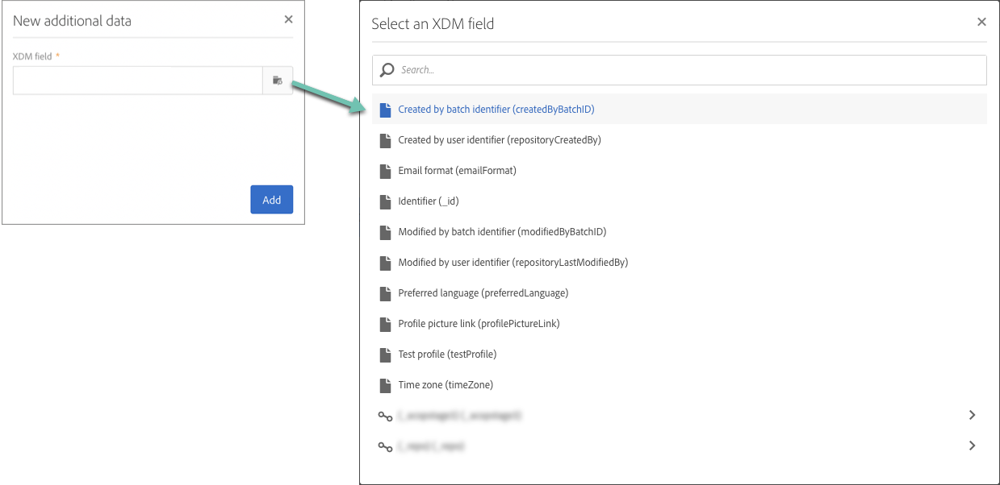

# Personalização de campanhas usando atributos da Adobe Experience Platform {#personalizing-campaigns-using-aep-attributes}

>[!IMPORTANT]
>
>O serviço Audience Destinations está atualmente em beta, o que pode estar sujeito a atualizações frequentes sem aviso prévio. Os clientes precisam ser hospedados no Azure (atualmente em beta somente para a América do Norte) para acessar esses recursos. Entre em contato com o Atendimento ao cliente da Adobe se desejar acesso.
>
>**** Os canais  **de push no** aplicativo ainda não estão disponíveis para personalização usando dados contextuais da Adobe Experience Platform.

Depois que seu fluxo de trabalho for configurado com um [público da Adobe Experience Platform](../../integrating/using/aep-about-audience-destinations-service.md), você poderá personalizar mensagens com atributos de perfil que existem exclusivamente no Experience Data Model (XDM).

Para fazer isso, você deve adicionar esses atributos na atividade **[!UICONTROL Read audience]** :

1. Abra a atividade **[!UICONTROL Read audience]**. Na guia **[!UICONTROL Additional data]**, clique no botão **[!UICONTROL Create element]**.

   Observe que a guia **[!UICONTROL Additional data]** só estará disponível depois que um público-alvo da Adobe Experience Platform for selecionado.

   

   >[!NOTE]
   >
   >Os tipos de dados de matriz e mapa não são suportados neste recurso. Além disso, somente os dados do schema de união serão exibidos no seletor.

1. Selecione o campo XDM desejado na lista e clique em **[!UICONTROL Confirm]**.

   

1. Clique no botão **[!UICONTROL Add]** para adicioná-lo à lista de dados adicionais.

   

1. Repita essas etapas para cada campo XDM que deseja adicionar ao fluxo de trabalho.

   >[!NOTE]
   >
   >Você pode adicionar no máximo 20 campos XDM em uma atividade **[!UICONTROL Read audience]** .

1. Depois que todos os campos tiverem sido adicionados, clique no botão **[!UICONTROL Confirm]** para salvar as alterações. Agora eles estarão disponíveis para personalizar seus deliveries.

Para obter mais informações sobre como criar e personalizar deliveries, consulte a documentação do Campaign Standard:

* [Introdução aos canais de comunicação](../../channels/using/get-started-communication-channels.md)
* [Sobre as atividades de canal](../../automating/using/about-channel-activities.md)
* [Personalização de deliveries](../../designing/using/personalization.md)
