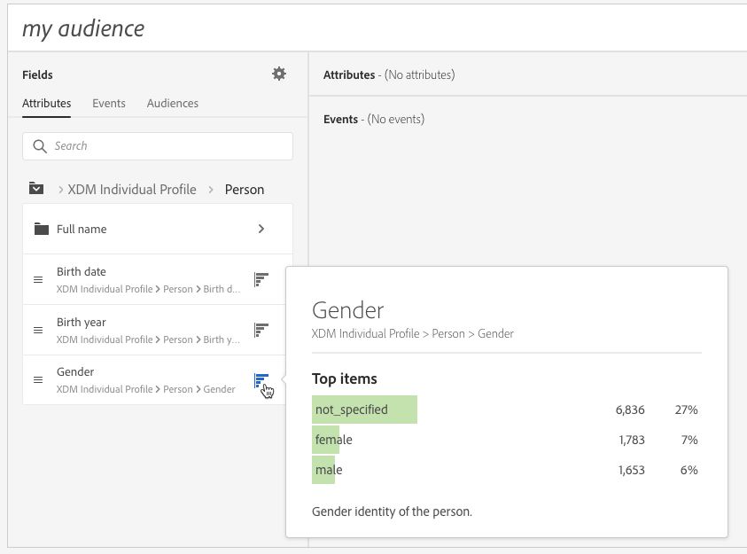

# Usar o Criador de segmentos {#using-the-segment-builder}

>[!IMPORTANT]
>
>O serviço Audience Destinations está atualmente em beta, o que pode estar sujeito a atualizações frequentes sem aviso prévio. Os clientes precisam ser hospedados no Azure (atualmente em beta somente para a América do Norte) para acessar esses recursos. Entre em contato com o Atendimento ao cliente do Adobe se desejar acesso.

O Construtor de segmentos permite que você crie públicos-alvo definindo regras com base nos dados provenientes do [Perfil do cliente em tempo real](https://docs.adobe.com/content/help/pt-BR/experience-platform/profile/home.html).

Esta seção apresenta os conceitos globais ao criar um segmento. Para obter informações detalhadas sobre o próprio Construtor de segmentos, consulte o [Guia do usuário do Construtor de segmentos](https://docs.adobe.com/content/help/en/experience-platform/segmentation/ui/overview.html).

A interface do Construtor de segmentos é composta da seguinte maneira:

* O painel esquerdo fornece todos os atributos, eventos e públicos-alvo disponíveis para criar o segmento, arrastando e soltando os campos desejados no espaço de trabalho do construtor de segmentos.
* A área central fornece um espaço de trabalho para criar o segmento definindo e combinando regras dos campos disponíveis.
* O painel do cabeçalho e direito exibe as propriedades do segmento (ou seja, nome, descrição e perfis qualificados estimados para o segmento).

## Criar um segmento

Para criar um segmento, siga estas etapas:

O Construtor de segmentos agora deve ser exibido em seu espaço de trabalho. Ele permite criar um segmento usando dados do Adobe Experience Platform que eventualmente serão usados para criar seu público-alvo.

1. Nomeie o segmento e insira uma descrição (opcional).

   

1. Certifique-se de que a política de mesclagem desejada esteja selecionada no painel de configurações.

   Para obter mais informações sobre políticas de mesclagem, consulte a seção dedicada do [Guia do usuário do Construtor de segmento](https://docs.adobe.com/content/help/en/experience-platform/segmentation/ui/overview.html).

   

1. Procure os campos desejados no painel esquerdo e arraste-os para o espaço de trabalho central.

   

1. Configure as regras correspondentes aos campos arrastados.

   

1. Clique no botão **[!UICONTROL Create segment]**.

## Encontrar os campos certos para um segmento

O painel esquerdo lista todos os atributos, eventos e públicos disponíveis para uso na construção de regras.

Os campos listados são atributos capturados pela sua empresa e disponibilizados pelo Sistema [Experience Data Model (XDM)](https://docs.adobe.com/content/help/pt-BR/experience-platform/xdm/home.html).

Os campos são organizados em guias:

* **[!UICONTROL Attributes]**: Atributos de perfis existentes que podem se originar do banco de dados do Adobe Campaign e/ou Adobe Experience Platform. Elas se referem a informações estáticas anexadas a um perfil (por exemplo, endereço de email, país de residência, status do programa de fidelidade etc.).

   

* **[!UICONTROL Events]**: Atividades que identificam consumidores que tiveram alguma interação com os pontos de contato do cliente de sua empresa, como &quot;qualquer pessoa que tenha feito pedidos duas vezes em duas semanas&quot;. Isso pode ser transmitido da Adobe Analytics ou assimilado diretamente na Adobe Experience Platform usando ferramentas ETL de terceiros.

   

>[!NOTE]
>
>**A** segmentação de várias entidades permite estender os dados do Perfil com dados adicionais com base em produtos, lojas ou outras classes que não sejam de perfil. Depois de conectados, os dados de classes adicionais ficam disponíveis como se fossem nativos no esquema Perfil.
>
>Para obter mais informações, consulte a [documentação dedicada](https://docs.adobe.com/content/help/en/experience-platform/segmentation/multi-entity-segmentation.html).

Por padrão, o Construtor de segmentos exibe campos nos quais os dados já estão presentes. Para exibir o schema completo, incluindo campos para os quais os dados não estão presentes, ative a opção **[!UICONTROL Show full XDM schema]** nas configurações.

O símbolo no final de cada campo fornece informações adicionais sobre o atributo e como usá-lo.

## Definição de regras para um segmento

>[!NOTE]
>
>A seção abaixo fornece informações globais sobre a definição de regras. Para obter mais informações, consulte o [Guia do usuário do Construtor de segmentos](https://docs.adobe.com/content/help/en/experience-platform/segmentation/ui/overview.html).

Para criar uma regra, siga estas etapas:

1. Localize o campo no painel esquerdo que reflete os atributos ou eventos nos quais a regra será baseada.

1. Arraste o campo para o espaço de trabalho central e configure-o de acordo com a definição de segmento desejada. Para fazer isso, várias funções de string e data/hora estão disponíveis.

   No exemplo abaixo, a regra direcionará todos os perfis com gênero que seja igual a &quot;Masculino&quot;.

   

   A população estimada correspondente ao segmento é recalculada automaticamente na seção **[!UICONTROL Segment Properties]** .

1. O botão **[!UICONTROL View Profiles]** fornece uma visualização dos primeiros 20 registros correspondentes à regra, permitindo validar rapidamente o segmento.

   

   Você pode adicionar quantas regras adicionais desejar para direcionar os perfis corretos.

   Ao adicionar uma regra a um contêiner, ela será anexada a qualquer regra existente com o operador lógico AND. Se necessário, clique no operador lógico para modificá-lo.

   

Depois de vinculadas, as duas regras formam um contêiner.

## Comparação de campos

O Construtor de segmentos permite que você compare dois campos para definir uma regra. Por exemplo, mulheres cujo endereço residencial está em um código postal diferente de seu endereço de trabalho.

Para fazer isso, siga estes passos:

1. Arraste o primeiro campo que deseja comparar (por exemplo, o código postal do endereço residencial) para o espaço de trabalho central.

   

1. Selecione o segundo campo (por exemplo, o código postal do endereço de trabalho) que será comparado ao primeiro campo.

   Arraste-o para o espaço de trabalho central, no mesmo container do primeiro campo, na caixa **[!UICONTROL Drop here to compare operands]**.

   

1. Configure o operador entre os dois campos conforme desejado. Neste exemplo, queremos que nosso segmento direcione perfis com o endereço residencial diferente do endereço de trabalho.

   

A regra agora está configurada e pronta para ser ativada como um público-alvo.
