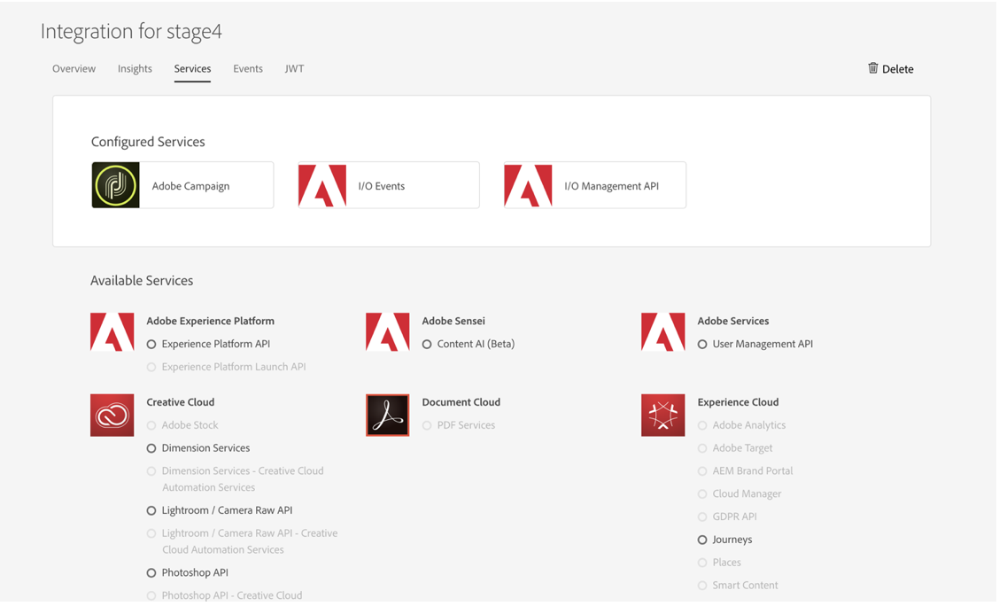

# Configurar o Adobe IO para integração do Microsoft Dynamics 365

Ative seus dados do CRM na comunicação entre canais: saiba mais sobre as etapas necessárias durante o pós-provisionamento para criar uma nova integração para o Microsoft Dynamics 365.

## Visão geral

Adobe Campaign Standard - a integração com o Microsoft Dynamics 365 está descrita [nesta página](../../integrating/using/working-with-campaign-standard-and-microsoft-dynamics-365.md).

Antes de executar as etapas de pós-provisionamento neste artigo, presume-se que você já tenha sido provisionado e tenha acesso de administrador à instância de Campaign Standard da sua organização.  Se isso não aconteceu, você precisará entrar em contato com o Atendimento ao cliente da Adobe para concluir o provisionamento da Campanha.

>[!CAUTION]
>
>As etapas descritas abaixo precisam ser executadas por um administrador.

## Configuração

É necessário configurar o acesso à API e configurar uma nova integração para o Unifi.

A configuração é feita no E/S da Adobe: você precisa criar uma nova integração para o Unifi, conforme apresentado neste vídeo:

>[!VIDEO](https://video.tv.adobe.com/v/27308)

### Criar uma nova integração

Para isso, siga o procedimento abaixo:

1. Navegue até o Console [de E/S da](https://console.adobe.io/home#) Adobe e selecione sua ID de empresa do Adobe IMS no menu suspenso na parte superior esquerda (veja abaixo).

Em seguida, clique em **[!UICONTROL New Integration]** na parte superior direita.

>[!NOTE]
>
>Se essa for a primeira integração de sua organização, o botão para **[!UICONTROL New Integration]** poderá estar no centro da página.

1. Selecione **[!UICONTROL Access an API]** e clique em **[!UICONTROL Continue]**.

1. Selecione _Adobe Campaign_ na **[!UICONTROL Experience Cloud]** seção e clique em **[!UICONTROL Continue]**.

1. Gerar um certificado e uma chave.

**Para plataformas MacOs e Linux**

Abra o aplicativo terminal e execute o comando abaixo:

```
openssl req -x509 -sha256 -nodes -days 365 -newkey rsa:2048 -keyout private.key -out certificate_pub.crt
```

**Para plataformas Windows**

* Baixe um cliente openssl para gerar certificados públicos (por exemplo, cliente [do](https://bintray.com/vszakats/generic/download_file?file_path=openssl-1.1.1-win64-mingw.zip)Openssl windows)

* Extraia a pasta do arquivo zip

* Abra o prompt de linha de comando e execute os comandos abaixo.

Substitua `<containing folder path>` abaixo pelo caminho da pasta extraída (por exemplo, C:\Users\labuser\Downloads\openssl-1.1.1-win64-mingw\openssl-1.1.1-win64-mingw):

```
set OPENSSL_CONF=<containing folder path>/openssl.cnf
 
cd <containing folder path>/
 
openssl req -x509 -sha256 -nodes -days 365 -newkey rsa:2048 -keyout private.key -out certificate_pub.crt
```

**Para todas as plataformas**

Siga as instruções para concluir a solicitação de certificado:

```
Generating a 2048 bit RSA private key
 
.................+++
 
.......................................+++
 
writing new private key to 'private.key'
 
-----
 
You are about to be asked to enter information that will be incorporated
 
into your certificate request.
 
What you are about to enter is what is called a Distinguished Name or a DN.
 
There are quite a few fields but you can leave some blank
 
For some fields there will be a default value,
 
If you enter '.', the field will be left blank.
 
-----
```

Depois de inserir as informações, dois arquivos serão gerados: **[!UICONTROL certificate_pub.crt]** e **[!UICONTROL private.key]**.

* **[!UICONTROL certificate_pub.crt]** expirará em 365 dias. É possível modificar o período de expiração alterando o valor de dias no comando openssl acima, mas girar as credenciais periodicamente é uma boa prática de segurança.

* **[!UICONTROL certificate_pub.crt]** será usado na próxima tela para concluir a integração no Console de E/S da Adobe.

>[!NOTE]
>
> **[!UICONTROL private.key]** serão usados posteriormente durante as etapas pós-provisionamento para Unifi.

1. Volte para o Console de E/S da Adobe e insira um nome e uma descrição para a integração.

1. Carregar **[!UICONTROL certificate_pub.crt]**

1. Selecione o perfil de produto que tem o título:

* A ID da organização da sua instância de Campanha
* **[!UICONTROL Administrators]**

Exemplo:  Campaign Standard - your-campanha-OrganizationID - Administradores

Clique em **[!UICONTROL Create Integration]**.


### Configurar detalhes da integração

1. Select **[!UICONTROL Continue to Integration Details]**

Analise os detalhes da integração.  Você precisará retorná-los quando executar as etapas de pós-provisionamento Unifi.


1. Clique na guia **[!UICONTROL Services]** e adicione **[!UICONTROL I/O Events]** e **[!UICONTROL I/O Management API]** serviços.  Para adicionar o serviço, clique no botão de opção e, em seguida, **[!UICONTROL Add service]**.  Você fará isso para cada serviço separadamente.

Quando terminar, seus serviços devem aparecer no topo como a figura abaixo. Você não precisará concluir a seção on gerando um JWT e um token de acesso.



O provisionamento posterior na Campanha agora está concluído.  Continue a concluir as etapas de provisionamento [pós-lançamento do Microsoft Dynamics 365](../../integrating/using/configure-microsoft-dynamics-365-for-campaign-integration.md).

**Tópicos relacionados**

* [Adobe IO - Integração da conta de serviço](https://www.adobe.io/authentication/auth-methods.html#!AdobeDocs/adobeio-auth/master/AuthenticationOverview/ServiceAccountIntegration.md)
* [Campaign Standard - Configuração de acesso à API](https://docs.campaign.adobe.com/doc/standard/en/api/ACS_API.html#setting-up-api-access)
* [Campaign Standard - Integração com o Dynamics 365](../../integrating/using/configure-microsoft-dynamics-365-for-campaign-integration.md)
