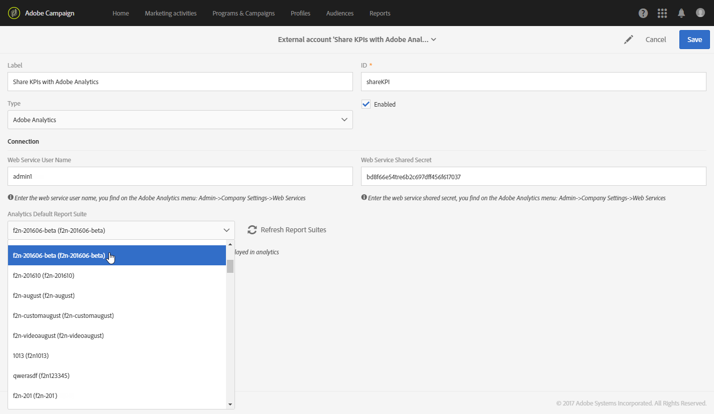

# Configurar a integração do Campaign com o Analytics{#configure-campaign-analytics-integration}

Essa integração permite que você compartilhe seus dados Principais indicadores de desempenho diretamente do Adobe Campaign para o Adobe Analytics Standard ou Premium.

Para iniciar a integração entre o Adobe Campaign Standard e o Adobe Analytics, primeiro é necessário configurar a conta externa vinculada ao Adobe Analytics.

As contas externas e os fluxos de trabalho técnicos só podem ser gerenciados pelo administrador funcional da plataforma.

1. No menu avançado, pelo logotipo do Adobe Campaign, selecione **[!UICONTROL Administration > Application settings > External accounts]**.
1. Select the **[!UICONTROL Share KPIs with Adobe Analytics]** external account.

   

1. Especifique seu **[!UICONTROL Web services user name]** e **[!UICONTROL Web services share secret]** no **[!UICONTROL Connection]** campo.

   Esses parâmetros podem ser encontrados no Analytics selecionando **[!UICONTROL Admin > Company settings > Web services]**.

   

1. Click the **[!UICONTROL Refresh report suites]** button.
1. Selecione na **[!UICONTROL Analytics default report suite]** lista suspensa o conjunto de relatórios do Adobe Analytics que deseja enriquecer com os dados do Adobe Campaign.

   Sua conta externa agora está pronta e vinculada ao Adobe Analytics. Você pode desativá-la a qualquer momento marcando a **[!UICONTROL Enabled]** caixa.

   

O fluxo de trabalho **[!UICONTROL Share KPIs with Adobe Analytics]** técnico será iniciado automaticamente e poderá ser visualizado no menu avançado selecionando **[!UICONTROL Administration > Application settings > Workflow]**. Esse fluxo de trabalho técnico será executado automaticamente a cada 15 minutos e enviará até 6 meses de dados antigos no Adobe Analytics.

Seus dados agora estão disponíveis no Adobe Analytics.

**Tópicos relacionados:**

* [Contas externas](../../administration/using/external-accounts.md)
* [Fluxos de trabalho técnicos](../../administration/using/technical-workflows.md)
* [Compartilhar KPIs para vídeo de relatório](https://helpx.adobe.com/marketing-cloud/how-to/email-marketing.html) integrado do Campaign

