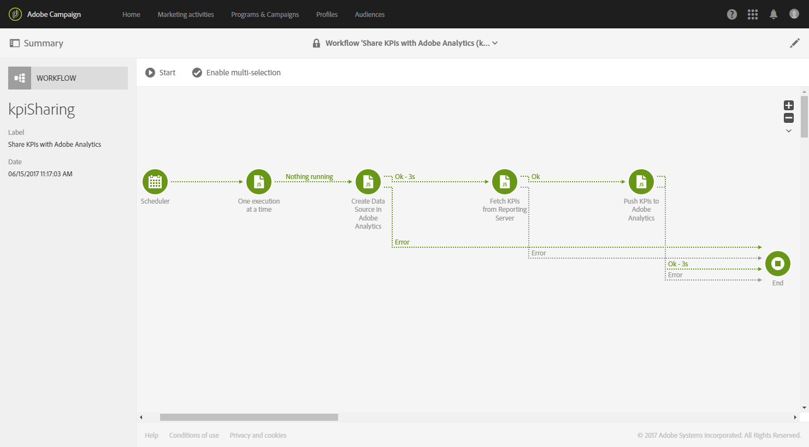

# Configurar a integração do Campaign com o Analytics{#configure-campaign-analytics-integration}

Essa integração permite que você compartilhe seus dados do Indicador-chave de desempenho diretamente da Adobe Campaign para a Adobe Analytics Standard ou Premium.

Para start da integração entre o Adobe Campaign Standard e o Adobe Analytics, primeiro é necessário configurar a conta externa vinculada ao Adobe Analytics.

Contas externas e workflows técnicos só podem ser gerenciados pelo administrador funcional da plataforma.

1. No menu avançado, por meio do logotipo Adobe Campaign, selecione **[!UICONTROL Administration > Application settings > External accounts]**.
1. Selecione a conta externa **[!UICONTROL Share KPIs with Adobe Analytics]**.

   

1. Especifique **[!UICONTROL Web services user name]** e **[!UICONTROL Web services share secret]** no campo **[!UICONTROL Connection]**.

   Esses parâmetros podem ser encontrados no Analytics selecionando **[!UICONTROL Admin > Company settings > Web services]**.

   

1. Clique no botão **[!UICONTROL Refresh report suites]**.
1. Selecione na lista suspensa **[!UICONTROL Analytics default report suite]** o conjunto de relatórios da Adobe Analytics que você deseja enriquecer com dados da Adobe Campaign.

   Sua conta externa agora está pronta e vinculada ao Adobe Analytics. Você pode desativá-la a qualquer momento marcando a caixa **[!UICONTROL Enabled]**.

   

O fluxo de trabalho técnico **[!UICONTROL Share KPIs with Adobe Analytics]** agora será iniciado automaticamente e poderá ser visualizado no menu avançado selecionando **[!UICONTROL Administration > Application settings > Workflow]**. Esse fluxo de trabalho técnico será executado automaticamente a cada 15 minutos e enviará até 6 meses de dados antigos no Adobe Analytics.

Seus dados agora estão disponíveis no Adobe Analytics.

**Tópicos relacionados:**

* [Contas externas](../../administration/using/external-accounts.md)
* [Workflows técnicos](../../administration/using/technical-workflows.md)
* [Compartilhar KPIs para vídeo de ](https://helpx.adobe.com/marketing-cloud/how-to/email-marketing.html) relatório de Campanha integrada

