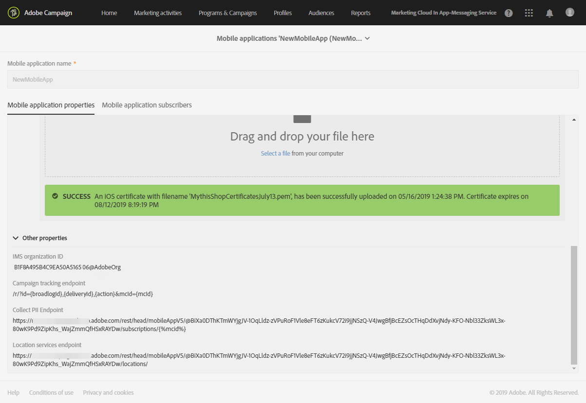

# Configuração da integração de dados do Campaign com os Pontos de interesse{#configuring-campaign-points-of-interest-data-integration}

## Configuração da integração de dados do Campaign com os SDKs da Adobe Experience Platform {#configuring-campaign-poi-aep-sdk}

>[!NOTE]
>
>Seu aplicativo móvel já deve estar configurado no Adobe Campaign Standard usando o SDK do Adobe Experience Platform. Para obter as etapas detalhadas, consulte [página](https://helpx.adobe.com/br/campaign/kb/configuring-app-sdk.html).

Os aplicativos móveis usados para coletar dados de localização devem ser configurados por um **administrador** na interface do Adobe Campaign.

Para usar os Serviços de localização da Adobe Experience Platform com aplicativos móveis configurados com o SDK do Adobe Experience Platform, é necessário:

1. Adicione o **[!UICONTROL Places]** extensão para a configuração do aplicativo móvel na interface da Coleção de dados. Configure seu aplicativo móvel no Adobe Campaign. Consulte [Instalar a extensão Places](https://developer.adobe.com/client-sdks/solution/places).

1. Depois que suas extensões forem configuradas, crie elementos de dados na interface da Coleção de dados para recuperar dados dessas extensões. Consulte esta [página](https://helpx.adobe.com/campaign/kb/config-app-in-launch.html#Step1Createdataelements) para criar seus elementos de dados.

1. Em seguida, na interface da Coleção de dados, é necessário criar regras para suportar casos de uso de dispositivos móveis entre o Point of Interests e o Adobe Campaign.\
   Essa regra será acionada quando um usuário inserir uma geosfera **[!UICONTROL Point of Interest]**. Consulte esta [página](https://helpx.adobe.com/campaign/kb/config-app-in-launch.html#Locationpostback) para criar sua regra.

1. Defina o seu **[!UICONTROL Points of Interest]** no Places. Consulte [Criar um ponto de interesse](https://experienceleague.adobe.com/docs/places/using/poi-mgmt-ui/create-a-poi-ui.html).

1. Acesse o aplicativo móvel e os dados de localização coletados no Adobe Campaign. Consulte [Acesso a aplicativos móveis usados para coletar dados de localização](#accessing-mobile-apps-used-to-collect-location-data) e [Acesso aos dados de localização coletados](#accessing-collected-location-data).

## Configuração da integração de dados do Campaign com os Pontos de interesse usando o SDK V4 {#configuring-campaign-poi-sdkv4}

Os aplicativos móveis usados para coletar dados de localização devem ser configurados por um **administrador** na interface do Adobe Campaign.

Para usar o recurso de dados de Ponto de interesse com aplicativos móveis configurados com o SDK V4, é necessário:

1. Ter acesso ao Adobe Analytics for Mobile. Verifique seu contrato de licença ou entre em contato com o executivo da sua conta Adobe para obter mais informações.
1. Configure seu aplicativo móvel no Adobe Campaign. Consulte [Configuração de um aplicativo móvel no Campaign](#setting-up-a-mobile-app-in-campaign).
1. Configure o aplicativo móvel na interface do Adobe Mobile Services. Isso permite que você garanta que os dados coletados pelo Adobe Mobile Services sejam enviados para a Adobe Campaign. Consulte [Configuração de um aplicativo móvel no Adobe Mobile Services](#configuring-a-mobile-app-in-adobe-mobile-services).
1. Execute a configuração específica do aplicativo móvel:

   * Empacote o arquivo de configuração baixado da interface do Adobe Mobile Services com o aplicativo móvel.
   * Integre o SDK móvel do Experience Cloud no aplicativo móvel. Consulte [Integração do SDK em um aplicativo para dispositivos móveis](#integrating-the-sdk-into-a-mobile-application).

1. Defina Pontos de interesse na interface do Adobe Mobile Services. Consulte [Definição de pontos de interesse no Adobe Mobile Services](#defining-points-of-interest-in-adobe-mobile-services).
1. Defina os dados que deseja coletar dos assinantes do aplicativo móvel. Consulte [Coleta de dados de Pontos de interesse dos assinantes](#collecting-subscribers--points-of-interest-data).
1. Acesse o aplicativo móvel e os dados de localização coletados no Adobe Campaign. Consulte [Acesso a aplicativos móveis usados para coletar dados de localização](#accessing-mobile-apps-used-to-collect-location-data) e [Acesso aos dados de localização coletados](#accessing-collected-location-data).

### Configuração de um aplicativo móvel no Adobe Campaign usando o SDK V4 {#setting-up-a-mobile-app-in-campaign}

Para coletar dados de pontos de interesse com o Adobe Campaign, é necessário configurar o aplicativo móvel do qual o Adobe Campaign receberá dados.

1. Clique em **Adobe** no canto superior esquerdo e selecione **[!UICONTROL Administration]** > **[!UICONTROL Channels]** > **[!UICONTROL Mobile app]**.
1. Clique em **[!UICONTROL Create]** para configurar um aplicativo.
1. Insira um nome no campo **[!UICONTROL Application name]** e clique em **[!UICONTROL Create]**.

   Não preencha o **[!UICONTROL Device-specific settings]** seção. Isso se aplica somente à configuração de aplicativos que recebem notificações por push.

No **[!UICONTROL Mobile application properties]** são listados dois URLs: **[!UICONTROL Collect PII endpoint]** e **[!UICONTROL Location Services endpoint]**. Eles serão usados na interface do Adobe Mobile Services. Consulte [Configuração de um aplicativo móvel no Adobe Mobile Services](#configuring-a-mobile-app-in-adobe-mobile-services).

* A variável **[!UICONTROL Collect PII endpoint]** O URL é usado para coletar as IDs de Experience Cloud e os tokens de registro dos usuários do aplicativo móvel quando ele é iniciado. Quando um usuário faz logon no aplicativo usando credenciais como email, nome, sobrenome etc., esses dados também são coletados e usados para reconciliar o token de registro do usuário com um perfil do Adobe Campaign.
* A variável **[!UICONTROL Location Services endpoint]** O URL é usado para coletar dados de localização, como latitude, longitude e raio de um usuário de um Ponto de interesse.

Agora você pode usar esses valores no Adobe Mobile Services para concluir a configuração, conforme explicado na seção [Configuração de um aplicativo móvel no Adobe Mobile Services](#configuring-a-mobile-app-in-adobe-mobile-services) seção.


### Configuração de um aplicativo móvel V4 no Adobe Mobile Services {#configuring-a-mobile-app-in-adobe-mobile-services}

Para enviar os dados coletados pelo Adobe Mobile Services para o Adobe Campaign, você deve configurar postbacks na interface do Mobile Services.

Você precisará de informações específicas que podem ser encontradas nos parâmetros do aplicativo para dispositivos móveis definidos no Adobe Campaign (consulte [Configuração de um aplicativo móvel no Campaign](#setting-up-a-mobile-app-in-campaign)):

* **[!UICONTROL IMS Organization ID]**
* **[!UICONTROL Collect PII Endpoint]**
* **[!UICONTROL Location Services endpoint]**

Você deve ter acesso ao Adobe Analytics para fazer a seguinte configuração. Se você não for um usuário do Adobe Analytics, entre em contato com o administrador do Adobe Campaign.

1. Efetue logon no [mobilemarketing.adobe.com](https://mobilemarketing.adobe.com/).
1. Crie o aplicativo ou selecione um existente.
1. Acesse a página **[!UICONTROL Manage App Settings]**.
1. No **Serviço de ID de visitante** seção, marque **Ativar** e selecione sua organização na lista suspensa. Clique em **Salvar**.

   >[!CAUTION]
   >
   >Essa organização deve ser a mesma usada na instância do Adobe Campaign.

1. Clique em **[!UICONTROL Manage Postbacks]**.
1. Crie um postback.

   * Selecionar **[!UICONTROL PII]** como o **[!UICONTROL Postback Type]**.
   * No **[!UICONTROL URL]** , copie o **[!UICONTROL Collect PII Endpoint]** URL do aplicativo móvel que você configurou na interface do Adobe Campaign, precedido pelo nome do servidor. Consulte [Configuração de um aplicativo móvel no Campaign](#setting-up-a-mobile-app-in-campaign).
   * Preencha o **[!UICONTROL Post Body]** do seguinte modo:

     Para o iOS:

     ```
     {
     "userKey": "{userKey}",
     "pushPlatform":"apns",
     "marketingCloudId":"",
     "cusEmail":"{email}",
     "cusFirstName":"{firstName}",
     "cusLastName":"{lastName}"
     }
     ```

     Para Android:

     ```
     {
     "userKey": "{userKey}",
     "pushPlatform":"gcm",
     "marketingCloudId":"",
     "cusEmail":"{email}",
     "cusFirstName":"{firstName}",
     "cusLastName":"{lastName}"
     }
     ```

   * Definir **Tipo de conteúdo** as **[!UICONTROL application/json]**.
   * No **Quais tags de dados acionam o postback?**, selecione qualquer evento, normalmente **[!UICONTROL Launched]** e **[!UICONTROL exists]**.
   * Clique em **[!UICONTROL Save & Activate]**.

1. Crie um segundo postback.

   * Selecionar **[!UICONTROL Postback]** como o **[!UICONTROL Postback Type]**.
   * No **[!UICONTROL URL]** , copie o **[!UICONTROL Location Services Endpoint]** URL do aplicativo móvel que você configurou na interface do Adobe Campaign, precedido pelo nome do servidor. Consulte [Configuração de um aplicativo móvel no Campaign](#setting-up-a-mobile-app-in-campaign).
   * Preencha o **[!UICONTROL Post Body]** do seguinte modo:

     ```
     {
     "locationData":{
     "distances":"{a.loc.dist}",
     "poiLabel":"{a.loc.poi}",
     "latitude.a":"{a.loc.lat.a}",
     "latitude.b":"{a.loc.lat.b}",
     "latitude.c":"{a.loc.lat.c}",
     "longitude.a":"{a.loc.lon.a}",
     "longitude.b":"{a.loc.lon.b}",
     "longitude.c":"{a.loc.lon.c}",
     "appId":"{a.appid}",
     "marketingCloudId":"{mid}"
     }
     }
     ```

   * Definir **Tipo de conteúdo** as **[!UICONTROL application/json]**.
   * No **Quais tags de dados acionam o postback?**, selecione **[!UICONTROL campaign.test]** e **[!UICONTROL exists]**.
   * Clique em **[!UICONTROL Save & Activate]**.

>[!NOTE]
>
>Para obter informações detalhadas sobre como configurar postbacks, consulte [Documentação do Adobe Mobile Services](https://experienceleague.adobe.com/docs/mobile-services/using/manage-app-settings-ug/configuring-app/signals.html).

### Integração do SDK em um aplicativo para dispositivos móveis {#integrating-the-sdk-into-a-mobile-application}

O SDK (software development kit) do Mobile Core Service facilita a integração de um aplicativo móvel ao Adobe Campaign.

Esta etapa está descrita neste [página](https://helpx.adobe.com/br/campaign/kb/configuring-app-sdkv4.html).

### Definição de pontos de interesse no Adobe Mobile Services {#defining-points-of-interest-in-adobe-mobile-services}

Para definir os Pontos de Interesse usados para coletar dados de localização:

1. Vá para a interface do Adobe Mobile Services.
1. Adicione seu aplicativo.

   Para obter mais informações sobre como gerenciar aplicativos no Mobile Services, consulte [Documentação do Adobe Mobile Services](https://experienceleague.adobe.com/docs/mobile-services/using/manage-apps-ug/t-new-app.html).

1. Defina os Pontos de interesse.

   Para obter mais informações sobre como gerenciar pontos de interesse, consulte a [Documentação do Adobe Mobile Services](https://experienceleague.adobe.com/docs/mobile-services/using/location-ug/t-manage-points.html).

### Coleta de dados de Pontos de interesse dos assinantes {#collecting-subscribers--points-of-interest-data}

Um recurso personalizado específico permite definir os dados que deseja coletar dos assinantes de aplicativos.

Esta etapa está descrita na seção [Configurar um aplicativo para dispositivos móveis usando o SDK V4](https://helpx.adobe.com/br/campaign/kb/configuring-app-sdkv4.html) página.

## Acesso a aplicativos móveis usados para coletar dados de localização {#accessing-mobile-apps-used-to-collect-location-data}

Para acessar os aplicativos criados com êxito no Adobe Campaign:

1. Clique em **Adobe** no canto superior esquerdo.
1. Selecionar **[!UICONTROL Administration]** > **[!UICONTROL Channels]** > **[!UICONTROL Mobile app (SDK v4)]** ou **[!UICONTROL Mobile app (AEP SDK)]** dependendo do SDK.
1. Selecione um aplicativo móvel na lista para exibir suas propriedades.

   

Uma lista dos assinantes do aplicativo também é exibida no campo **[!UICONTROL Mobile application subscribers]** guia. Os assinantes são todos os usuários que instalaram o aplicativo nos dispositivos móveis. Os perfis do banco de dados do Adobe Campaign são identificados com um token de registro.

## Acesso aos dados de localização coletados {#accessing-collected-location-data}

Quando a configuração estiver concluída, os dados de Pontos de interesse coletados serão listados na **[!UICONTROL Places]** de cada perfil. Para acessar a lista:

1. Selecione um perfil.
1. Clique em **[!UICONTROL Edit profile properties]** botão à direita.
1. Selecione a guia **[!UICONTROL Places]**.

   

Os dados de Pontos de interesse coletados para o perfil atual são listados. Os dados de localização são armazenados no banco de dados do Adobe Campaign por seis meses.

Para obter mais informações sobre acesso e edição de perfis, consulte [Perfis](../../audiences/using/about-profiles.md).
