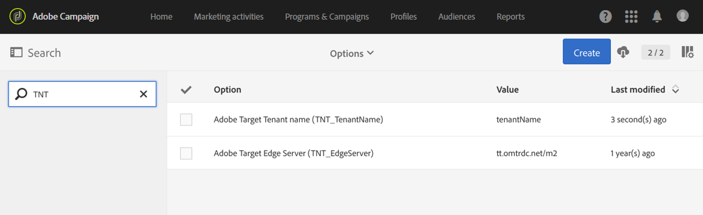

# Configuração da integração do Campaign com o Target{#configuring-the-campaign-target-integration}

A integração entre o Adobe Campaign e o Adobe Target permite inserir conteúdo dinâmico no seu delivery.

Uma configuração é necessária primeiro no Adobe Campaign para usar as funcionalidades de integração com o Adobe Target e deve ser gerenciada pelo administrador funcional.

Os seguintes elementos são necessários para esse procedimento:

* Um locatário do Adobe Experience Cloud
* Um locatário do Adobe Target
* Um rawbox do Adobe Target especificado para estabelecer a conexão com o Adobe Campaign

1. No menu avançado, no logotipo do Adobe Campaign, no canto superior esquerdo, selecione **[!UICONTROL Administration]** > **[!UICONTROL Application settings]** > **[!UICONTROL Options]**.
1. Para configurar as opções de servidor e locatário do Adobe Target, preencha os seguintes campos adequadamente:

   * **[!UICONTROL TNT_TenantName]**: nome do locatário do Adobe Target. Esse valor corresponde ao nome do **[!UICONTROL Client]** do Adobe Target.
   * **[!UICONTROL TNT_EdgeServer]**: servidor Adobe Target usado para integração. Essa opção já é fornecida por padrão. Este valor corresponde ao Adobe Target **[!UICONTROL Server Domain]**, seguido pelo valor **/m2**. Por exemplo: **tt.omtrdc.net/m2**.

   

Seus usuários agora podem adicionar imagens dinâmicas em um delivery com o Adobe Target.
