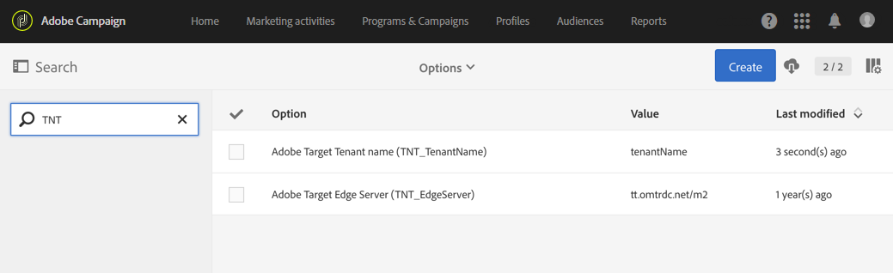

# Configuração da integração do Campaign com o Target{#configuring-the-campaign-target-integration}

A integração entre o Adobe Campaign e o Adobe Target permite inserir conteúdo dinâmico em seu delivery.

Uma configuração é necessária no Adobe Campaign para usar as funcionalidades de integração com a Adobe Target e deve ser gerenciada pelo administrador funcional.

Para este procedimento, são necessários os seguintes elementos:

* Um locatário da Adobe Experience Cloud
* Um locatário da Adobe Target
* Um rawbox do Adobe Target especificado para estabelecer a conexão com o Adobe Campaign

1. No menu avançado, pelo logotipo Adobe Campaign no canto superior esquerdo, selecione **[!UICONTROL Administration]** > **[!UICONTROL Application settings]** > **[!UICONTROL Options]**.
1. Para configurar as opções de servidor e locatário para Adobe Target, preencha os seguintes campos de acordo:

   * **[!UICONTROL TNT_TenantName]**: nome do locatário do Adobe Target. Esse valor corresponde ao nome do **[!UICONTROL Client]** do Adobe Target.
   * **[!UICONTROL TNT_EdgeServer]**: Servidor Adobe Target usado para integração. Essa opção já é fornecida por padrão. This value corresponds to the Adobe Target **[!UICONTROL Server Domain]**, followed by the **/m2** value. Por exemplo: **tt.omtrdc.net/m2**.

   

Seus usuários agora podem adicionar imagens dinâmicas em um delivery com o Adobe Target.
