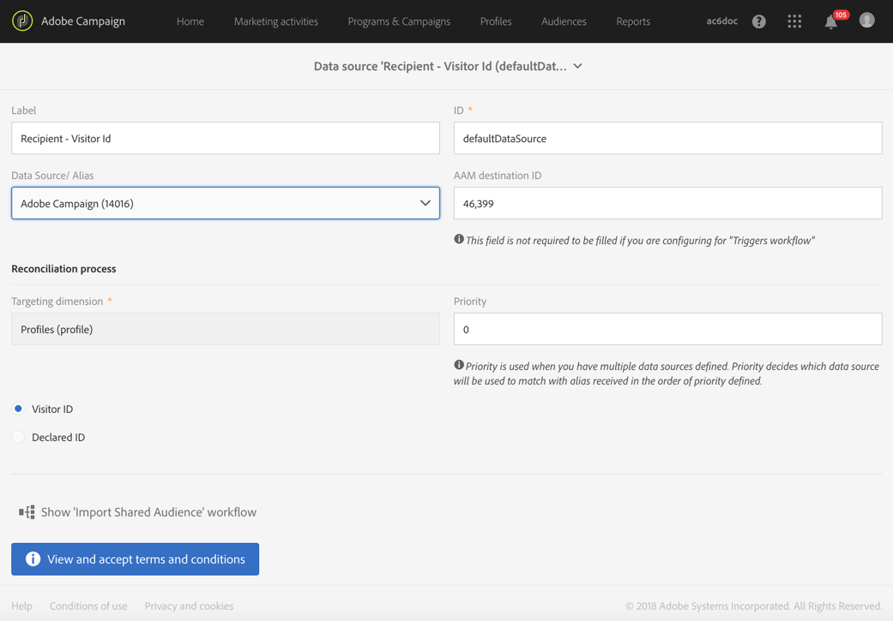

# Configuração de acionadores na Experience Cloud{#configuring-triggers-in-experience-cloud}

## Ativando a funcionalidade {#activating-the-functionality}

A funcionalidade deve ser ativada no Adobe Campaign pela Adobe. Entre em contato com seu parceiro de serviços profissional ou executivo de conta da Adobe.

A equipe da Adobe precisará das seguintes informações para ativar acionadores:

* Nome da empresa da Marketing Cloud
* ID ORG IMS
* Empresa de logon do Analytics (pode ser igual ao nome da empresa da Marketing Cloud)

## Configuração de soluções e serviços {#configuring-solutions-and-services}

Para usar esse recurso, é necessário ter acesso às seguintes soluções/principais serviços:

* Adobe Campaign
* Adobe Analytics Ultimate, Premium, Foundation, OD, Select, Prime, Mobile Apps, Select ou Standard.
* Serviço principal acionadores da Experience Cloud

   

* Serviço principal da Experience Cloud DTM

   

* Serviço principal de ID de visitante da Experience Cloud e da Experience Cloud People

   

Você também precisa ter um site de trabalho.

>[!CAUTION]
>
>A delegação de subdomínio é um elemento-chave de entrega. Certifique-se de que os emails do Adobe Campaign sejam enviados do mesmo domínio usado pelo site.

É necessário configurar o serviço [principal da](#configuring-experience-cloud-dtm-core-service)Experience Cloud DTM, o serviço [principal da](#configuring-experience-cloud-people-core-service) Experience Cloud People e o [Campaign](#configuring-triggers-and-aliases-in-campaign) para executar esses casos de uso.

### Configuração do serviço principal da Experience Cloud DTM {#configuring-experience-cloud-dtm-core-service}

1. No Serviço principal da Experience Cloud DTM (Gerenciamento dinâmico de tags), ative a Experience Cloud ID e o Adobe Analytics para suas páginas do site.

   

1. A reconciliação de ID entre o site, o Adobe Analytics e o Adobe Campaign exige o uso de alias. Crie um alias, "visitorid", por exemplo.

   

### Configuração do serviço principal do Experience Cloud People {#configuring-experience-cloud-people-core-service}

O alias mencionado anteriormente no DTM precisa ser criado no Serviço principal de pessoas da Experience Cloud por meio de um Atributo do cliente. Certifique-se de criar um novo e referenciar o mesmo alias do DTM no código de integração (por exemplo, "visitorid").

>[!NOTE]
>
>Usaremos esse Atributo do cliente na fonte de dados no Adobe Campaign (próxima etapa).

### Configuração de acionadores e aliases no Campaign {#configuring-triggers-and-aliases-in-campaign}

1. Verifique se você está **[!UICONTROL Experience Cloud triggers]** visível na instância do Adobe Campaign Standard. Caso contrário, entre em contato com os administradores do Adobe Campaign.

   

1. Os alias permitem que um contato no Analytics seja reconciliado com um perfil no Campaign. É necessário corresponder os alias definidos no serviço da Experience Cloud ID com uma Fonte de dados compartilhada no Campaign. É necessário configurar a resolução de alias no Adobe Campaign por meio de uma fonte de dados ( **[!UICONTROL Administration]** &gt; **[!UICONTROL Application Settings]** &gt; **[!UICONTROL Shared Data Sources]** ). Certifique-se de escolher a fonte de dados correta no menu **[!UICONTROL Data Source/Alias]** suspenso, que é mapeada com a mesma fonte de dados Atributo do cliente criada na etapa anterior.

   

   >[!NOTE]
   >
   >Você pode reconciliar seus acionadores para usuários anônimos e conectados. Para usuários anônimos, o perfil deve existir no Adobe Campaign e um email foi enviado ao usuário antes. Para isso, a configuração da ID do visitante é suficiente. No entanto, se você deseja reconciliar acionadores para usuários conectados, é necessário configurar a Fonte de Dados de ID declarada. Para obter mais informações, consulte a configuração [da Fonte de](../../integrating/using/provisioning-and-configuring-integration-with-audience-manager-or-people-core-service.md#step-2--configure-the-data-sources)Dados.

## Criar um acionador na interface da Experience Cloud {#creating-a-trigger-in-the-experience-cloud-interface}

É necessário criar um acionador da Adobe Experience Cloud para que você possa usá-lo no Campaign.

Crie um novo acionador na Experience Cloud e certifique-se de selecionar o conjunto de relatórios usado em seu site. Certifique-se de escolher a dimensão correta para que o acionador seja acionado.

Consulte a documentação [da](https://marketing.adobe.com/resources/help/en_US/mcloud/triggers.html) Adobe Experience Cloud e assista a este [vídeo](https://helpx.adobe.com/marketing-cloud/how-to/email-marketing.html#step-two).

## Aciona práticas recomendadas e limitações {#triggers-best-practices-and-limitations}

Esta é uma lista de práticas recomendadas e limitações para o uso da integração Campanha - Acionadores:

* Se você tiver várias instâncias do Campaign Standard, os acionadores poderão ser recebidos por todas as instâncias, desde que estejam na mesma ID organizacional do IMS. O Analytics também precisa estar na mesma ID organizacional do IMS.
* Não é possível criar um acionador no serviço principal do acionador usando eventos de dois conjuntos de relatórios diferentes.
* Os acionadores são baseados em mensagens transacionais. As mensagens transacionais são usadas sempre que você tem que enviar uma mensagem muito rapidamente. Não é possível enfileirar mensagens transacionais e depois repeti-las em lote.
* Os acionadores não são de natureza determinista. Quando um acionador é gerado, ele envia todos os aliases associados ao cookie, de modo que, no caso de navegadores compartilhados, como em quiosques de varejo, bibliotecas, cyber cafés ou dispositivos compartilhados em casa (marido e mulher fazendo logon pelo mesmo dispositivo), não é possível mapear para a ID correta. Todas as IDs usadas para fazer logon com o navegador são enviadas para o Campaign, que envia uma mensagem com base na primeira reconciliação. Se houver várias "IDs de email" elegíveis para reconciliação, o Campaign não enviará um email. Não há como o Campaign saber qual é a ID de email correta a menos que seja capturada e enviada pelo Analytics.
* Não é possível armazenar conteúdo da carga no Campaign. Os acionadores não podem ser usados para atualizar os dados de um perfil.
* Atributos do cliente não são suportados em Acionadores (ou seja, somente os dados do conjunto de relatórios podem ser usados para definir regras de negócios de Acionadores).
* A coleção de coleções não é compatível com o Campaign.

>[!CAUTION]
>
>Seu site deve estar em execução no mesmo domínio que o servidor do Adobe Campaign. Caso contrário, você não poderá usar a ID de visitante para reconciliar e acessar os usuários que visitam o site anonimamente.

