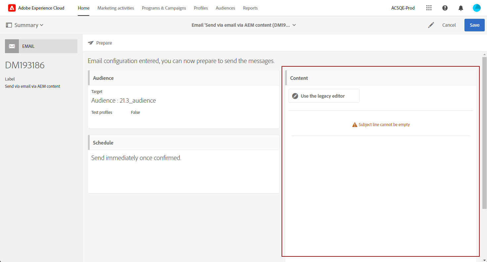
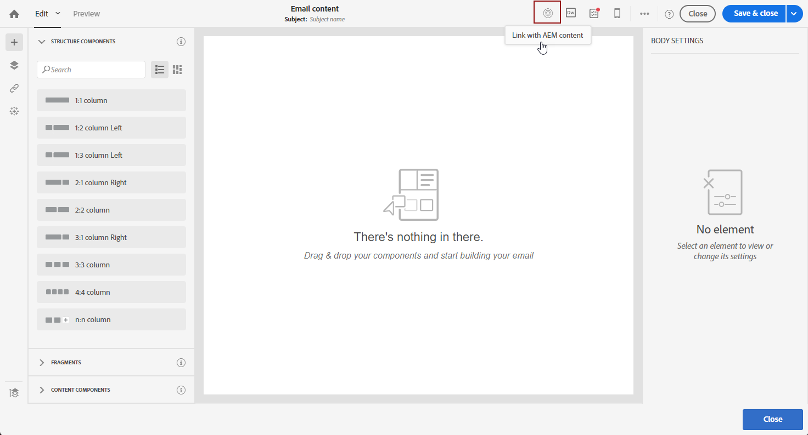

# Importação de conteúdo do Adobe Experience Manager para um email do Adobe Campaign {#creating-email-aem}

Com este documento, você aprenderá a criar e gerenciar conteúdo de email no Adobe Experience Manager e, em seguida, a usá-lo em suas campanhas de marketing, importando-o em seus emails para o Adobe Campaign Standard.

Os pré-requisitos são:

* Acesso a uma instância do AEM configurada para a integração.
* Acesso a uma instância do Adobe Campaign configurada para a integração.
* Um template de email do Adobe Campaign configurado para receber conteúdo AEM.

## Acesso a emails no Adobe Experience Manager {#email-content-aem}

Faça logon na instância de criação do Adobe Experience Manager e navegue em seu site para acessar a pasta que contém seu conteúdo de email.

>[!VIDEO](https://video.tv.adobe.com/v/29996)

## Criação de novo conteúdo de e-mail no Adobe Experience Manager {#creating-email-content-aem}

Vários modelos específicos para o Adobe Campaign estão disponíveis. Você deve usar um desses modelos, pois eles contêm componentes predefinidos suportados pelo Adobe Campaign.

Por padrão, dois modelos predefinidos permitem criar conteúdo de email para o Adobe Campaign.

* **[!UICONTROL Adobe Campaign Email]**: esse template contém um conteúdo padrão que pode ser personalizado. Você pode escolher entre Email do Adobe Campaign (AC6.1) e Email do Adobe Campaign (ACS).
* **[!UICONTROL Importer Page]**: esse modelo permite importar um arquivo ZIP contendo um arquivo HTML com conteúdo que você poderá personalizar.

1. No Adobe Experience Manager, crie uma nova **[!UICONTROL Page]**.

1. Selecione o **[!UICONTROL Adobe Campaign Email]** modelo. Consulte o vídeo a seguir para obter as etapas detalhadas.

   >[!VIDEO](https://video.tv.adobe.com/v/29997)

1. Abra seu novo conteúdo de email.

1. No **[!UICONTROL Page properties]**, definir **[!UICONTROL Adobe Campaign]** como o **[!UICONTROL Cloud Service Configuration]**. Isso permite a comunicação entre seu conteúdo e sua instância do Adobe Campaign.

   Para obter mais informações, assista ao seguinte vídeo:

   >[!VIDEO](https://video.tv.adobe.com/v/29999)

## Edição e envio de um email {#editing-email-aem}

É possível editar o conteúdo do email adicionando componentes e ativos. Os campos de personalização podem ser usados para fornecer uma mensagem mais relevante com base nos dados dos recipients no Adobe Campaign.

Para criar um conteúdo de email no Adobe Experience Manager:

1. Edite o assunto e a variável **[!UICONTROL Plain text]** do seu e-mail acessando a **[!UICONTROL Page properties]** > **[!UICONTROL Email]** do sidekick.

1. Adicionar **[!UICONTROL Personalization fields]** por meio da **[!UICONTROL Text & Personalization]** componente. Cada componente corresponde a um uso específico: inserção de imagens, adição de personalização etc.

   Para obter mais informações, assista ao seguinte vídeo:

   >[!VIDEO](https://video.tv.adobe.com/v/29998)

1. No **[!UICONTROL Workflow]** , selecione a **[!UICONTROL Approve for Adobe Campaign]** workflow de validação. Você não poderá enviar um e-mail no Adobe Campaign se ele usar um conteúdo que não tenha sido aprovado.

Para enviar seu email no Adobe Campaign Standard:

1. Depois que os parâmetros de conteúdo e envio forem definidos, crie um email com base em um template de email específico do AEM no Adobe Campaign Standard.

+++ Saiba mais sobre o modelo específico para AEM.

   1. No menu avançado, acesse **[!UICONTROL Resources]** `>` **[!UICONTROL Templates]** `>` **[!UICONTROL Delivery templates]**.

      

   1. Duplique ou selecione um dos templates do delivery.

   1. No **[!UICONTROL Properties]** do seu modelo, no campo **[!UICONTROL Content]** selecione **[!UICONTROL Adobe Experience Manager as Content mode]** em seguida, sua conta do Adobe Experience Manager.

      

+++

   

1. Preencha as propriedades do seu email e clique em **[!UICONTROL Create]** para poder selecionar seu conteúdo AEM.

1. Acesse o **[!UICONTROL Content]** bloco.

   

1. No **[!UICONTROL Use Adobe Experience Manager content]** clique em **[!UICONTROL Link AEM content]**.

   Em seguida, selecione o conteúdo que deseja usar no email.

   

1. Personalize ainda mais seu email especificando parâmetros adicionais, como públicos-alvo e cronograma de execução, por meio do painel. Após a configuração, você pode enviar o delivery de email. [Saiba mais](../../sending/using/confirming-the-send.md)

