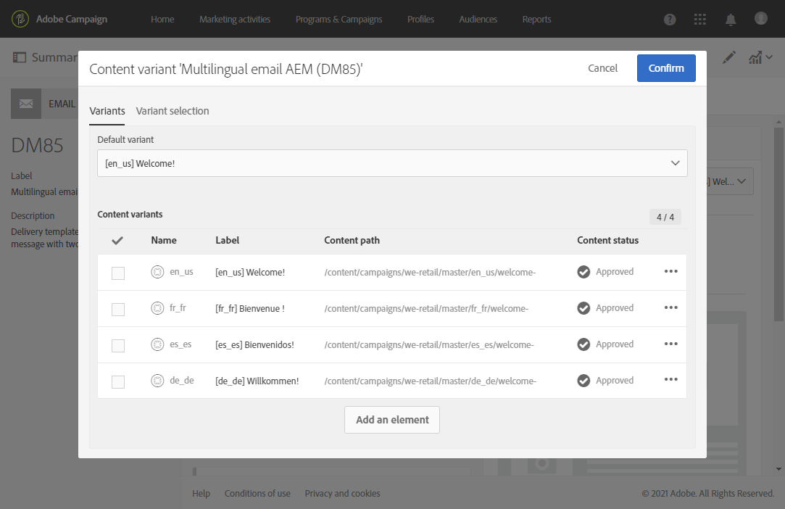

# Criação de um email multilíngue com a integração do Adobe Experience Manager {#creating-multilingual-email-aem}

Usando este documento, você aprenderá a criar um email multilíngue usando o conteúdo e as cópias de idioma do Adobe Experience Manager.

Os pré-requisitos são:

* Acesso a uma instância AEM configurada para a integração.
* Acesso a uma instância do Adobe Campaign configurada para a integração.
* Um modelo de email multilíngue da Adobe Campaign configurado para receber conteúdo AEM.

## Criação de novo conteúdo de e-mail no Adobe Experience Manager {#creating-email-content-aem}

1. Na página inicial do Adobe Experience Manager, selecione **[!UICONTROL Site]**.

   

1. Selecione em qual pasta você deseja criar sua página e clique em **[!UICONTROL Create]** e em **[!UICONTROL Page]**. Aqui, criamos nossa página na pasta pt_br que será o nosso idioma padrão.

   

1. Selecione o modelo **[!UICONTROL Adobe Campaign Email (ACS)]**.

1. Preencha as propriedades do seu email e clique em **[!UICONTROL Create]**.

   

1. Abra seu novo conteúdo de email e personalize-o conforme necessário. Para obter mais informações, consulte esta [página](../../integrating/using/creating-email-experience-manager.md#editing-email-aem).

   

1. Na guia **[!UICONTROL Workflow]**, selecione o fluxo de trabalho de validação **[!UICONTROL Approve for Adobe Campaign]**. Você não poderá enviar um e-mail no Adobe Campaign se ele usar um conteúdo que não tenha sido aprovado.

   

1. Clique em **[!UICONTROL Complete]** e em **[!UICONTROL Newsletter review]** na janela **[!UICONTROL Complete work item]**.

1. Clique em **[!UICONTROL Complete]** e em **[!UICONTROL Newsletter approval]**. Depois que o conteúdo e os parâmetros de envio forem definidos, você poderá continuar aprovando, preparando e enviando o email no Adobe Campaign Standard.

   

## Criando cópias de idioma {#creating-language-copies}

Depois de projetar seu conteúdo de email, agora é necessário criar cópias de idioma que serão sincronizadas com a Adobe Campaign Standard como variantes.

1. Selecione sua página criada anteriormente, clique em **[!UICONTROL Create]** e em **[!UICONTROL Language Copy]**.

   

1. Selecione o conteúdo de email criado anteriormente que será traduzido nos idiomas escolhidos e clique em **[!UICONTROL Next]**.

   

1. Na lista suspensa **[!UICONTROL Target language(s)]**, selecione em qual idioma o conteúdo será traduzido e clique em **[!UICONTROL Next]**.

   

1. Clique em **[!UICONTROL Create]**.

Agora, suas cópias de idioma são criadas. Agora, você pode editar seu conteúdo dependendo do idioma escolhido.

>[!CAUTION]
>
>Cada cópia de idioma precisa ser aprovada pelo fluxo de trabalho de validação **[!UICONTROL Approve for Adobe Campaign]**. Você não poderá enviar um e-mail no Adobe Campaign se ele usar um conteúdo que não tenha sido aprovado.

## Criação de conteúdo multilíngue no Adobe Campaign Standard {#multilingual-acs}

1. Na página inicial do Adobe Campaign Standard, clique em **[!UICONTROL Create an email]**.

   

1. Selecione seu modelo de email multilíngue do Adobe Campaign configurado para receber conteúdo do Adobe Experience Manager. Para saber mais sobre como criar um modelo vinculado à sua instância do Adobe Experience Manager, consulte esta [página](../../integrating/using/configure-experience-manager.md#config-acs).

   >[!NOTE]
   >
   >Nesse caso, você precisará duplicado do modelo incorporado **[!UICONTROL Multilingual email (mailMultiLang)]** para poder enviar seu email multilíngue.

   

1. Preencha as **[!UICONTROL Properties]** e **[!UICONTROL Audience]** do seu email e clique em **[!UICONTROL Create]**.

1. Na **[!UICONTROL Edit properties]**, verifique se sua conta do Adobe Experience Manager está definida corretamente no menu suspenso **[!UICONTROL Content]**.

   

1. Clique em **[!UICONTROL Language copy creation]**.

   

1. Selecione o conteúdo do Adobe Experience Manager criado anteriormente e clique em **[!UICONTROL Confirm]**. O conteúdo do Adobe Experience Manager exibido aqui é apenas um conteúdo validado e pode ser filtrado em seus **[!UICONTROL Label]** e **[!UICONTROL Path]**.

   >[!NOTE]
   >
   >A cópia de idioma escolhida será definida como padrão, você poderá alterá-la posteriormente no bloco **[!UICONTROL Content variant]**.

   

1. Clique em **[!UICONTROL Create variants]** para vincular seu conteúdo multilíngue. A Adobe Campaign Standard vinculará automaticamente as outras cópias de idioma a esse conteúdo. As variantes criadas terão a mesma etiqueta e o mesmo idioma de código que as escolhidas no Adobe Experience Manager.

   

1. Clique no bloco **[!UICONTROL Content variant]** para alterar sua variante padrão, se necessário, e clique em **[!UICONTROL Confirm]**.

   

1. Se seu conteúdo ou variantes forem atualizados no Adobe Experience Manager, você poderá sincronizá-lo diretamente no Adobe Campaign Standard com o botão **[!UICONTROL Refresh AEM contents]**.

1. Seu email está pronto para ser enviado. Para obter mais informações sobre essas operações, consulte esta [página](../../sending/using/get-started-sending-messages.md).

Sua audiência receberá seu e-mail dependendo do **[!UICONTROL Preferred languages]** definido em seus **[!UICONTROL Profiles]**. Para saber mais sobre como editar perfis e idiomas preferenciais, consulte esta [página](../../audiences/using/editing-profiles.md).
