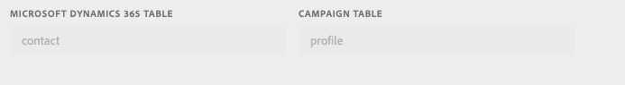

# Sincronizar dados

Você pode sincronizar tabelas do Microsoft Dynamics 365 para métricas de marketing do Campaign e do Campaign para o Microsoft Dynamics 365. A sincronização é executada por meio de três workflows técnicos dedicados: **[!UICONTROL Microsoft Dynamics 365 to Campaign]**, **[!UICONTROL Campaign to Microsoft Dynamics 365]**, **[!UICONTROL Opt-In/Out]**. Consulte esta seção para [saber mais](../../integrating/using/d365-acs-self-service-app-workflows.md).

>[!IMPORTANT]
>Você precisa interromper/iniciar o workflow **[!UICONTROL Microsoft Dynamics 365 to Campaign]** para que suas alterações sejam levadas em conta. [Saiba mais](../../integrating/using/d365-acs-self-service-app-workflows.md)

## Mapear tabelas do Microsoft Dynamics 365 para o Campaign

A página **[!UICONTROL Microsoft Dynamics 365 to Campaign]** mostra uma lista de entidades no Microsoft Dynamics 365 e os recursos personalizados no Adobe Campaign com os quais serão sincronizados. Você pode adicionar novos mapeamentos, editar ou excluir os mapeamentos existentes.

Esta é uma descrição de cada uma das colunas nesta tabela:

* **[!UICONTROL MICROSOFT DYNAMICS 365 TABLE]**: esta coluna identifica qual entidade no Microsoft Dynamics 365 será a fonte de dados para o mapeamento.

* **[!UICONTROL CAMPAIGN TABLE]**: esta coluna identifica qual recurso no Adobe Campaign será o destino dos dados para o mapeamento.

* **[!UICONTROL ACTIONS]**: as ações possíveis são listadas abaixo:

   * Clique no ícone **[!UICONTROL Edit]** para editar esse mapeamento.

   * Use o ícone **[!UICONTROL Delete]** para excluir um mapeamento de tabela.

   * Clique no ícone **[!UICONTROL Replay Data]** para sincronizar novamente todos os dados na tabela do Microsoft Dynamics 365. Normalmente, o aplicativo de integração sincronizará apenas os dados no Microsoft Dynamics 365 que foram alterados recentemente.  No entanto, em alguns casos (por exemplo, você fez uma alteração ou cometeu um erro), talvez você queira que todos os dados sejam sincronizados novamente.  Nesses casos, você clicaria nesse botão e, na próxima vez que interromper/iniciar o workflow **[!UICONTROL Microsoft Dynamics 365 to Campaign]**, seus dados começariam a sincronizar.

      Se clicar no botão **[!UICONTROL Replay Data]** e as verificações forem bem-sucedidas, o ícone será desativado: indica que os dados desse par de mapeamento de tabela serão sincronizados novamente com a próxima execução do workflow **[!UICONTROL Microsoft Dynamics 365 to Campaign]**.

      Não é possível optar por reproduzir os dados quando o seguinte for verdadeiro:

      * Se houver 2.000.000 (ou mais) itens na métrica Backlog associada ao workflow **[!UICONTROL Microsoft Dynamics 365 to Campaign]** (exibido na página **[!UICONTROL Workflows]**)
      * Se houver 2.000.000 ou mais registros na Tabela do Microsoft Dynamics 365

      O número de registros que precisam ser sincronizados novamente varia. Se você tiver um grande número de registros, pode levar algum tempo para concluir o processo de sincronização. Consulte a métrica **[!UICONTROL Backlog]** na página **[!UICONTROL Workflows]** conforme o aplicativo de integração funciona para concluir o processo de sincronização.

      >[!IMPORTANT]
      >
      > É altamente recomendável interromper o fluxo de trabalho de integração ao publicar alterações no Adobe Campaign Standard ou no Microsoft Dynamics 365. As alterações aplicáveis incluem: atualizações em recursos/entidades (e seus campos associados), links, colunas de identificador etc. que estão sendo usadas atualmente pela integração.

## Criar um novo mapeamento {#add-a-new-mapping}

Para criar um novo mapeamento, siga as etapas abaixo:

1. na página **[!UICONTROL Microsoft Dynamics 365 to Campaign]** , clique no botão **[!UICONTROL Add New Mapping]**.

1. Use as listas suspensas para selecionar as tabelas do Microsoft Dynamics 365 e do Campaign para mapear.
A maioria das outras entradas na página dependerá das tabelas escolhidas.

   

   >[!NOTE]
   >Não é possível mapear cada tabela mais de uma vez. Portanto, você observará que as seleções suspensas não incluirão tabelas que já foram mapeadas.

1. Clique em **[!UICONTROL OK]** para confirmar: o aplicativo precisará de um breve momento para ler nas informações de campo associadas às tabelas selecionadas.

Em seguida, você pode continuar com a configuração de mapeamento. [Saiba mais](#new-mapping-settings)

>[!IMPORTANT]
>
>Você só pode escolher as tabelas desta página quando adicionar o mapeamento pela primeira vez. Certifique-se de ter selecionado as tabelas corretas antes de clicar no botão **[!UICONTROL Save]** : depois de salvos, os campos de seleção da tabela serão **somente leitura**.

### Editar um mapeamento existente

Se você editar um mapeamento existente, verá que as seleções de tabela não são editáveis.

Isso ocorre por design, pois as entradas mais abaixo na página são baseadas nos campos associados a essas tabelas. Alterar as tabelas tornaria todos os campos associados a essas tabelas inválidos.  Se desejar alterar a tabela para a qual mapear, será necessário retornar à página anterior, excluir o mapeamento que deseja alterar e adicionar um novo mapeamento.

### Configurar um mapeamento de tabela individual {#new-mapping-settings}

Nesta seção, você aprenderá a configurar um mapeamento **único** de uma tabela do Microsoft Dynamics 365 para uma tabela do Adobe Campaign.

Você pode definir as seguintes configurações:

* **[!UICONTROL Tables]**: esta seção lista o nome da tabela do Microsoft Dynamics 365 e a tabela do Campaign para a qual ela será mapeada.
* **[!UICONTROL Field Mappings]**: saiba mais  [nesta seção](#field-mappings)
* **[!UICONTROL Field Replacements]**: saiba mais  [nesta seção](#field-replacements)
* **[!UICONTROL Filters]**: saiba mais  [nesta seção](#filters)
* **[!UICONTROL Advanced Settings]**: saiba mais  [nesta seção](#advanced-settings)

### Mapeamentos de campo {#field-mappings}

#### Chaves primárias

Ao adicionar um novo Microsoft Dynamics 365 ao mapeamento de tabela do Campaign, é necessário identificar o campo de ID.

A chave primária do Microsoft Dynamics 365 é somente leitura porque o aplicativo a detectará.

Para o Campaign, é necessário selecionar qual campo será a chave exclusiva. Ele deve ser configurado como um [CRM ID custom resource](../../developing/using/uc-calling-resource-id-key.md) e não deve ter duplicatas.

>[!NOTE]
>
>Você só poderá escolher o campo ID na tabela quando selecionar **[!UICONTROL Add New Mapping]**. Se você clicar no botão Editar para editar um mapeamento de tabela existente, o campo ID será somente leitura.

As chaves primárias sempre serão os primeiros nomes de campo listados na seção **[!UICONTROL Field Mappings]**. Como lembrete, o ícone a seguir é listado à direita para lembrá-lo de que essas são as chaves primárias.

#### Adicionar outros mapeamentos de campo

A seção **[!UICONTROL Field Mappings]** permite adicionar mapeamentos de campo diferentes das Chaves primárias. Para adicionar um novo mapeamento de um campo do Microsoft Dynamics 365 para Adobe Campaign, clique no botão **[!UICONTROL Add new field mapping]**.

Selecione Microsoft Dynamics 365 e Campaign fields nas listas:

Essas listas contêm os nomes de campos associados às tabelas do Microsoft Dynamics 365 e do Campaign que você selecionou na parte superior da página.

O alternador **[!UICONTROL Apply updates]** permite controlar se as atualizações nesse campo serão propagadas do Microsoft Dynamics 365 para o Campaign:
* Se estiver ativado , as atualizações para os valores no Microsoft Dynamics 365 serão propagadas para o Adobe Campaign à medida que as atualizações ocorrerem.

* Se você desativar , o valor será propagado quando os dados forem carregados inicialmente (ou repetidos), mas as atualizações incrementais no campo no Microsoft Dynamics 365 não serão propagadas.

>[!NOTE]
>
>Clique no cabeçalho da coluna **[!UICONTROL Apply updates]** para atualizar **todos** dos switches para ligado ou desligado.

Ao selecionar valores de campo, você verá o tipo de dados exibido abaixo dos menus suspensos.   Isso é algo que deve ser lembrado ao mapear valores de um campo para outro.

>[!NOTE]
>
> Não é possível mapear vários campos do Microsoft Dynamics 365 para um único campo do Campaign.

### Substituições de campo {#field-replacements}

Use o botão **[!UICONTROL Add New Field Replacement]** para definir uma nova substituição de campo.

As substituições de campo permitem identificar:

* um nome de campo do Microsoft Dynamics 365 (que foi adicionado acima na seção mapeamentos de campo),
* um valor existente (que existe no Microsoft Dynamics 365), e
* um novo valor para gravar no Adobe Campaign

Uma lista suspensa será fornecida para valores de lista de opções, enumeração e booleano. Uma caixa de texto será usada para outros tipos de sequência e numéricos.

### Filtros {#filters}

Use o botão **[!UICONTROL Add New Filter]** para selecionar quais registros do Microsoft Dynamics 365 serão propagados para o Campaign. É possível escolher qualquer campo associado a um registro para adicionar aos filtros (o nome do campo não precisa ser adicionado aos mapeamentos de campo).

Você especifica um filtro preenchendo as seguintes informações:

* Nome do campo do Microsoft Dynamics 365
* um valor comparativo, e
* um valor (do Microsoft Dynamics 365)
Se o nome, a comparação e o valor do campo forem avaliados como true para um determinado registro, o registro será propagado para o Adobe Campaign.

Você pode escolher como esses filtros são avaliados definindo a entrada denominada **[!UICONTROL Choose the filter comparison operator]**.  Se você escolher **And**, todos os filtros devem ser verdadeiros para que um registro seja propagado para o Campaign. Se você escolher **Or**, o registro será propagado se qualquer um deles for avaliado como verdadeiro.

A opção **[!UICONTROL Do you want to delete records in Adobe Campaign Standard that will be filtered out from Microsoft Dynamics 365?]** controla se você deseja que os registros que foram filtrados sejam excluídos do Campaign. Se você selecionar **No**, os registros permanecerão no Adobe Campaign. Selecione **Yes** para excluí-los pela lógica de integração.

>[!NOTE]
>
> Se nenhum filtro for adicionado, todos os registros que foram modificados serão propagados para o Adobe Campaign.

### Configurações avançadas {#advanced-settings}

Você pode configurar as seguintes opções adicionais ao configurar um mapeamento:

* Defina a opção **[!UICONTROL Apply deletes in Microsoft Dynamics 365 to Campaign?]** como **Yes**, se desejar propagar exclusões que ocorram no Microsoft Dynamics 365 para o campo correspondente no Adobe Campaign (com base no mapeamento do nome do campo). Selecione **No** para ignorar exclusões no Microsoft Dynamics 365.

* Defina a opção **[!UICONTROL Use technical values in Microsoft Dynamics 365 picklists?]** como **Não** se desejar propagar para o Campaign o valor de exibição associado a uma lista de opções do Microsoft Dynamics 365. Selecione **Yes** para propagar o valor técnico.

## Sincronizar eventos de marketing do Campaign com o Microsoft Dynamics 365

A página **[!UICONTROL Campaign to Microsoft Dynamics 365]** permite identificar quais eventos de marketing por email serão mapeados do Adobe Campaign para o Microsoft Dynamics 365.

As quatro métricas que você pode controlar são: **Envia**, **Cliques**, **Aberturas** e **Devoluções**.

Selecione **Yes** para confirmar que deseja que os eventos desse tipo fluam para o Microsoft Dynamics 365.

Clique [aqui](../../integrating/using/d365-acs-self-service-app-workflows.md) para obter mais informações sobre esses fluxos de evento de email.

## Fluxo de trabalho de aceitação/rejeição {#opt-in-out-wf}

O workflow **Opt-In/Out** permite identificar o fluxo das informações de aceitação/rejeição entre o Microsoft Dynamics 365 e o Adobe Campaign. Isso pressupõe que os dados estejam associados à entidade &quot;contato&quot; do Microsoft Dynamics 365 e ao &quot;perfil&quot; do recurso do Adobe Campaign.

Saiba mais sobre o gerenciamento de recusa em [esta seção](../../integrating/using/d365-acs-notices-and-recommendations.md#opt-out).

Lembre-se de que é necessário clicar em &quot;Salvar&quot; para salvar suas seleções. Lembre-se também de que você deve interromper o fluxo de trabalho **Campaign to Microsoft Dynamics 365** e, em seguida, clicar em play para a integração incorporar suas alterações.

### Direcionamento de sincronização de aceitação/rejeição

Abaixo está a lista de opções disponíveis para sincronizar dados:

* **[!UICONTROL Disabled]**: quando essa opção é selecionada, nenhuma informação de aceitação/rejeição será movida entre o Adobe Campaign e o Microsoft Dynamics 365.

* **[!UICONTROL Unidirectional (Microsoft Dynamics 365 to Campaign)]**: essa opção é usada para continuar a aceitação/rejeição do Microsoft Dynamics 365 somente para o Adobe Campaign. O aplicativo de integração não permitirá configurar o fluxo nesta tela; em vez disso, clique em **[!UICONTROL Save button]** e navegue até o workflow **[!UICONTROL Microsoft Dynamics 365 to Campaign]**. Nesse fluxo de trabalho, você pode editar o mapeamento da tabela de contatos/perfis para identificar como deseja que os campos de aceitação/rejeição sejam mapeados.

* **[!UICONTROL Unidirectional (Campaign to Microsoft Dynamics 365)]**: essa opção tornará visível a seção  **** Mapeamentos . Essas entradas permitirão definir quais campos do Adobe Campaign mapearão dados para quais campos no Microsoft Dynamics 365. Isso significa que se você atualizar manualmente um valor no Microsoft Dynamics 365, seu valor será substituído pelo valor do Adobe Campaign se ocorrer uma alteração.

* **[!UICONTROL Bidirectional]**: essa opção tornará visível a seção  **** Mapeamentos . Esses pares identificarão quais campos no Microsoft Dynamics 365 e no Adobe Campaign serão mapeados entre si. [Saiba mais](../../integrating/using/d365-acs-notices-and-recommendations.md).

### Mapeamentos

Esta seção só se aplica quando o campo de direção de sincronização de aceitação/rejeição está definido como **[!UICONTROL Unidirectional (Campaign to Microsoft Dynamics 365)]** ou **[!UICONTROL Bidirectional]**. Você pode definir quais campos no Microsoft Dynamics 365 mapeiam para quais entradas no Adobe Campaign.

Os nomes de campo do Microsoft Dynamics 365 incluem todos aqueles do tipo **boolean**.

Os nomes de campo do Adobe Campaign são um conjunto fixo de valores específicos para aceitação/rejeição. Os nomes de campo do Adobe Campaign são um conjunto fixo de valores específicos para aceitação/rejeição. **Não é possível alterar** o conjunto de valores desta lista.
