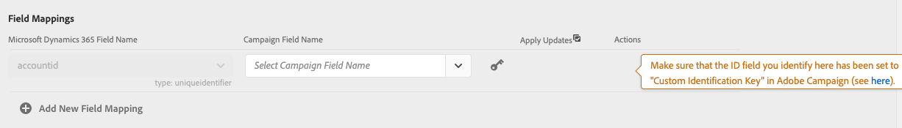

# Sincronizar dados

Você pode sincronizar tabelas do Microsoft Dynamics 365 com métricas de marketing de Campanha e Campanha para o Microsoft Dynamics 365. A sincronização é executada por meio de três workflows técnicos dedicados: **[!UICONTROL Microsoft Dynamics 365 to Campaign]**, **[!UICONTROL Campaign to Microsoft Dynamics 365]**, **[!UICONTROL Opt-In/Out]**. Consulte esta seção para [saber mais](../../integrating/using/d365-acs-self-service-app-workflows.md).

>[!IMPORTANT]
>É necessário parar/start o fluxo de trabalho **[!UICONTROL Microsoft Dynamics 365 to Campaign]** para que suas alterações sejam levadas em conta. [Saiba mais](../../integrating/using/d365-acs-self-service-app-workflows.md)

## Mapear tabelas do Microsoft Dynamics 365 para a Campanha

A página **[!UICONTROL Microsoft Dynamics 365 to Campaign]** mostra uma lista de entidades no Microsoft Dynamics 365 e os recursos personalizados no Adobe Campaign com os quais serão sincronizados. Você pode adicionar novos mapeamentos, editar ou excluir mapeamentos existentes.

Esta é uma descrição de cada uma das colunas desta tabela:

* **[!UICONTROL MICROSOFT DYNAMICS 365 TABLE]**: esta coluna identifica qual entidade no Microsoft Dynamics 365 será a fonte de dados para o mapeamento.

* **[!UICONTROL CAMPAIGN TABLE]**: essa coluna identifica qual recurso no Adobe Campaign será o destino dos dados para o mapeamento.

* **[!UICONTROL ACTIONS]**: as ações possíveis estão listadas abaixo:

   * Clique no ícone **[!UICONTROL Edit]** para editar esse mapeamento.

   * Use o ícone **[!UICONTROL Delete]** para excluir um mapeamento de tabela.

   * Clique no ícone **[!UICONTROL Replay Data]** para sincronizar novamente todos os dados na tabela do Microsoft Dynamics 365. Normalmente, o aplicativo de integração só sincronizará os dados no Microsoft Dynamics 365 que foram alterados recentemente.  No entanto, em alguns casos (por exemplo, você fez uma alteração ou cometeu um erro), talvez você queira que todos os dados sejam sincronizados novamente.  Nesses casos, você clicaria nesse botão e, na próxima vez que parar/start o fluxo de trabalho **[!UICONTROL Microsoft Dynamics 365 to Campaign]**, seus dados seriam start de sincronização.

      Se você clicar no botão **[!UICONTROL Replay Data]** e as verificações forem bem-sucedidas, o ícone será desativado: indica que os dados para este par de mapeamento de tabela serão sincronizados novamente com a próxima execução do fluxo de trabalho **[!UICONTROL Microsoft Dynamics 365 to Campaign]**.

      Não é possível optar por reproduzir os dados quando os seguintes forem verdadeiros:

      * Se houver 2.000.000 (ou mais) itens na métrica Backlog associada ao fluxo de trabalho **[!UICONTROL Microsoft Dynamics 365 to Campaign]** (exibido na página **[!UICONTROL Workflows]**)
      * Se houver 2.000.000 ou mais registros na Tabela do Microsoft Dynamics 365

      O número de registros que precisam ser sincronizados novamente varia. Se você tiver um grande número de registros, pode levar algum tempo para concluir o processo de sincronização. Consulte a métrica **[!UICONTROL Backlog]** na página **[!UICONTROL Workflows]** à medida que o aplicativo de integração funciona para concluir o processo de sincronização.

      >[!IMPORTANT]
      >
      > É altamente recomendável parar o fluxo de trabalho de integração ao publicar alterações no Adobe Campaign Standard ou no Microsoft Dynamics 365. As alterações aplicáveis incluem: atualizações de recursos/entidades (e seus campos associados), links, colunas de identificador etc. que estão sendo usados atualmente pela integração.

## Criar um novo mapeamento {#add-a-new-mapping}

Para criar um novo mapeamento, siga as etapas abaixo:

1. na página **[!UICONTROL Microsoft Dynamics 365 to Campaign]**, clique no botão **[!UICONTROL Add New Mapping]**.

1. Use as listas suspensas para selecionar as tabelas do Microsoft Dynamics 365 e Campanha a serem mapeadas.
A maioria das outras entradas na página dependerá das tabelas escolhidas.

   

   >[!NOTE]
   >Não é possível mapear cada tabela mais de uma vez. Portanto, você observará que as seleções suspensas não incluirão tabelas que já foram mapeadas.

1. Clique em **[!UICONTROL OK]** para confirmar: o aplicativo precisará de um breve momento para ler as informações de campo associadas às tabelas selecionadas.

Em seguida, você pode continuar com a configuração de mapeamento. [Saiba mais](#new-mapping-settings)

>[!IMPORTANT]
>
>Você só pode escolher as tabelas nesta página quando estiver adicionando o mapeamento pela primeira vez. Verifique se você selecionou as tabelas corretas antes de clicar no botão **[!UICONTROL Save]**: depois de salvos, os campos de seleção de tabela serão **somente leitura**.

### Editar um mapeamento existente

Se você editar um mapeamento existente, verá que as seleções de tabela não são editáveis.

Isso é feito por design, pois as entradas mais detalhadas na página são baseadas nos campos associados a essas tabelas. Alterar as tabelas tornaria todos os campos associados a essas tabelas inválidos.  Se desejar alterar a tabela para mapear, será necessário retornar à página anterior, excluir o mapeamento que deseja alterar e adicionar um novo mapeamento.

### Configurar um mapeamento de tabela individual {#new-mapping-settings}

Nesta seção, você aprenderá a configurar um mapeamento **single** de uma tabela do Microsoft Dynamics 365 para uma tabela do Adobe Campaign.

Você pode definir as seguintes configurações:

* **[!UICONTROL Tables]**: esta seção lista o nome da tabela do Microsoft Dynamics 365 e a tabela de Campanha para a qual ela será mapeada.
* **[!UICONTROL Field Mappings]**: saiba mais sobre  [esta seção](#field-mappings)
* **[!UICONTROL Field Replacements]**: saiba mais sobre  [esta seção](#field-replacements)
* **[!UICONTROL Filters]**: saiba mais sobre  [esta seção](#filters)
* **[!UICONTROL Advanced Settings]**: saiba mais sobre  [esta seção](#advanced-settings)

### Mapeamentos de campo {#field-mappings}

#### Chaves primárias

Ao adicionar um novo Microsoft Dynamics 365 ao mapeamento de tabela de Campanha, é necessário identificar o campo ID.

A chave primária do Microsoft Dynamics 365 é somente leitura porque o aplicativo a detectará.

Para a Campanha, é necessário selecionar qual campo será a chave exclusiva. Ele deve ser configurado como um [recurso personalizado de ID CRM](../../developing/using/uc-calling-resource-id-key.md) e não deve ter duplicados.

>[!NOTE]
>
>Você só poderá escolher o campo ID na tabela quando tiver selecionado **[!UICONTROL Add New Mapping]**. Se você clicar no botão Editar para editar um mapeamento de tabela existente, o campo ID será somente leitura.

As chaves primárias sempre serão os primeiros nomes de campo listados na seção **[!UICONTROL Field Mappings]**. Como lembrete, o ícone a seguir é listado à direita para lembrá-lo de que essas são as chaves primárias.

#### Adicionar outros mapeamentos de campo

A seção **[!UICONTROL Field Mappings]** permite que você adicione mapeamentos de campos diferentes das Chaves primárias. Para adicionar um novo mapeamento de um campo do Microsoft Dynamics 365 para Adobe Campaign, clique no botão **[!UICONTROL Add new field mapping]**.

Selecione os campos Microsoft Dynamics 365 e Campanha no lista:

Essas listas contêm os nomes dos campos associados ao Microsoft Dynamics 365 e às tabelas de Campanha que você selecionou na parte superior da página.

O alternador **[!UICONTROL Apply updates]** permite controlar se as atualizações neste campo serão propagadas do Microsoft Dynamics 365 para a Campanha:
* Se estiver ativado , as atualizações dos valores no Microsoft Dynamics 365 serão propagadas para a Adobe Campaign à medida que as atualizações ocorrerem.

* Se você desligar , o valor será propagado quando os dados forem carregados inicialmente (ou reproduzidos), mas as atualizações incrementais para o campo no Microsoft Dynamics 365 não serão propagadas.

>[!NOTE]
>
>Clique no cabeçalho da coluna **[!UICONTROL Apply updates]** para atualizar **all** dos comutadores para ligar ou desligar.

Quando você seleciona valores de campo, o tipo de dados é exibido abaixo dos menus suspensos.   Isso é algo que deve ser lembrado ao mapear valores de um campo para o outro.

>[!NOTE]
>
> Não é possível mapear vários campos do Microsoft Dynamics 365 para um único campo de Campanha.

### Substituições de campo {#field-replacements}

Use o botão **[!UICONTROL Add New Field Replacement]** para definir uma nova substituição de campo.

As substituições de campo permitem identificar:

* um nome de campo do Microsoft Dynamics 365 (que foi adicionado acima na seção mapeamentos de campos),
* um valor existente (que existe no Microsoft Dynamics 365) e
* um novo valor para gravar no Adobe Campaign

Uma lista suspensa será fornecida para valores de lista de opções, lista discriminada e booleano. Uma caixa de texto será usada para outros tipos de sequência de caracteres e numéricos.

### Filtros {#filters}

Use o botão **[!UICONTROL Add New Filter]** para selecionar quais registros do Microsoft Dynamics 365 serão propagados para a Campanha. Você pode escolher qualquer campo associado a um registro para adicionar aos filtros (o nome do campo não precisa ser adicionado aos mapeamentos de campo).

Especifique um filtro preenchendo as seguintes informações:

* Nome do campo do Microsoft Dynamics 365
* um valor de comparação, e
* um valor (do Microsoft Dynamics 365)
Se o nome do campo, a comparação e o valor forem avaliados como true para um determinado registro, o registro será propagado para a Adobe Campaign.

Você pode escolher como esses filtros são avaliados definindo a entrada chamada **[!UICONTROL Choose the filter comparison operator]**.  Se você escolher **E**, todos os filtros devem ser verdadeiros para que um registro seja propagado para a Campanha. Se você escolher **Or**, o registro será propagado se qualquer um deles for avaliado como true.

A opção **[!UICONTROL Do you want to delete records in Adobe Campaign Standard that will be filtered out from Microsoft Dynamics 365?]** controla se você deseja que os registros filtrados sejam excluídos da Campanha. Se você selecionar **Não**, os registros permanecerão no Adobe Campaign. Selecione **Yes** para que sejam excluídos pela lógica de integração.

>[!NOTE]
>
> Se nenhum filtros for adicionado, todos os registros que foram modificados serão propagados para o Adobe Campaign.

### Configurações avançadas {#advanced-settings}

Você pode configurar as seguintes opções adicionais ao configurar um mapeamento:

* Defina a opção **[!UICONTROL Apply deletes in Microsoft Dynamics 365 to Campaign?]** como **Yes**, se desejar propagar as exclusões que ocorrem no Microsoft Dynamics 365 para o campo correspondente no Adobe Campaign (com base no mapeamento do nome do campo). Selecione **Não** para ignorar exclusões no Microsoft Dynamics 365.

* Defina a opção **[!UICONTROL Use technical values in Microsoft Dynamics 365 picklists?]** como **Não** se desejar propagar para Campanha o valor de exibição associado a uma lista de opções do Microsoft Dynamics 365. Selecione **Yes** para propagar o valor técnico.

## Sincronizar eventos de marketing de Campanha com o Microsoft Dynamics 365

A página **[!UICONTROL Campaign to Microsoft Dynamics 365]** permite identificar quais eventos de marketing de email serão mapeados do Adobe Campaign para o Microsoft Dynamics 365.

As quatro métricas que você pode controlar são: **Envia**, **Cliques**, **Abre** e **Devoluções**.

Selecione **Yes** para confirmar que você deseja que eventos desse tipo fluam para o Microsoft Dynamics 365.

Clique [aqui](../../integrating/using/d365-acs-self-service-app-workflows.md) para obter mais informações sobre esses fluxos de evento de email.

## Fluxo de trabalho de opt in/sair {#opt-in-out-wf}

O fluxo de trabalho **Entrada/Saída** permite identificar o fluxo das informações de opt in/saída entre o Microsoft Dynamics 365 e o Adobe Campaign. Isso pressupõe que os dados estejam associados à entidade &quot;contato&quot; do Microsoft Dynamics 365 e ao &quot;perfil&quot; do recurso da Adobe Campaign.

Saiba mais sobre o gerenciamento de não participação em [esta seção](../../integrating/using/d365-acs-notices-and-recommendations.md#opt-out).

Lembre-se de que é necessário clicar em &quot;Salvar&quot; para salvar suas seleções. Lembre-se também de que você deve interromper a Campanha **para o fluxo de trabalho do Microsoft Dynamics 365** e clicar em Reproduzir para que a integração incorpore suas alterações.

### Direção de sincronização opt in/sair

Abaixo está a lista de opções disponíveis para sincronizar dados:

* **[!UICONTROL Disabled]**: quando essa opção é selecionada, nenhuma informação de opt in/saída será movida entre o Adobe Campaign e o Microsoft Dynamics 365.

* **[!UICONTROL Unidirectional (Microsoft Dynamics 365 to Campaign)]**: essa opção é usada para continuar a opção de não participação do Microsoft Dynamics 365 somente para o Adobe Campaign. O aplicativo de integração não permitirá que você configure o fluxo nesta tela; em vez disso, clique em **[!UICONTROL Save button]** e navegue até o fluxo de trabalho **[!UICONTROL Microsoft Dynamics 365 to Campaign]**. Neste fluxo de trabalho, você pode editar o mapeamento da tabela de contatos/perfis para identificar como deseja que os campos de aceitação/não participação sejam mapeados.

* **[!UICONTROL Unidirectional (Campaign to Microsoft Dynamics 365)]**: essa opção tornará visível a seção  **** Mapeamentos. Essas entradas permitirão definir quais campos do Adobe Campaign mapearão dados para quais campos no Microsoft Dynamics 365. Isso significa que, se você atualizar manualmente um valor no Microsoft Dynamics 365, esse valor será substituído pelo valor da Adobe Campaign se ocorrer uma alteração.

* **[!UICONTROL Bidirectional]**: essa opção tornará visível a seção  **** Mapeamentos. Esses pares identificarão quais campos no Microsoft Dynamics 365 e Adobe Campaign serão mapeados entre si. [Saiba mais](../../integrating/using/d365-acs-notices-and-recommendations.md).

### Mapeamentos

Esta seção só se aplica quando o campo de direção de sincronização de aceitação/não participação estiver definido como **[!UICONTROL Unidirectional (Campaign to Microsoft Dynamics 365)]** ou **[!UICONTROL Bidirectional]**. Você pode definir quais campos no Microsoft Dynamics 365 mapeiam para quais entradas no Adobe Campaign.

Os nomes de campo do Microsoft Dynamics 365 incluem todos aqueles do tipo **boolean**.

Os nomes de campos do Adobe Campaign são um conjunto fixo de valores específicos para aceitação/não participação. Os nomes de campos do Adobe Campaign são um conjunto fixo de valores específicos para aceitação/não participação. **Não é possível alterar** o conjunto de valores desta lista.
