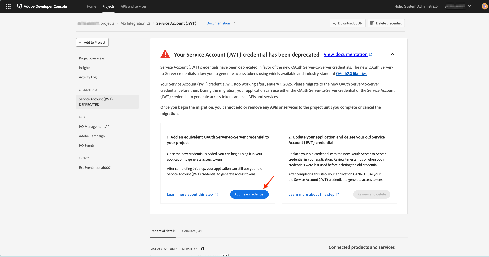
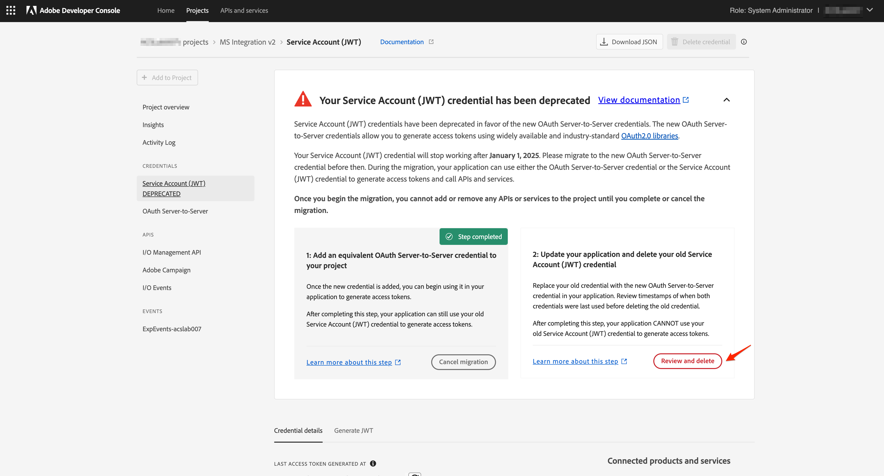

# Migrar credenciais de JWT para servidor para servidor OAuth

A credencial da conta de serviço (JWT) foi substituída pela nova credencial OAuth de servidor para servidor. A nova credencial facilita a manutenção de aplicativos Adobe. Também elimina a necessidade de girar certificados periodicamente e funciona imediatamente usando bibliotecas OAuth2 padrão.

Embora as credenciais da Conta de serviço (JWT) tenham sido marcadas como obsoletas, elas continuarão a funcionar até 1º de janeiro de 2025. Portanto, você deve migrar sua integração para usar a nova credencial OAuth de servidor para servidor antes de 1º de janeiro de 2025. Verifique as [linhas do tempo de descontinuação](https://developer.adobe.com/developer-console/docs/guides/authentication/ServerToServerAuthentication/migration/#deperecation-timelines) para obter mais informações

## Etapas para migrar credenciais do JWT para o servidor do OAuth

A migração para a credencial de servidor para servidor do OAuth é um processo simples que permite uma migração sem tempo de inatividade para o seu aplicativo. Você pode seguir as etapas abaixo para migrar as credenciais.

1. Faça logon no [Adobe Developer Console](https://developer.adobe.com/console)
2. No menu de filtragem no lado esquerdo, selecione a opção Tem credencial de conta de serviço (JWT). Dessa forma, o exibe todos os projetos que têm uma credencial de conta de serviço (JWT). Na lista de projetos, clique no projeto que você pretende migrar.

   

3. Abra a guia Credencial de conta de serviço (JWT) no lado esquerdo da navegação e visualize o cartão de migração. No cartão de migração, clique no botão **Adicionar nova credencial** para adicionar uma credencial OAuth de servidor para servidor equivalente. Adicionar uma credencial OAuth de servidor para servidor ao projeto iniciará a migração.
   
4. A nova credencial **OAuth Server-to-Server** será adicionada à navegação à esquerda.
   * Clique em Cancelar migração se desejar cancelar a migração.
   * Não clique no botão Revisar e excluir até verificar se a nova credencial OAuth de servidor para servidor está funcionando.

     

5. Atualizar as credenciais no Microsoft Dynamics 365 para o aplicativo Adobe Campaign Standard
   * Faça logon no aplicativo de integração e navegue até a página Configurações.
   * Selecione OAuth como o tipo de autenticação.
   * Como a nova credencial OAuth de servidor para servidor usa as mesmas credenciais da antiga credencial de conta de serviço (JWT), a maioria dos campos já será preenchida.
   * Insira a ID do cliente e o segredo do cliente. Essas aplicações podem ser encontradas no projeto no Adobe Developer Console.
   * Clique em Salvar para salvar as configurações.

     

6. Verifique se as novas credenciais estão funcionando
   * Faça logon no aplicativo de integração e navegue até a página Fluxos de trabalho.
   * Interromper os workflows ativos. Aguarde até que os workflows sejam interrompidos.
   * Inicie os workflows. Aguarde até que os workflows estejam no estado RUNNING.
   * Monitore os workflows por alguns minutos para garantir que eles estejam funcionando corretamente. Você também pode verificar os dados no Adobe Campaign Standard e no Microsoft Dynamics 365 para garantir que os dados estejam sendo sincronizados corretamente.

7. Excluir a credencial JWT para concluir a migração
   * Faça logon no [Adobe Developer Console](https://developer.adobe.com/console)
   * Clique nos projetos e selecione o projeto migrado.
   * Clique na guia Credencial de conta de serviço (JWT) no lado esquerdo da navegação.
   * Clique no botão Revisar e Excluir.

     
   * Revise o carimbo de data e hora do último acesso ou do último menu usado para verificar se o aplicativo de integração está gerando tokens de acesso usando a nova credencial OAuth ou ainda usando a credencial JWT antiga.

     
   * Depois de verificar que o aplicativo de integração está usando a nova credencial OAuth e não está mais usando a credencial JWT, prossiga para a exclusão da credencial antiga clicando no botão **Confirmar e continuar** e conclua a migração.

     
