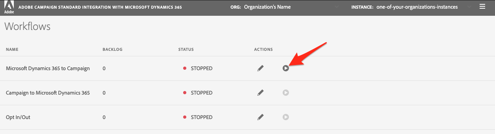

# Introdução ao aplicativo de integração de autoatendimento {#gs-self-service-app}

A integração do Adobe Campaign Standard com o aplicativo de integração de autoatendimento do Microsoft Dynamics 365 oferece a capacidade de configurar fluxos de dados, controlar se eles estão ou não em execução e em qual ambiente. No entanto, você deve concluir alguns pré-requisitos antes de começar a usar o aplicativo de integração de autoatendimento.

## Conceitos e restrições {#concepts-and-restrictions}

Antes de começar com a ferramenta de integração, é necessário compreender os conceitos e as medidas de proteção associadas à integração e realizar algumas etapas iniciais para obter acesso.

Saiba mais nestas seções:

* [Introdução à integração com o Microsoft Dynamics 365](../../integrating/using/d365-acs-get-started.md)
* [Práticas recomendadas e limitações da integração](../../integrating/using/d365-acs-notices-and-recommendations.md)
* [Saiba mais sobre as principais etapas para implementar esta integração](../../integrating/using/d365-acs-get-started.md#request-and-implement-this-integration)
* [Usar a integração com o Microsoft Dynamics 365](../../integrating/using/d365-acs-using-the-integration.md)

## Pré-requisitos {#self-service-app-prerequisites}

Você precisa configurar o Microsoft Dynamics 365 e o Adobe Campaign Standard para que o aplicativo de integração tenha acesso aos seus dados. Isso levará algum tempo para ser configurado no Dynamics 365, Adobe Campaign Standard e Adobe I/O; no entanto, uma vez configuradas, você poderá controlar a integração por meio da interface do usuário do aplicativo de integração de autoatendimento.

Saiba mais nestas seções:

* [Configurar o Microsoft Dynamics 365 para integração com o Campaign](../../integrating/using/d365-acs-configure-d365.md)
* [Configurar o Adobe I/O](../../integrating/using/d365-acs-configure-adobe-io.md)
* [Mapear recursos personalizados do Campaign e entidades personalizadas do Microsoft Dynamics 365](../../integrating/using/d365-acs-notices-and-recommendations.md)

## Etapas principais para configurar o aplicativo de integração de autoatendimento {#self-service-app-configuration-steps}

Em seguida, você pode começar com a ferramenta de integração. Siga as etapas abaixo:

1. [Obter acesso ao aplicativo de integração](../../integrating/using/d365-acs-self-service-app-control-access.md)
1. [Configurar o aplicativo de integração para uso](../../integrating/using/d365-acs-self-service-app-settings.md)
1. [Implementar a sincronização de dados](../../integrating/using/d365-acs-self-service-app-data-sync.md)
1. [Configurar workflows de sincronização](../../integrating/using/d365-acs-self-service-app-workflows.md)

## Link para o aplicativo de integração {#self-service-app-link}

Abra um navegador e navegue até o conector associado à sua região:

* [Pacífico Asiático](https://d365-acs-ap.ea.adobe.com/)
* [Europa, Oriente Médio ou África (EMEA)](https://d365-acs-em.ea.adobe.com/)
* [Américas](https://d365-acs-am.ea.adobe.com/)

## Confirmação de solicitação de privacidade {#self-service-app-acknowledgement}

Ao navegar pela primeira vez na interface de usuário de autoatendimento, você receberá a confirmação de privacidade. Você precisa reconhecer que entende sua função na execução de solicitações de privacidade no Campaign e no Microsoft Dynamics 365 separadamente antes de continuar.
Saiba mais sobre suas responsabilidades de privacidade e sobre como gerenciar solicitações de privacidade em [esta seção](../../integrating/using/d365-acs-notices-and-recommendations.md#acs-msdyn-manage-privacy).

## Configurar suas credenciais {#self-service-app-credentials}

Ao navegar pela primeira vez na interface do usuário, você deve ver uma página com um cabeçalho que se pareça com o seguinte:

>[!NOTE]
>
> É normal receber alertas que mencionam que é &quot;não é possível se conectar&quot; ao Adobe Campaign Standard ou ao Microsoft Dynamics 365 se as configurações do aplicativo ainda não foram definidas.

Verifique se as seleções &quot;ORG&quot; e &quot;INSTANCE&quot; são as que você planeja configurar.  Caso contrário, clique na lista suspensa e selecione a organização e a instância corretas.

>[!IMPORTANT]
>
> Se você estiver configurando o conector pela primeira vez e/ou for novo nesse processo, então **strong** incentivamos você a selecionar a instância &quot;stage&quot; ou &quot;dev&quot;. Certifique-se de verificar se a configuração funciona bem antes de tentar a configuração na produção.

Se tiver a organização e a instância corretas, clique no menu &quot;hamburger&quot; para expor um menu suspenso. Em seguida, clique em **[!UICONTROL Settings...]** no menu suspenso para visitar a página onde você insere suas credenciais para o Microsoft Dynamics 365 e Campaign (veja abaixo).

Na página **[!UICONTROL Settings]**, preencha as seguintes seções:

* Credenciais do Microsoft Dynamics 365
* Credenciais do Adobe

Vá [aqui](../../integrating/using/d365-acs-self-service-app-settings.md) para encontrar informações mais detalhadas sobre onde encontrar as informações para cada entrada. Quando terminar, clique no botão **[!UICONTROL Save]** na parte inferior.

## Verifique a configuração inicial {#self-service-app-initial-config}

Supondo que você tenha completado os pré-requisitos acima e adicionado corretamente todas as suas credenciais, agora vamos navegar para a página **[!UICONTROL Workflows]**. Saiba mais sobre os workflows do aplicativo de integração em [this page](../../integrating/using/d365-acs-self-service-app-workflows.md).

Na página **[!UICONTROL Workflows]** , clique no ícone de lápis associado ao workflow **[!UICONTROL Microsoft Dynamics 365 to Campaign]** para editar sua configuração.

Na página **[!UICONTROL Microsoft Dynamics 365 to Campaign]**, é possível acessar a lista dos mapeamentos de tabela configurados.  O padrão será um contato/mapeamento de perfil pronto para uso. Todas as outras entidades personalizadas precisarão ser configuradas separadamente.

Na página **[!UICONTROL Edit Table Mapping]**, marque a seção **[!UICONTROL Mappings]** para garantir que os campos do Microsoft Dynamics 365 estejam sendo mapeados para o campo correto no Campaign. Se precisar adicionar outros mapeamentos, faça isso agora, bem como quaisquer substituições ou filtros. [Saiba mais](../../integrating/using/d365-acs-self-service-app-data-sync.md).

Se quiser adicionar novos mapeamentos, consulte [esta seção](../../integrating/using/d365-acs-self-service-app-data-sync.md#add-a-new-mapping) para obter mais informações.

Quando a configuração estiver correta, clique no botão **[!UICONTROL Play]** ao lado do workflow **[!UICONTROL Microsoft Dynamics 365 to Campaign]** para iniciar a integração e o fluxo de dados.

>[!IMPORTANT]
>
>Recomendamos que você execute isso primeiro em seus ambientes Stage ou Dev antes de executar em Produção. **** Verifique se a instância stage/dev está selecionada no cabeçalho.

Depois de executado, você deve ser capaz de testar adicionando ou modificando entradas no Microsoft Dynamics 365 e observando essas alterações no Adobe Campaign em alguns minutos. Se, a qualquer momento, precisar interromper esse processo, pressione o mesmo botão para interrompê-lo. [Saiba mais](../../integrating/using/d365-acs-self-service-app-workflows.md#workflow-status)

## Espaço de trabalho do aplicativo de integração {#self-service-app-workspace}

### Cabeçalho do aplicativo {#app-header}

O cabeçalho no aplicativo de autoatendimento permite definir qual organização e instância você está visualizando e/ou configurando no momento.

Selecione o **ORG** e o **INSTANCE** que deseja exibir/editar. Esses campos aparecem somente leitura, no entanto, tornam-se editáveis quando você coloca o cursor do mouse sobre eles.

Um menu suspenso será exibido ao clicar no botão com as três linhas horizontais  no lado direito do cabeçalho.

As entradas no menu suspenso são:

* **Configurações**: Selecionar essa opção enviará você para uma tela que permite especificar credenciais da API para o Microsoft Dynamics 365 e Adobe Campaign, bem como outras configurações gerais para o aplicativo.

* **Documentação**: Essa opção é um link para a Documentação do Adobe Campaign específico para essa integração

* **Atendimento** ao cliente: Este é um link para a documentação do Experience Cloud relacionada à abertura de um ticket do Atendimento ao cliente

* **Fazer logoff**: Isso permitirá que você saia do aplicativo e faça logon novamente como outro usuário.

* **Sobre**: Isso exibe uma caixa de diálogo que contém informações sobre o aplicativo, incluindo informações de direitos autorais.

### Caminhos de navegação {#app-breadcrumbs}

As navegações estruturais são exibidas na parte superior de algumas telas à medida que você navega pelo aplicativo.

**Exemplo:**

Abaixo está um exemplo da tela **[!UICONTROL Edit Table Mapping]** que mostra a navegação estrutural e o título da página. Nesse caso, você pode clicar no texto **[!UICONTROL Workflows]** ou **[!UICONTROL Microsoft Dynamics 365 to Campaign]** para ir para uma das telas anteriores. **[!UICONTROL Edit Table Mapping]** neste caso, a navegação estrutural não é clicável porque é a tela atual.

### Botões comuns {#app-buttons}

Os ícones a seguir são usados em várias páginas no aplicativo de autoatendimento.

 - Adicione um novo item a uma lista.

 - Editar algo que já existe

 - Excluir um item de uma lista de itens
