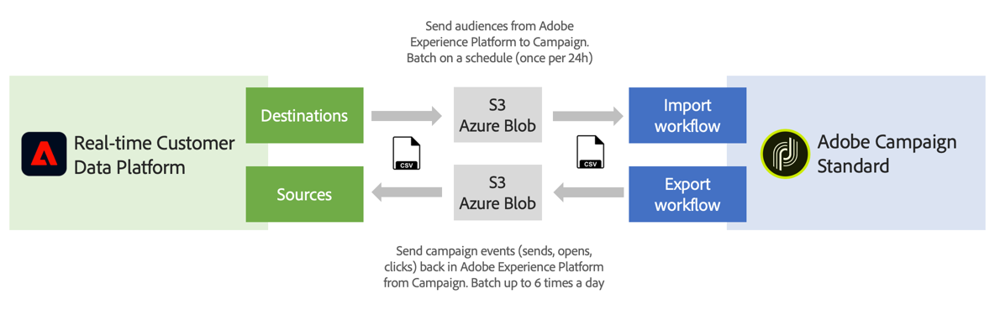

# Introdução a origens e destinos {#rtcdp}

## Sobre origens e destinos

Com a Adobe Experience Platform, você pode compartilhar dados entre a Campaign Standard e a Plataforma de dados do cliente em tempo real (RTCDP) da Adobe. Isso permite direcionar os públicos-alvos da Adobe Experience Platform nos workflows do Campaign e enviar de volta para a Plataforma de dados do cliente em tempo real da Adobe relacionados a esses públicos-alvos, como envios, aberturas e cliques.

* Com **Destinos**, assimile públicos do Adobe Experience Platform na Campaign Standard. Isso permite ativar os dados conhecidos e desconhecidos para suas campanhas de marketing.
* Com **Fontes**, exporte dados do Campaign Standard (por exemplo, envios, aberturas e cliques) para o Adobe Experience Platform. Isso permite centralizar os dados coletados de origens diferentes em um único local e usar os insights obtidos com eles para fazer mais.

>[!IMPORTANT]
>
>Lembre-se dos limites de armazenamento SFTP, armazenamento do banco de dados e perfil ativo conforme o contrato do Adobe Campaign ao fazer essa integração.

Para obter uma visão geral mais detalhada da Plataforma de dados do cliente em tempo real da Adobe, Origens e Fontes, consulte estas páginas:

* [Adobe Real-time Customer Data Platform](https://experienceleague.adobe.com/docs/experience-platform/rtcdp/overview.html?lang=pt-BR)
* [Documentação de destinos](https://experienceleague.adobe.com/docs/experience-platform/destinations/home.html?lang=pt-BR)
* [Documentação de origens](https://experienceleague.adobe.com/docs/experience-platform/sources/home.html?lang=pt-BR)

## Conectar o Campaign Standard com o Adobe Experience Platform

Para compartilhar dados entre o Adobe Experience Platform e o Campaign Standard, primeiro é necessário conectar o Adobe Campaign como um **Destino** e conectar seu local de armazenamento de blobs do AWS S3 ou do Azure como um **Source** na Adobe Experience Platform.

Após configurar os conectores, é possível configurar uma importação ou exportação de dados para o Campaign Standard usando workflows.

Para obter mais detalhes sobre como configurar esses processos de importação e exportação, consulte estas seções:

* [Assimilar públicos-alvos da Adobe Experience Platform no Campaign](../../integrating/using/ingest-aep-data.md)
* [Exportar dados do Campaign para a Adobe Experience Platform](../../integrating/using/export-campaign-data.md)
