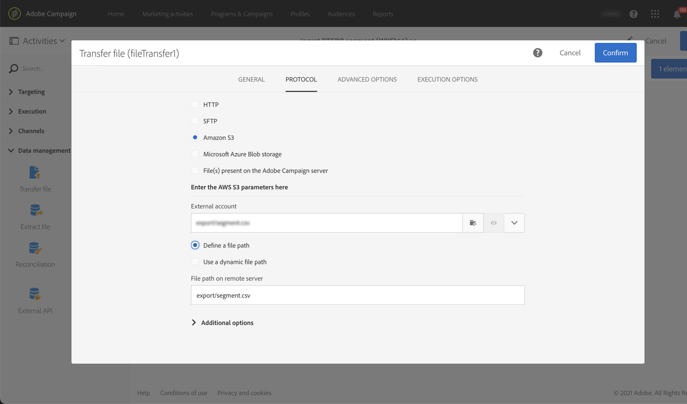
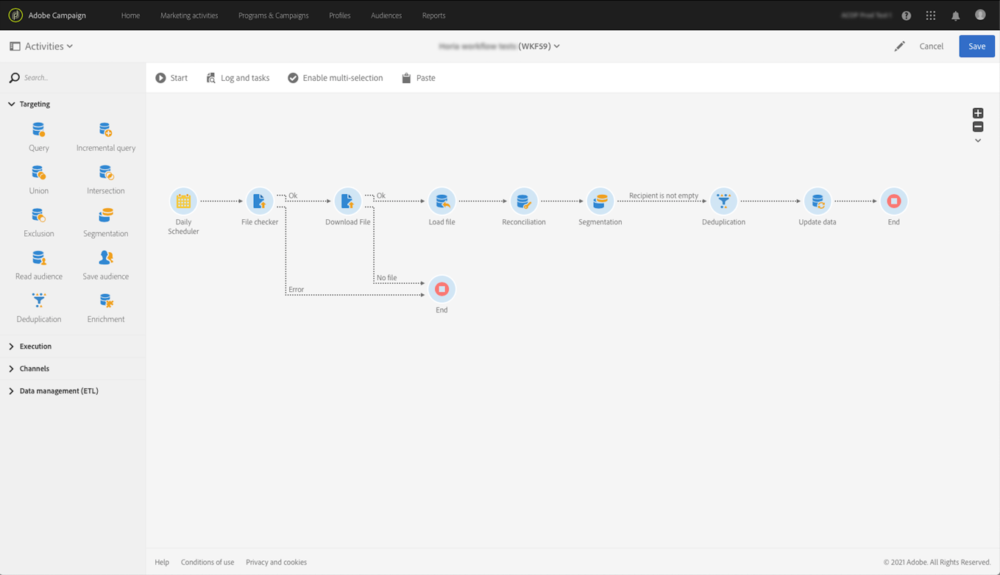

# Assimilar públicos-alvos da Adobe Experience Platform no Campaign {#destinations}

Para assimilar públicos-alvos da Adobe Experience Platform no Campaign e usá-los em seus workflows, primeiro é necessário conectar o Adobe Campaign como um **Destino** da Adobe Experience Platform e configurá-lo com o segmento a ser exportado.

Depois que o Destino for configurado, os dados serão exportados para o local de armazenamento e você precisará criar um fluxo de trabalho dedicado no Campaign Standard para assimilá-los.

## Conectar o Adobe Campaign como um destino

Na Adobe Experience Platform, configure uma conexão com o Adobe Campaign selecionando um local de armazenamento para os segmentos exportados. Essas etapas também permitem selecionar os segmentos a serem exportados e especificar campos XDM adicionais para inclusão.

Para obter mais informações, consulte a [Documentação de destinos](https://experienceleague.adobe.com/docs/experience-platform/destinations/catalog/email-marketing/adobe-campaign.html?lang=pt-BR).

Após o Destino ser configurado, a Adobe Experience Platform cria um arquivo .txt ou .csv delimitado por tabulação no local de armazenamento fornecido. Esta operação é agendada e executada uma vez a cada 24 horas.

Agora você pode configurar um fluxo de trabalho do Campaign Standard para assimilar o segmento no Campaign.

## Criar um fluxo de trabalho de importação no Campaign Standard

Depois que o Campaign Standard for configurado como um Destino, será necessário criar um fluxo de trabalho dedicado para importar o arquivo que foi exportado pelo Adobe Experience Platform.

Para fazer isso, é necessário adicionar e configurar uma atividade **[!UICONTROL Transfer file]**. Para obter mais informações sobre como configurar essa atividade, consulte [esta seção](../../automating/using/transfer-file.md).

Em seguida, você pode criar o fluxo de trabalho de acordo com suas necessidades (atualizar o banco de dados usando os dados do segmento, enviar entregas entre canais para o segmento etc.)

Como exemplo, o fluxo de trabalho abaixo faz o download do arquivo do local de armazenamento diariamente e atualiza o banco de dados do Campaign com os dados do segmento.

Exemplos de fluxos de trabalho de gerenciamento de dados estão disponíveis na seção [casos de uso de fluxos de trabalho](../../automating/using/about-workflow-use-cases.md#management).

Tópicos relacionados:

* [Atividades de gerenciamento de dados](../../automating/using/about-data-management-activities.md)
* [Sobre importação e exportação de dados](../../automating/using/about-data-import-and-export.md)
