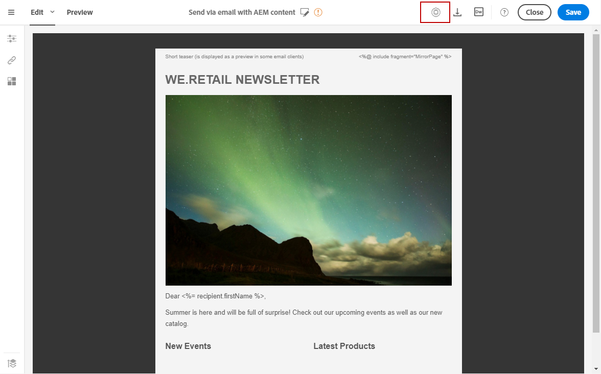

# Integrating with Experience Manager{#integrating-with-experience-manager}

Essa integração entre o Adobe Campaign Standard e o Adobe Experience Manager permite usar conteúdo criado no Adobe Experience Manager em seus emails do Adobe Campaign.

Portanto, você pode aproveitar ao máximo as funcionalidades de edição de conteúdo do Adobe Experience Manager, bem como as capacidades de gerenciamento de dados e entrega do Adobe Campaign.

>[!NOTE]
>
>Não é possível realizar testes A/B para conteúdo importado do Adobe Experience Manager.

O Adobe Campaign Standard é compatível com o Adobe Experience Manager 6.1, 6.2, 6.3 e 6.4. As seções a seguir apresentam uma visão geral das ações que você pode executar. For more information, refer to the sections dedicated to [configuration](https://helpx.adobe.com/experience-manager/6-4/sites/administering/using/campaignstandard.html) and the [use](https://helpx.adobe.com/experience-manager/6-4/sites/authoring/using/campaign.html) of the integration.

## Prerequisites {#prerequisites}

Certifique-se de ter os seguintes elementos antes:

* An Adobe Experience Manager **authoring** instance
* An Adobe Experience Manager **publishing** instance
* Uma instância do Adobe Campaign

## Use case {#use-case}

Para criar um conteúdo de email no Adobe Experience Manager:

1. Crie um conteúdo de email usando um modelo criado especificamente para o Adobe Campaign.
1. In the content properties, select the **[!UICONTROL Cloud Service]** corresponding to your Adobe Campaign instance.
1. Edite o conteúdo inserindo texto, imagens, personalização etc.
1. Valide o conteúdo.

For more information, refer to the [detailed documentation](https://docs.adobe.com/docs/en/aem/6-2/author/personalization/adobe-campaign/campaign.html).

Para recuperar o conteúdo no Adobe Campaign:

1. Crie um email com base no modelo de conteúdo do tipo Adobe Experience Manager.
1. Vincule um conteúdo criado com o Adobe Experience Manager usando a tela de definição de conteúdo de email do Adobe Campaign.

## Configuration {#configuration}

Para usar essas duas soluções juntas, você deve configurá-las para se conectarem uns com os outros.

1. Configurar o Adobe Campaign. Para fazer isso:

   * Configure uma conta externa do tipo Adobe Experience Manager.
   * Configure the **AEMResourceTypeFilter** option, which recognizes the content types created in Adobe Experience Manager for Adobe Campaign.
   * Crie um modelo de e-mail especificando que é o conteúdo do Adobe Experience Manager e vincule a conta externa criada anteriormente a este modelo.

1. Configure o Adobe Experience Manager. Para fazer isso:

   * Configure a replicação entre as instâncias de criação e publicação do Adobe Experience Manager.
   * Connect Adobe Experience Manager to Adobe Campaign by configuring a dedicated **[!UICONTROL Cloud Service]**.

