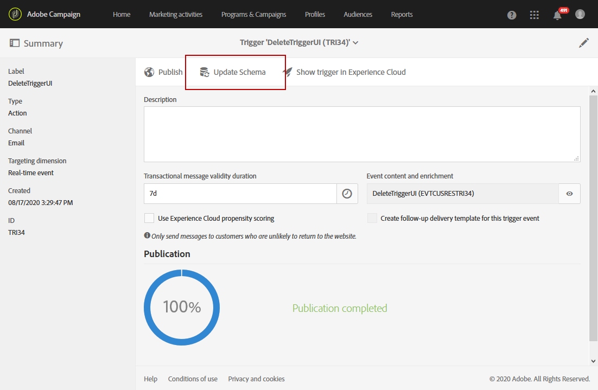

# Usar acionadores no Campaign{#using-triggers-in-campaign}

## Criação de um acionador mapeado no Campaign {#creating-a-mapped-trigger-in-campaign}

>[!NOTE]
>
>Para criar Acionadores, você precisará da função **[!UICONTROL Administration]** ou do grupo de segurança **[!UICONTROL Administrators]**. Para obter mais informações sobre essas operações, consulte esta [página](../../administration/using/list-of-roles.md).

É recomendável definir os comportamentos que deseja monitorar antecipadamente na Adobe Experience Cloud (serviço principal de **[!UICONTROL Triggers]**). Para obter mais informações, consulte a [documentação da Adobe Experience Cloud](https://docs.adobe.com/content/help/pt-BR/core-services/interface/activation/triggers.html). Observe que, ao definir o acionador, é necessário ativar os aliases. Para cada comportamento (navegação/abandono de formulário, adição/exclusão de produtos, sessão expirada etc.), um novo acionador deve ser adicionado na Adobe Experience Cloud.

Agora é necessário criar um evento de acionador no Adobe Campaign com base em um acionador existente da Adobe Experience Cloud.

Você pode assistir a este [vídeo](https://helpx.adobe.com/marketing-cloud/how-to/email-marketing.html#step-two) para ajudá-lo a entender como os acionadores são configurados no Adobe Campaign.

Estas são as etapas para colocar o acionador em prática:

1. Clique no logotipo **[!UICONTROL Adobe Campaign]**, no canto superior esquerdo, em seguida selecione **[!UICONTROL Marketing plans]** > **[!UICONTROL Transactional messages]** > **[!UICONTROL Experience Cloud Triggers]**.

   

1. Clique no botão **[!UICONTROL Create]**. O assistente de criação que é aberto exibe a lista de todos os acionadores definidos na Adobe Experience Cloud. A coluna **[!UICONTROL Fired by Analytics]** exibe o número de eventos enviados pelo acionador da Adobe Experience Cloud para o Campaign. Esse é o mapeamento de acionadores criados na interface da Experience Cloud.

   

1. Selecione o acionador da Adobe Experience Cloud que deseja usar e clique em **[!UICONTROL Next]**.
1. Configure as propriedades gerais do acionador. Nesta etapa do assistente, especifique também o canal e o targeting dimension a serem usados para o acionador (consulte [Targeting dimensions e recursos](../../automating/using/query.md#targeting-dimensions-and-resources)). Em seguida, confirme a criação do acionador.
1. Clique no botão à direita do campo **[!UICONTROL Event content and enrichment]** para visualizar o conteúdo do payload. Essa tela também permite enriquecer os dados do evento com os dados do perfil armazenados no banco de dados do Adobe Campaign. O enriquecimento é executado da mesma maneira que é executado para uma mensagem transacional padrão.

   

1. No campo **[!UICONTROL Transactional message validity duration]**, defina a duração para a qual a mensagem permanecerá válida após o evento ser enviado pelo Analytics. Se uma duração de 2 dias for definida, a mensagem não será mais enviada depois que essa duração tiver expirado. Se você colocar várias mensagens em espera, elas não serão enviadas se você retomá-las após um determinado período.

   

1. Agora você pode publicar seus acionadores. Para obter mais informações, consulte [Publicação de um acionador no Campaign](../../integrating/using/using-triggers-in-campaign.md#publishing-trigger-in-campaign).

## Publicar um acionador no Campaign {#publishing-trigger-in-campaign}

Depois de criar um evento de acionador no Adobe Campaign com base em um acionador Adobe Experience Cloud existente, agora é necessário publicá-lo.

1. No acionador criado anteriormente, clique no botão **[!UICONTROL Publish]** para iniciar a publicação do evento de acionador.

   

1. Você pode verificar o progresso da publicação do acionador em **[!UICONTROL Publication]**.

   

1. Quando a publicação for concluída, a seguinte mensagem aparecerá em **[!UICONTROL Publication]**.

   

1. Se precisar fazer uma alteração no esquema do acionador, mesmo depois de publicar o evento do acionador, clique no botão **[!UICONTROL Update schema]** para recuperar as alterações mais recentes.

   Observe que essa ação cancelará a publicação do acionador e a mensagem transacional. Você precisará publicá-los novamente depois.

   

1. Clique no botão **[!UICONTROL Show Trigger in Experience Cloud]** para exibir a definição do acionador no Adobe Experience Cloud.

Depois que o evento for publicado, um modelo transacional vinculado ao novo evento é criado automaticamente. Depois é necessário modificar e publicar o modelo que acabou de ser criado. Para obter mais informações, consulte a seção [Edição do modelo](../../start/using/marketing-activity-templates.md).

## Edição do modelo de mensagem transacional {#editing-the-transactional-message-template}

Depois de criar e publicar o evento de acionador, o modelo transacional correspondente é criado automaticamente. Para obter mais informações, consulte a seção [Criação de um acionador mapeado no Campaign](#creating-a-mapped-trigger-in-campaign).

Para que o evento acione o envio de uma mensagem transacional, é necessário personalizar o modelo, testá-lo e publicá-lo. Essas etapas são as mesmas de uma mensagem transacional padrão. Para obter mais informações, consulte a seção [Editing a transactional message](../../channels/using/editing-transactional-message.md) .

>[!NOTE]
>
>Se você cancelar a publicação do modelo, a publicação do evento de acionador será automaticamente cancelada.

Ao editar o conteúdo, você pode adicionar um campo de personalização com base nas informações enviadas pelo acionador do Analytics. Se você enriquecer os dados do evento com os dados de perfil do Adobe Campaign, será possível personalizar a mensagem com base nessas informações. Para personalizar a mensagem, selecione **[!UICONTROL Transactional event]** > **[!UICONTROL Event context]** e selecione um campo.

## Acesso aos relatórios {#accessing-the-reports}

Para exibir o relatório de acionador dedicado no Adobe Campaign, abra o evento de acionador, criado anteriormente, e clique em **[!UICONTROL Show trigger report]**.

O relatório mostra o número de eventos processados em comparação ao número de eventos enviados pelo Analytics. Ele também exibe uma lista de todos os acionadores recentes.

