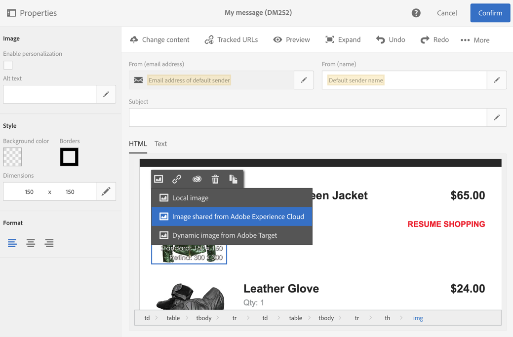
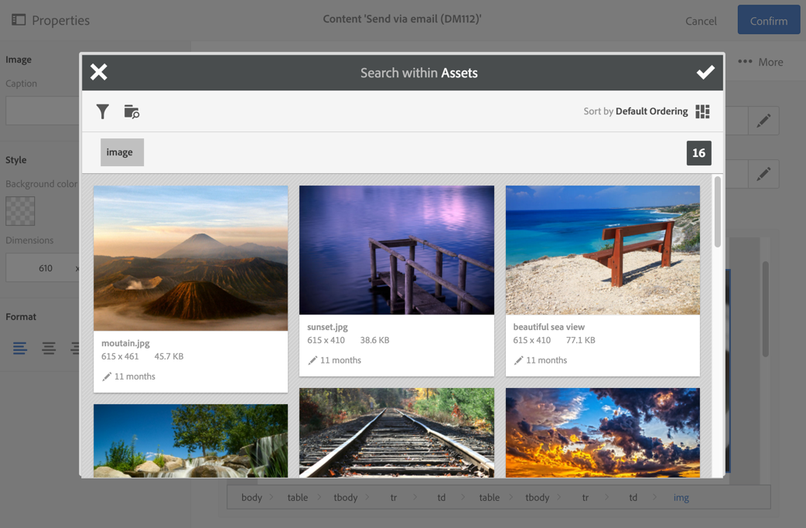

# Trabalhar com o serviço principal do Campaign e do Assets{#working-with-campaign-and-assets-core-service}

Integrar o serviço principal do Assets ou o Assets on Demand (dependendo da configuração de seu ambiente do Adobe Experience Cloud) com o Adobe Campaign permite usar qualquer ativo compartilhado no Adobe Experience Cloud em emails e landing pages do Adobe Campaign.

A integração com o Assets Core Service é restrita a [Administradores funcionais](../../administration/using/users-management.md#functional-administrators).

Os recursos compartilhados do Adobe Experience Cloud podem ser usados em seus emails e landing pages, da seguinte maneira:

1. Ao editar o conteúdo de um email ou de uma página de aterrissagem, vá para um bloco de imagem e selecione **[!UICONTROL Image shared from Adobe Experience Cloud]** por meio do menu contextual.

   

1. Na janela de seleção que é aberta, selecione uma imagem e depois confirme.

   

A imagem é então inserida. O delivery agora pode ser personalizado conforme necessário e enviado.

**Tópicos relacionados:**

* [Assets e Compartilhamento](https://experienceleague.adobe.com/docs/core-services/interface/services/assets/experience-cloud-assets.html?lang=pt-BR)
* [Editor de conteúdo](../../designing/using/personalization.md#example-email-personalization)
