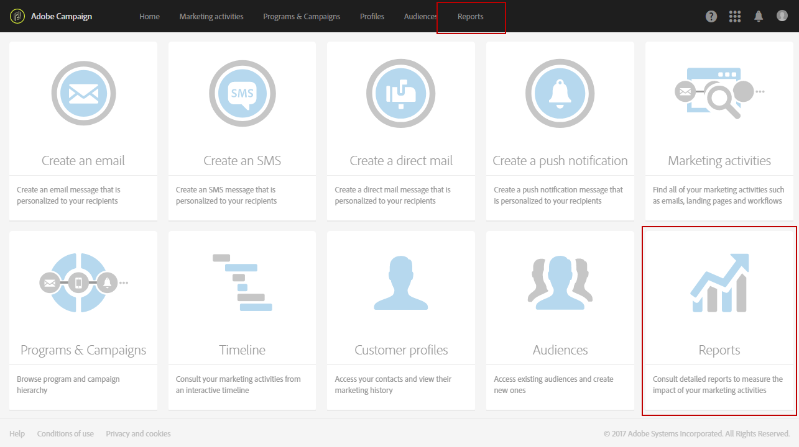
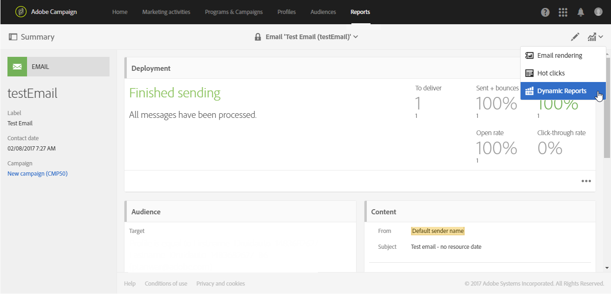
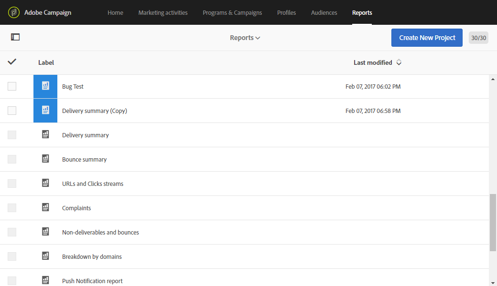
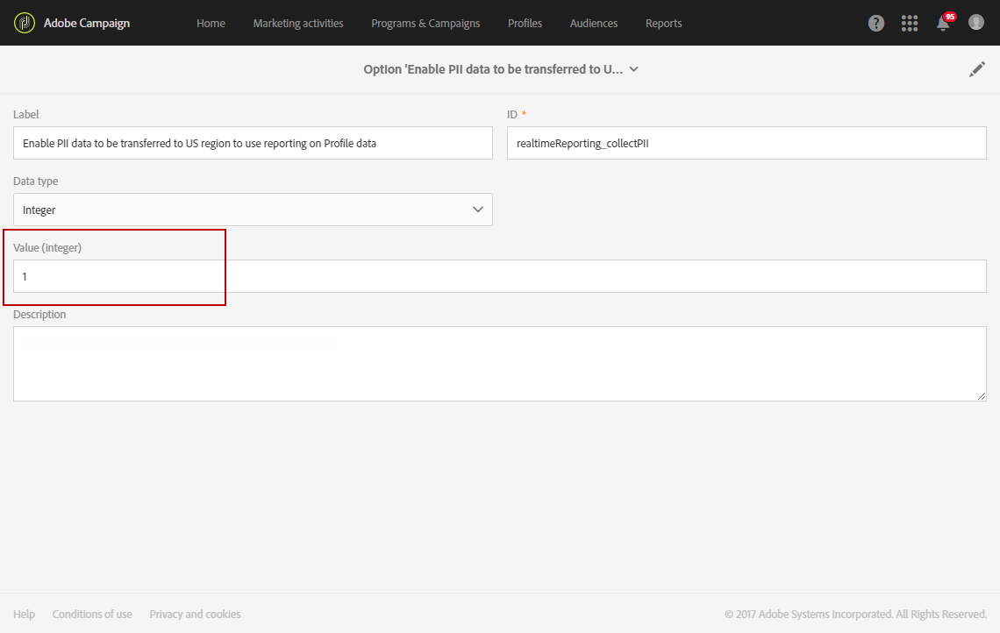

# Introdução aos relatórios dinâmicos {#about-dynamic-reports}

O Dynamic Reporting fornece relatórios totalmente personalizáveis e em tempo real. Eles adicionam acesso aos dados do perfil, permitindo análises demográficas por dimensões do perfil, como gênero, cidade e idade, além de dados funcionais de campanhas de email, como aberturas e cliques. Com a interface de arrastar e soltar, você pode explorar dados, determinar o desempenho de suas campanhas de email em relação aos segmentos de clientes mais importantes e medir seu impacto nos destinatários.

>[!NOTE]
>
>Somente usuários com direitos administrativos ou com unidades organizacionais definidas como **Todos** podem criar ou salvar um novo relatório. Para obter mais informações, consulte esta [seção](../../administration/using/users-management.md).

## Acesso aos relatórios dinâmicos {#accessing-dynamic-reports}

Os relatórios podem ser acessados:

* Na home page, selecionando a guia **[!UICONTROL Reports]** na barra superior ou o cartão **[!UICONTROL Reports]** para acessar relatórios para todas as entregas.

  

* Em cada programa, campanha e mensagem, clique no botão **Relatórios** clicando em **Relatórios Dinâmicos** para exibir apenas os relatórios específicos da entrega.

  

Alguns relatórios não podem estar disponíveis imediatamente após um delivery, dependendo do tempo necessário para coletar e processar informações.

Os relatórios dinâmicos são divididos em duas categorias:

* **Modelos**, que podem ser modificados copiando-os com a opção **Salvar como** (**Projeto > Salvar como...**) no modelo.
* **Relatórios personalizados** (identificados em azul), que podem ser criados diretamente clicando no botão **Criar novo projeto** na página inicial de **Relatórios**.

>[!NOTE]
>
>Os dados são filtrados de acordo com as unidades organizacionais.

## Contrato de uso de relatórios dinâmicos {#dynamic-reporting-usage-agreement}

O objetivo do contrato de uso dos Relatórios dinâmicos é funcionar como um consentimento pop-up para o processamento de dados. Por padrão, o contrato só é visível e só pode ser aceito ou recusado por usuários com direitos administrativos.

Três opções estão disponíveis:

* **[!UICONTROL Ask me later]**: Ao clicar em **Pergunte-me mais tarde**, a janela não será mais exibida por 24 horas. Até que você aceite ou recuse o contrato, as dimensões do perfil não aparecerão em seus relatórios e as informações de identificação pessoal de seus clientes não serão coletadas ou enviadas.
* **[!UICONTROL Accept]**: ao aceitar este contrato, você autoriza a Adobe Campaign a coletar as informações de identificação Pessoal de seus clientes e a transferi-las para o data center ou para os relatórios.
* **[!UICONTROL Decline]**: ao recusar o contrato, as dimensões do perfil não aparecerão em seus relatórios e as informações de identificação Pessoal de seus clientes não serão coletadas nem enviadas. Observe que, nesse caso, a externalID ainda será coletada e usada para identificar os usuários finais.

A tabela abaixo exibe o que acontece após aceitar este contrato, dependendo da sua região.

|  | Relatórios dinâmicos | Conector Microsoft Dynamics 365 |
|---|---|---|
| Américas e APAC (Ásia-Pacífico) | **Recurso disponível**.  Todas as informações prontas para uso (ou seja, cidade, país/região, estado, gênero e segmentos com base na idade) e perfis personalizados enviadas para o centro de relatórios dos EUA. Para saber mais sobre dimensões de perfil, consulte esta [página](../../reporting/using/list-of-components.md) | **Recurso disponível**.  Todos os campos de perfis prontos para uso e personalizados e de eventos do Adobe Campaign Standard são processados no data center dos EUA. |
| EMEA (Europa, Oriente Médio e África) | **Recurso disponível**.  Todas as informações prontas para uso (isto é, cidade, país/região, estado, gênero e segmentos com base na idade) e perfis personalizados são enviadas para o centro de relatórios do EMEA. Para saber mais sobre dimensões de perfil, consulte esta [página](../../reporting/using/list-of-components.md) | **Recurso disponível.**  Todos os campos de perfis prontos para uso e personalizados e campos de eventos do Adobe Campaign Standard processados no data center do EMEA.  **[!UICONTROL Control data]**&#x200B;que contém dados de registro do Adobe I/O e IDs de eventos de usuários finais de clientes enviados e armazenados no data center dos EUA. |

A tabela abaixo exibe o que acontece após a recusa deste contrato, dependendo da sua região. Observe que mesmo que você recuse este contrato, os relatórios sobre deliveries e a integração com o Microsoft Dynamics 365 ainda estarão disponíveis.

| Região | Relatórios dinâmicos | Conector Microsoft Dynamics 365 |
|---|---|---|
| Américas e APAC (Ásia-Pacífico) | **Recurso disponível**.   Nenhuma informação de perfil pronta para uso e personalizada enviada para o centro de relatórios dos EUA, com exceção da ExternalID. | **Recurso disponível**.  Nenhum campo de perfil pronto para uso ou personalizado enviado para o data center dos EUA, com exceção da ID externa e da ID do destinatário.  Todos os campos de eventos do Adobe Campaign Standard processados no data center dos EUA, com exceção da ID da mirror page.  Para obter mais informações sobre a integração com o Microsoft Dynamics 365, consulte esta [página](../../integrating/using/d365-acs-get-started.md). |
| EMEA (Europa, Oriente Médio e África) | **Recurso disponível**.  Nenhuma informação de perfil pronta para uso e personalizada enviada para a central de relatórios do EMEA, com exceção da ExternalID. | **Recurso disponível.**  Nenhum campo de perfil pronto para uso ou personalizado enviado para o data center do EMEA, com exceção da ID externa e da ID do destinatário.  Todos os campos de eventos do Adobe Campaign Standard processados no data center do EMEA, com exceção da ID da mirror page.  **[!UICONTROL Control data]**&#x200B;que contém os dados de registro do Adobe I/O e as IDs de eventos de usuário final do cliente enviadas e armazenadas no data center dos EUA. Para obter mais informações sobre a integração com o Microsoft Dynamics 365, consulte esta [página](../../integrating/using/d365-acs-get-started.md). |

Esta opção não é definitiva, você sempre pode alterá-la selecionando **[!UICONTROL Enable PII data to be transferred to US region to use reporting on Profile data]** em **[!UICONTROL Administration]** > **[!UICONTROL Application Settings]** > **[!UICONTROL Options]**.

O valor pode ser alterado a qualquer momento. O valor 1 corresponde a **[!UICONTROL Ask me later]**, 2 **[!UICONTROL Decline]** e 3 **[!UICONTROL Accept]**.

