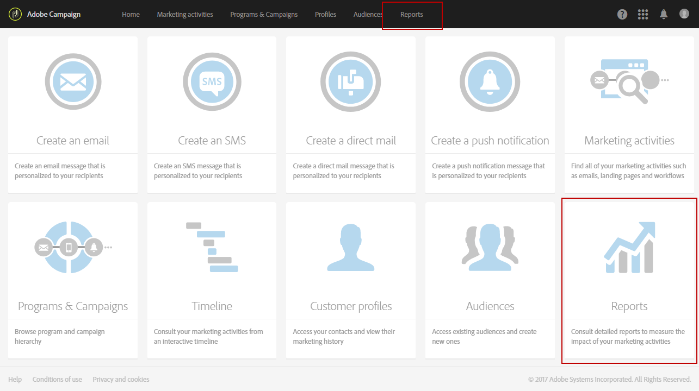

# Sobre relatórios dinâmicos{#about-dynamic-reports}

>[!NOTE]
>
>Somente usuários com direitos administrativos ou com unidades organizacionais definidas como **Todos** podem criar ou salvar um novo relatório. Para obter mais informações, consulte esta [seção](../../administration/using/users-management.md).

Os Relatórios dinâmicos fornecem relatórios totalmente personalizáveis e em tempo real. Ele adiciona acesso aos dados do perfil, permitindo a análise demográfica por dimensões de perfil, como gênero, cidade e idade, além de dados funcionais de campanha por email, como abrir e clicar. Com a interface de arrastar e soltar, você pode explorar dados, determinar como suas campanhas de email se comportam em relação aos segmentos de clientes mais importantes e medir seu impacto nos destinatários.

Graças ao menu arrastar e soltar e às visualizações personalizáveis, o recurso de relatórios dinâmicos permite combinar dimensões, métricas e intervalo de tempo em qualquer combinação, com detalhamentos e comparações ilimitados.

**Tópicos relacionados:**

* [Lista de relatórios](../../reporting/using/defining-the-report-period.md)
* [Unidades organizacionais](../../administration/using/organizational-units.md)
* [Vídeo de relatórios](https://helpx.adobe.com/campaign/kt/acs/using/acs-creating-a-dynamic-report-feature-video-use.html) dinâmicos

## Acesso a relatórios dinâmicos {#accessing-dynamic-reports}

Os relatórios podem ser acessados:

* Na página inicial, selecionando a **[!UICONTROL Reports]** guia na barra superior ou o **[!UICONTROL Reports]** cartão para acessar os relatórios de todas as entregas.

   

* Em cada programa, campanha e mensagem, no botão **Relatórios** , clicando em Relatórios **** dinâmicos para exibir somente os relatórios específicos da entrega.

   

Determinados relatórios não podem estar disponíveis imediatamente após uma entrega, dependendo do tempo necessário para coletar e processar informações.

Os relatórios dinâmicos são divididos em duas categorias:

* **Modelos**, que podem ser modificados copiando-os usando a opção **Salvar como** (**Projeto &gt; Salvar como...**) no modelo.
* **Relatórios** personalizados (identificados em azul), que podem ser criados diretamente clicando no botão **Criar novo projeto** na página inicial **Relatórios** .

>[!NOTE]
>
>Os dados são filtrados dependendo de suas unidades organizacionais.

## Contrato de uso de relatório dinâmico {#dynamic-reporting-usage-agreement}

>[!NOTE]
>
> A partir da versão 19.4 do Campaign Standard, o pop-up de consentimento para relatórios dinâmicos foi atualizado para incluir a integração entre o Adobe Campaign Standard e o Microsoft Dynamics 365.

A finalidade do contrato de uso de relatório dinâmico é funcionar como um consentimento pop-up para o processamento de dados. Por padrão, o contrato só é visível e só pode ser aceito ou recusado por usuários atribuídos com direitos administrativos.

Três opções estão disponíveis:

* **[!UICONTROL Ask me later]**: Ao clicar em **Perguntar mais tarde**, a janela parará de ser exibida por 24 horas. Até que você aceite ou recuse o contrato, as dimensões do perfil não aparecerão em seus relatórios e as informações de identificação pessoal de seus clientes não serão coletadas ou enviadas.
* **[!UICONTROL Accept]**: Ao aceitar este contrato, você autoriza o Adobe Campaign a coletar as informações de identificação pessoal de seus clientes e a transferi-las para o relatório ou data center.
* **[!UICONTROL Decline]**: Ao recusar o contrato, as dimensões do perfil não aparecerão em seus relatórios e as informações de identificação pessoal de seus clientes não serão coletadas ou enviadas. Observe que, nesse caso, a externalID ainda será coletada e usada para identificar usuários finais.

A tabela abaixo exibe o que acontece depois de aceitar este contrato, dependendo da sua região.

|  | Relatório dinâmico | Conector do Microsoft Dynamics 365 |
|---|---|---|
| Américas e APAC (Pacífico Asiático) | **Recurso disponível**.  Todas as informações prontas para uso (ou seja, cidade, país/região, estado, gênero e segmentos com base na idade) e perfis personalizados encaminhados para o centro de relatórios dos EUA. For more information on profile dimensions, refer to this [page](../../reporting/using/list-of-components-.md) | **Recurso disponível**.  Todos os campos de perfis prontos e personalizados e os campos de eventos do Adobe Campaign Standard são processados no data center dos EUA. |
| EMEA (Europa, Oriente Médio e África) | **Recurso disponível**.  Todas as informações prontas para uso (ou seja, cidade, país/região, estado, gênero e segmentos com base na idade) e perfis personalizados encaminhados para o centro de relatórios da EMEA. For more information on profile dimensions, refer to this [page](../../reporting/using/list-of-components-.md) | **Recurso disponível.** Campos de perfis  prontos e personalizados e campos de eventos do Adobe Campaign Standard processados no data center da EMEA.  **[!UICONTROL Control data]** que contém dados de registro de E/S da Adobe e IDs de eventos de usuários finais do cliente enviados e armazenados no data center dos EUA. |

A tabela abaixo mostra o que acontece depois de recusar este contrato, dependendo da sua região. Observe que mesmo se você recusar este contrato, os relatórios sobre entregas e integração com o Microsoft Dynamics 365 ainda estarão disponíveis.

| Região | Relatório dinâmico | Conector do Microsoft Dynamics 365 |
|---|---|---|
| Américas e APAC (Pacífico Asiático) | **Recurso disponível**.   Nenhuma informação predefinida e personalizada de perfis enviada para o centro de relatórios dos EUA, com exceção da ExternalID. | **Recurso disponível**.  Nenhum campo de perfil personalizado ou predefinido enviado para o centro de dados dos EUA, com exceção da ID externa e da ID do destinatário.  Todos os campos de evento do Adobe Campaign Standard processados no data center dos EUA, com exceção da ID da página espelhada.  Para obter mais informações sobre a integração do Microsoft Dynamics 365, consulte esta [página](https://helpx.adobe.com/campaign/kb/acs-ms-dynamics.html). |
| EMEA (Europa, Oriente Médio e África) | **Recurso disponível**.  Nenhuma informação predefinida e personalizada de perfis enviada para o centro de relatórios da EMEA, com exceção da ExternalID. | **Recurso disponível.**  Nenhum campo de perfil personalizado ou predefinido enviado para o centro de dados da EMEA, com exceção da ID externa e da ID do destinatário.  Todos os campos de evento do Adobe Campaign Standard processados no centro de dados EMEA, com exceção da ID da página espelhada.   **[!UICONTROL Control data]** que contém dados de registro de E/S da Adobe e IDs de eventos de usuários finais do cliente enviados e armazenados no data center dos EUA. Para obter mais informações sobre a integração do Microsoft Dynamics 365, consulte esta [página](https://helpx.adobe.com/campaign/kb/acs-ms-dynamics.html). |

Essa opção não é final, você sempre pode alterá-la selecionando **[!UICONTROL Enable PII data to be transferred to US region to use reporting on Profile data]** &gt; **[!UICONTROL Administration]** &gt; **[!UICONTROL Application Settings]** &gt; **[!UICONTROL Options]**.

O valor pode ser alterado a qualquer momento. O valor 1 corresponde a **[!UICONTROL Ask me later]**, 2 **[!UICONTROL Decline]** e 3 **[!UICONTROL Accept]**.

Observe que para versões anteriores ao Adobe Campaign Standard 19.4, o valor -1 corresponde a **[!UICONTROL Ask me later]**, 0 **[!UICONTROL Decline]** e 1 **[!UICONTROL Accept]**.

