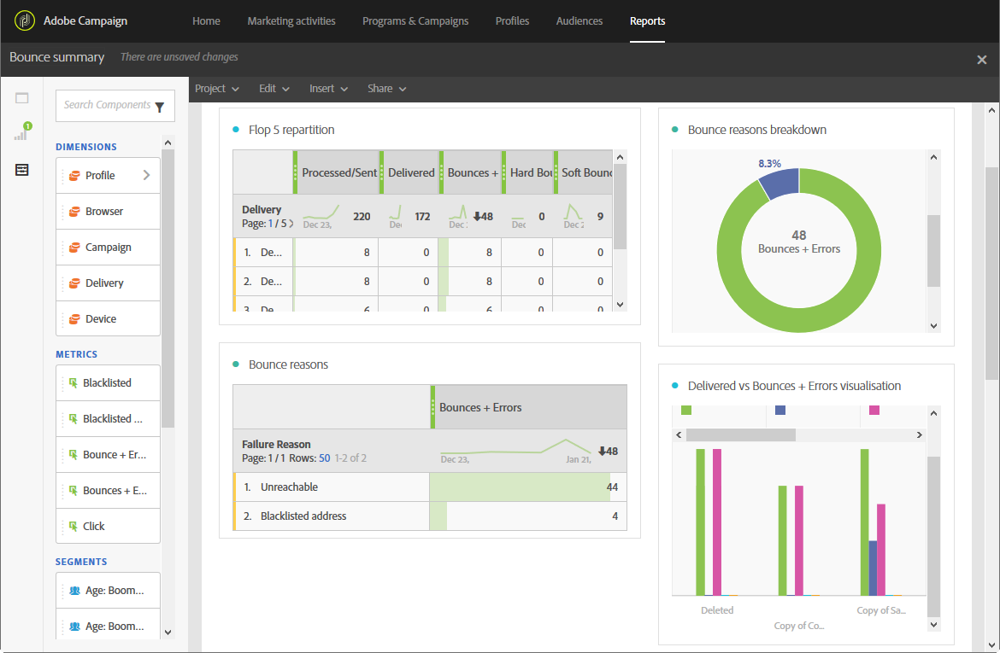

# Resumo da rejeição{#bounce-summary}

Este relatório detalha os erros gerais de hardware e software encontrados durante os delivery, bem como o processamento automático de rejeições (consulte [Entendendo falhas de delivery](../../sending/using/understanding-delivery-failures.md)).

Cada tabela é representada por números de resumo e gráficos. Você pode alterar a forma como os detalhes são exibidos em suas respectivas configurações de visualização.

**A** repartição da Flop 5 lista os cinco delivery com o maior número de quarentenas:

A tabela **Motivos de rejeição** contém os dados disponíveis para os tipos de erros que causaram saltos para cada delivery:

* **[!UICONTROL User unknown]**: O tipo de erro gerado quando um delivery é enviado para um endereço de email inválido.
* **[!UICONTROL Invalid domain]**: O tipo de erro gerado quando um delivery é enviado para um endereço de email cujo domínio está errado ou não existe mais.
* **[!UICONTROL Unreachable]**: O tipo de erro encontrado na cadeia de caracteres de delivery de mensagem, como domínio temporariamente inacessível.
* **[!UICONTROL Account disabled]**: O tipo de erro gerado quando um delivery é enviado para um endereço de email que não existe mais.
* **[!UICONTROL Mailbox full]**: O tipo de erro gerado quando a caixa de entrada do recipient está cheia. Há cinco tentativas de entregar a mensagem antes que esse erro seja gerado.
* **[!UICONTROL Not connected]**: O tipo de erro gerado quando o telefone móvel do recipient está desligado ou não está conectado a uma rede no momento em que a mensagem é enviada.

   >[!NOTE]
   >
   >Esse tipo de erro diz respeito apenas a delivery em canais móveis.

* **[!UICONTROL Refused]**: O tipo de erro gerado quando um endereço é recusado pelo ISP (Internet provedor de serviço). Por exemplo, quando uma regra de segurança é aplicada por software antisspam.

A tabela **Repartição de domínio** exibe os problemas gerais encontrados durante os delivery de acordo com o domínio do recipient.
