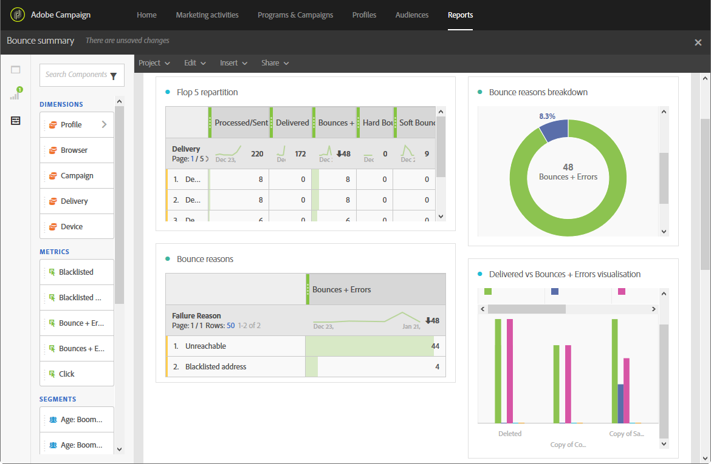

# Resumo da rejeição{#bounce-summary}

Este relatório detalha os erros gerais de hardware e software encontrados durante os deliveries, bem como o processamento automático de rejeições (consulte [Noções básicas sobre falhas de delivery](../../sending/using/understanding-delivery-failures.md)).

Cada tabela é representada por números de resumo e gráficos. É possível alterar como os detalhes são mostrados nas respectivas configurações de visualização.

A **repartição de Flop 5** lista as cinco entregas com o maior número de quarentenas:

A tabela **Motivos da rejeição** contém os dados disponíveis para os tipos de erros que causaram rejeições para cada entrega:

* **[!UICONTROL User unknown]**: O tipo de erro gerado quando uma entrega é enviada para um endereço de email inválido.
* **[!UICONTROL Invalid domain]**: O tipo de erro gerado quando uma entrega é enviada para um endereço de email cujo domínio está errado ou não existe mais.
* **[!UICONTROL Unreachable]**: O tipo de erro encontrado na cadeia de caracteres de entrega de mensagens, como domínio temporariamente inacessível.
* **[!UICONTROL Account disabled]**: O tipo de erro gerado quando uma entrega é enviada para um endereço de email que não existe mais.
* **[!UICONTROL Mailbox full]**: O tipo de erro gerado quando a caixa de entrada do destinatário está cheia. Há cinco tentativas de entregar a mensagem antes que esse erro seja gerado.
* **[!UICONTROL Not connected]**: O tipo de erro gerado quando o celular do destinatário está desligado ou não está conectado a uma rede no momento em que a mensagem é enviada.

  >[!NOTE]
  >
  >Esse tipo de erro só afeta deliveries em canais móveis.

* **[!UICONTROL Refused]**: O tipo de erro gerado quando um endereço é recusado pelo ISP (provedor de serviços de Internet). Por exemplo, quando uma regra de segurança tiver sido aplicada por um software antisspam.

A tabela **Repartição de domínio** exibe os problemas gerais encontrados durante as entregas de acordo com o domínio do destinatário.
