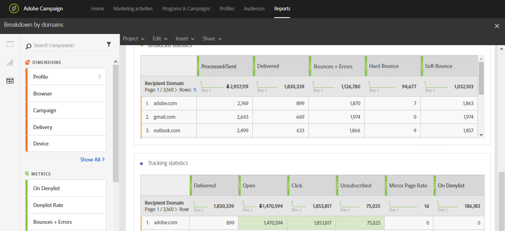

# Detalhamento por domínios{#breakdown-by-domains}

Este relatório contém os dados de desempenho de cada domínio representado no público-alvo de uma entrega de email. Se for um relatório de campanha ou de programa, os dados de desempenho estão disponíveis para vários públicos-alvo. Esses dados permitem analisar o comportamento de cada domínio em reação a eventos específicos. Por exemplo, exibição de link, URL de inclui na lista de bloqueios etc.

A tabela **Estatísticas de transmissão** contém os dados disponíveis para possíveis erros encontrados com cada domínio, como:

* **Processados/enviados**: o número de emails enviados.
* **Entregues**: o número de emails entregues.
* **Rejeições + Erros**: o número de mensagens que não puderam ser entregues.
* **Rejeição permanente**: o número total de erros permanentes, como um endereço de email incorreto.
* **Rejeição temporária**: o número total de erros temporários, como uma caixa de entrada cheia.

A segunda tabela, **Estatísticas de rastreamento**, contém os dados disponíveis para a reatividade do destinatário para entrega, como:

* **Entregues**: o número de emails entregues
* **Aberto**: o número de vezes que uma mensagem foi aberta em uma entrega.
* **Clique**: o número de vezes que o conteúdo foi clicado em uma entrega.
* **Cancelar assinatura**: o número de cliques no link de assinatura.
* **Mirror Page**: o número de cliques no link da mirror page.
* **Na inclui na lista de bloqueios**: o número de destinatários que declararam um email como spam ou lixo eletrônico. [Saiba mais](../../audiences/using/about-opt-in-and-opt-out-in-campaign.md)
