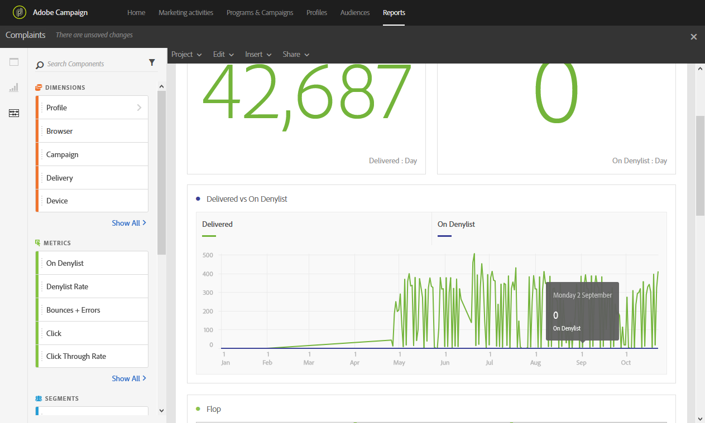

# Reclamações{#complaints}

O relatório **[!UICONTROL Complaints]** identifica as entregas que receberam mais declarações como spam.

A tabela **Flop**, classificada por domínio de destinatário, exibe o número de destinatários que declararam um email ou lixo eletrônico. Os resultados da tabela também estão disponíveis em um gráfico e em números de resumo.

A tabela **Entregue vs Em Inclui na lista de bloqueios** lista o número de destinatários que declararam um email como spam ou lixo eletrônico. A tabela é classificada por delivery.
