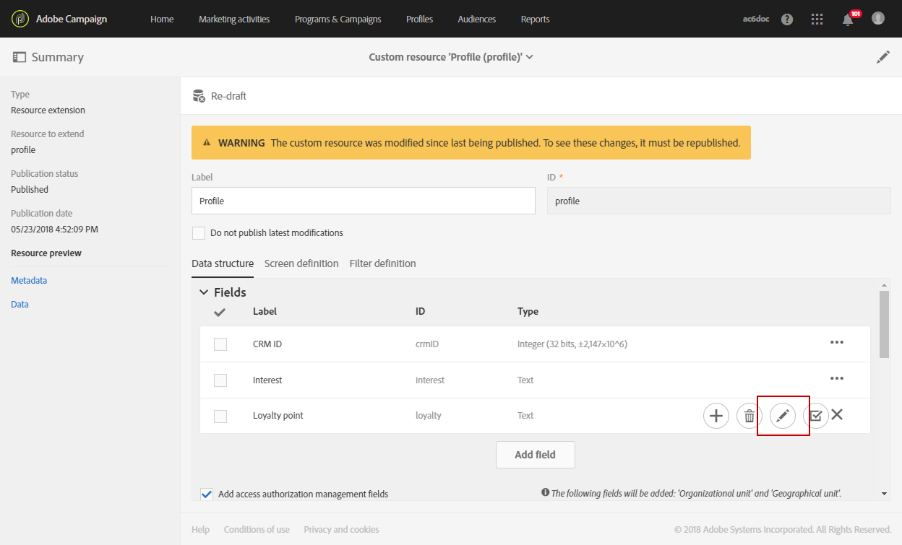
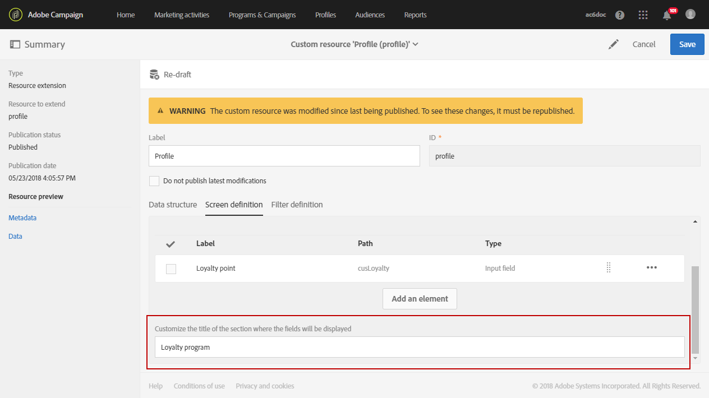

# Criar uma dimensão de perfil personalizada{#creating-a-custom-profile-dimension}

Os relatórios também podem ser criados e gerenciados com base em dados de perfil personalizados criados durante a extensão de recurso personalizado do perfil.

Neste exemplo, queremos criar o campo de perfil personalizado **Loyalty Programs** que será dividido em três níveis: ouro, prata e bronze. Esse perfil personalizado será estendido para poder usá-lo como uma dimensão de perfil personalizada em relatórios dinâmicos.

* [Etapa 1: Criar um novo campo de perfil](#step-1--create-a-new-profile-field)
* [Etapa 2: Estender os logs de envio com o campo de perfil](#step-2--extend-the-sending-logs-with-the-profile-field)
* [Etapa 3: Criar um delivery direcionado a recipients inscritos no programa de fidelidade](#step-3--create-a-delivery-targeting-recipients-enrolled-in-the-loyalty-program)
* [Etapa 4: Criar um relatório dinâmico para filtrar recipients com a dimensão de perfil personalizada](#step-4--create-a-dynamic-report-to-filter-recipients-with-the-custom-profile-dimension)

## Etapa 1: Criar um novo campo de perfil {#step-1--create-a-new-profile-field}

Primeiro, precisamos criar o novo campo de perfil **Loyalty program** que atribuirá o nível de fidelidade aos nossos recipients: ouro, prata ou bronze.

>[!NOTE]
>
>Os recursos personalizados só podem ser gerenciados por um administrador.

Para fazer isso:

1. No menu avançado, selecione **[!UICONTROL Administration]** > **[!UICONTROL Development]** > **[!UICONTROL Custom resources]** e depois o recurso personalizado **[!UICONTROL Profile (profile)]**.

   

1. Na guia **[!UICONTROL Data structure]**, na categoria **[!UICONTROL Fields]**, clique no botão **[!UICONTROL Add field]**.

   

1. Insira **[!UICONTROL Label]**, **[!UICONTROL ID]** e selecione o recurso personalizado **[!UICONTROL Type]**. Aqui, selecionamos **[!UICONTROL Text]** já que os recipients terão a escolha entre ouro, prata e bronze.

   

1. Clique no ícone  para definir o campo.

   

1. Aqui, precisamos especificar os valores autorizados marcando **[!UICONTROL Specify a list of authorized valued]** e criar cada valor clicando em **[!UICONTROL Create element]**.

   

1. Insira **[!UICONTROL Label]** e **[!UICONTROL Value]**, em seguida, clique em **[!UICONTROL Add]**. Para este exemplo, precisamos criar o valor ouro, prata e bronze. Clique em **[!UICONTROL Confirm]** quando terminar.

   

1. Selecione a guia **[!UICONTROL Screen definition]**. Na lista suspensa **[!UICONTROL Detail screen configuration]**, marque a seção **[!UICONTROL Add personalized fields]** para criar uma nova seção em nosso perfil.

   

1. Clique no botão **[!UICONTROL Add an element]** para criar sua nova seção. Selecione o **[!UICONTROL Type]**: **[!UICONTROL Input field]**, **[!UICONTROL Value]** ou **[!UICONTROL List]**, em seguida, o campo a ser adicionado nesta nova seção.

   

1. Você também pode adicionar um título à sua seção no campo **[!UICONTROL Customize the title of the section where the fields will be displayed]**.

   Clique em **[!UICONTROL Save]** quando a configuração for concluída.

   

1. No menu avançado, selecione **[!UICONTROL Administration]** > **[!UICONTROL Development]** > **[!UICONTROL Publication]** para começar a publicar o recurso personalizado.
1. Clique em **[!UICONTROL Prepare publication]** e, quando a preparação for concluída, clique no botão **[!UICONTROL Publish]**.

   

O novo campo de perfil agora está pronto para ser usado e selecionado pelos recipients.

## Etapa 2: Estender os logs de envio com o campo de perfil {#step-2--extend-the-sending-logs-with-the-profile-field}

Agora que seu campo de perfil foi criado, precisamos estender os logs de envio com nosso campo de perfil para criar a dimensão de perfil personalizado associada nos relatórios dinâmicos.

Antes de estender o log com nosso campo de perfil, verifique se a janela PII foi aceita para ter acesso à guia **[!UICONTROL Sending logs extension]**. Para obter mais informações, consulte esta [página](../../reporting/using/about-dynamic-reports.md#dynamic-reporting-usage-agreement).

>[!NOTE]
>
>Os logs só podem ser estendidos com campos de perfil por administrador.

1. No menu avançado, selecione **[!UICONTROL Administration]** > **[!UICONTROL Development]** > **[!UICONTROL Custom resources]** e depois o recurso personalizado **[!UICONTROL Profile (profile)]**.
1. Abra o menu suspenso **[!UICONTROL Sending logs extension]**.
1. Clique no botão **[!UICONTROL Create element]**.

   

1. Selecione o campo criado anteriormente e clique em **[!UICONTROL Confirm]**.
1. Marque **[!UICONTROL Add this field in Dynamic reporting as a new dimension]** para criar sua dimensão de perfil personalizada.

   

   Essa opção só estará disponível se a janela PII tiver sido aceita. Para obter mais informações, consulte esta [página](../../reporting/using/about-dynamic-reports.md#dynamic-reporting-usage-agreement).

1. Clique em **[!UICONTROL Add]** e salve o recurso personalizado.
1. Como o recurso personalizado foi modificado, precisamos publicá-lo para implementar as novas alterações.

   No menu avançado, selecione **[!UICONTROL Administration]** > **[!UICONTROL Development]** > **[!UICONTROL Publication]** para começar a publicar o recurso personalizado.

1. Clique em **[!UICONTROL Prepare publication]** e, quando a preparação for concluída, clique no botão **[!UICONTROL Publish]**.

   

Seu perfil personalizado agora está disponível como uma dimensão de perfil personalizada em seus relatórios.

Agora que seu campo foi criado e que os logs de envio foram estendidos com esse campo de perfil, você pode começar a direcionar recipients nos deliveries.

## Etapa 3: Criar um delivery direcionado a recipients inscritos no programa de fidelidade {#step-3--create-a-delivery-targeting-recipients-enrolled-in-the-loyalty-program}

Depois que o campo de perfil for publicado, você poderá iniciar o delivery. Neste exemplo, queremos direcionar cada recipient inscrito no programa de fidelidade.

1. Na guia **[!UICONTROL Marketing activities]**, clique em **[!UICONTROL Create]** e selecione **[!UICONTROL Email]**.
1. Escolha um **[!UICONTROL Email type]** e insira as propriedades do email.
1. Para direcionar os recipients inscritos no programa de fidelidade, arraste e solte a atividade **[!UICONTROL Profiles (attributes)]**.
1. Selecione o campo criado anteriormente no menu suspenso **[!UICONTROL Field]**.

   

1. Selecione seu **[!UICONTROL Filter conditions]**. Aqui, queremos direcionar os recipients que fazem parte de um dos três níveis do programa de fidelidade.

   

1. Clique em **[!UICONTROL Confirm]** e, quando terminar a filtragem, clique em **[!UICONTROL Next]**.
1. Defina e personalize o conteúdo da mensagem, o nome do remetente e o assunto. Para obter mais informações sobre criação de email, consulte esta [página](../../designing/using/designing-content-in-adobe-campaign.md).

   Em seguida, clique em **[!UICONTROL Create]**.

1. Quando estiver pronto, você poderá visualizar e enviar sua mensagem. Para obter mais informações sobre como preparar e enviar sua mensagem, consulte esta [página](../../sending/using/preparing-the-send.md).

Depois que o email for enviado corretamente aos recipients selecionados, você poderá começar a filtrar os dados e rastrear o sucesso do delivery com relatórios.

## Etapa 4: Crie um relatório dinâmico para filtrar recipients com a dimensão de perfil personalizada {#step-4--create-a-dynamic-report-to-filter-recipients-with-the-custom-profile-dimension}

Após enviar o delivery, é possível detalhar os relatórios usando a dimensão de perfil personalizada na tabela **[!UICONTROL Profile]**.

1. Na guia **[!UICONTROL Reports]** , selecione um relatório pronto para uso ou clique no botão **[!UICONTROL Create]** para iniciar um do zero.

   

1. Na categoria **[!UICONTROL Dimensions]**, clique em **[!UICONTROL Profile]** e arraste e solte sua dimensão de perfil **programa de fidelidade** personalizada na tabela de forma livre.

   

1. Arraste e solte as métricas **[!UICONTROL Processed/Sent]** e **[!UICONTROL Open]** para começar a filtrar os dados.

   

1. Arraste e solte uma visualização em seu espaço de trabalho, se necessário.

   

**Tópicos relacionados:**

* [Usar dados de perfil personalizados para criar relatórios abrangentes](https://helpx.adobe.com/campaign/kb/simplify-campaign-management.html#Reportandshareinsightswithallstakeholders)
