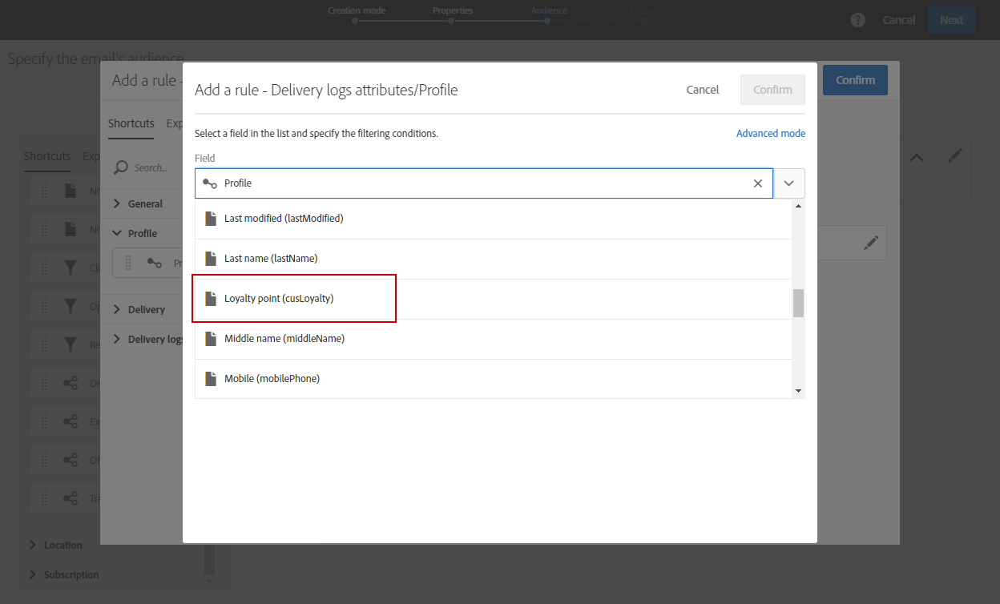

# Criação de uma dimensão de perfil personalizada{#creating-a-custom-profile-dimension}

Os relatórios também podem ser criados e gerenciados com base em dados de perfil personalizados criados durante a extensão de recurso personalizado do perfil.

Neste exemplo, queremos criar o campo de perfil personalizado Programas **de** fidelidade que serão divididos em três níveis: ouro, prata e bronze. Esse perfil personalizado será estendido para poder usá-lo como uma dimensão de perfil personalizado em relatórios dinâmicos.

* [Etapa 1: Criar um novo campo de perfil](../../reporting/using/creating-a-custom-profile-dimension.md#step-1--create-a-new-profile-field)
* [Etapa 2: Estender os logs de envio com o campo de perfil](../../reporting/using/creating-a-custom-profile-dimension.md#step-2--extend-the-sending-logs-with-the-profile-field)
* [Etapa 3: Criar uma meta de entrega para destinatários inscritos no programa de fidelidade](../../reporting/using/creating-a-custom-profile-dimension.md#step-3--create-a-delivery-targeting-recipients-enrolled-in-the-loyalty-program)
* [Etapa 4: Criar um relatório dinâmico para filtrar destinatários com a dimensão de perfil personalizada](../../reporting/using/creating-a-custom-profile-dimension.md#step-4--create-a-dynamic-report-to-filter-recipients-with-the-custom-profile-dimension)

## Etapa 1: Criar um novo campo de perfil {#step-1--create-a-new-profile-field}

Primeiro, precisamos criar o novo programa **de** Fidelidade do campo de perfil que atribuirá o nível de fidelidade aos nossos destinatários: ouro, prata ou bronze.

>[!NOTE]
>
>Os recursos personalizados só podem ser gerenciados por um administrador.

Para isso:

1. No menu avançado, selecione **[!UICONTROL Administration]** &gt; **[!UICONTROL Development]** &gt; **[!UICONTROL Custom resources]** e depois o recurso **[!UICONTROL Profile (profile)]** personalizado.

   

1. Na **[!UICONTROL Data structure]** guia, na **[!UICONTROL Fields]** categoria, clique no **[!UICONTROL Add field]** botão.

   

1. Digite o **[!UICONTROL Label]** e **[!UICONTROL ID]** selecione o recurso personalizado **[!UICONTROL Type]**. Aqui, selecionamos **[!UICONTROL Text]** já que os destinatários terão a escolha entre ouro, prata e bronze.

   

1. Clique no  ícone para definir seu campo.

   

1. Aqui, precisamos especificar os valores autorizados verificando **[!UICONTROL Specify a list of authorized valued]** e criando cada valor clicando em **[!UICONTROL Create element]**.

   

1. Digite o **[!UICONTROL Label]** e **[!UICONTROL Value]** clique em **[!UICONTROL Add]**. Para este exemplo, precisamos de criar o valor ouro, prata e bronze. Clique **[!UICONTROL Confirm]** quando concluído.

   

1. Selecione a **[!UICONTROL Screen definition]** guia. Na **[!UICONTROL Detail screen configuration]** lista suspensa, marque a **[!UICONTROL Add personalized fields]** seção para criar uma nova seção em nosso perfil.

   

1. Clique no **[!UICONTROL Add an element]** botão para criar sua nova seção. Selecione o **[!UICONTROL Type]**: **[!UICONTROL Input field]**, **[!UICONTROL Value]** ou **[!UICONTROL List]**, o campo a ser adicionado nesta nova seção.

   

1. Também é possível adicionar um título à sua seção no campo **[!UICONTROL Customize the title of the section where the fields will be displayed]**.

   Clique **[!UICONTROL Save]** quando a configuração estiver concluída.

   

1. No menu avançado, selecione **[!UICONTROL Administration]** &gt; **[!UICONTROL Development]** &gt; **[!UICONTROL Publication]** para começar a publicar seu recurso personalizado.
1. Clique **[!UICONTROL Prepare publication]** e, quando a preparação estiver concluída, clique no **[!UICONTROL Publish]** botão.

   

Seu novo campo de perfil está pronto para ser usado e selecionado pelos destinatários.

## Etapa 2: Estender os logs de envio com o campo de perfil {#step-2--extend-the-sending-logs-with-the-profile-field}

Agora que seu campo de perfil foi criado, precisamos estender os logs de envio com nosso campo de perfil para criar a dimensão de perfil personalizado associada nos relatórios dinâmicos.

Antes de estender o log com nosso campo de perfil, verifique se a janela PII foi aceita para ter acesso à **[!UICONTROL Sending logs extension]** guia. Para obter mais informações, consulte esta [página](../../reporting/using/about-dynamic-reports.md#dynamic-reporting-usage-agreement).

>[!NOTE]
>
>Os registros só podem ser estendidos com campos de perfil pelo administrador.

1. No menu avançado, selecione **[!UICONTROL Administration]** &gt; **[!UICONTROL Development]** &gt; **[!UICONTROL Custom resources]** e depois o recurso **[!UICONTROL Profile (profile)]** personalizado.
1. Abra o **[!UICONTROL Sending logs extension]** menu suspenso.
1. Clique no **[!UICONTROL Create element]** botão.

   

1. Selecione o campo criado anteriormente e clique em **[!UICONTROL Confirm]**.
1. Marque **[!UICONTROL Add this field in Dynamic reporting as a new dimension]** para criar sua dimensão de perfil personalizada.

   

   Essa opção só estará disponível se a janela PII tiver sido aceita. Para obter mais informações, consulte esta [página](../../reporting/using/about-dynamic-reports.md#dynamic-reporting-usage-agreement).

1. Clique em **[!UICONTROL Add]** e salve seu recurso personalizado.
1. Como o recurso personalizado foi modificado, precisamos publicá-lo para implementar as novas alterações.

   No menu avançado, selecione **[!UICONTROL Administration]** &gt; **[!UICONTROL Development]** &gt; **[!UICONTROL Publication]** para começar a publicar seu recurso personalizado.

1. Clique **[!UICONTROL Prepare publication]** e, quando a preparação estiver concluída, clique no **[!UICONTROL Publish]** botão.

   

Seu perfil personalizado agora está disponível como uma dimensão de perfil personalizado em seus relatórios.

Agora que seu campo foi criado e que os logs de envio foram estendidos com esse campo de perfil, você pode começar a direcionar destinatários em entregas.

## Etapa 3: Criar uma meta de entrega para destinatários inscritos no programa de fidelidade {#step-3--create-a-delivery-targeting-recipients-enrolled-in-the-loyalty-program}

Depois que o campo de perfil for publicado, você poderá iniciar a entrega. Neste exemplo, queremos direcionar cada destinatário inscrito no programa de fidelidade.

1. Na **[!UICONTROL Marketing activities]** guia, clique em **[!UICONTROL Create]** e selecione **[!UICONTROL Email]**.
1. Escolha um e **[!UICONTROL Email type]** digite as propriedades do seu email.
1. Para direcionar o destinatário inscrito no programa de fidelidade, arraste e solte a **[!UICONTROL Profiles (attributes)]** atividade.
1. Selecione o campo criado anteriormente no **[!UICONTROL Field]** menu suspenso.

   

1. Selecione seu **[!UICONTROL Filter conditions]**. Aqui, queremos direcionar destinatários que fazem parte de um dos três níveis do programa de fidelidade.

   

1. Clique em **[!UICONTROL Confirm]** e, quando terminar de filtrar, clique em **[!UICONTROL Next]**.
1. Defina e personalize o conteúdo da mensagem, o nome do remetente e o assunto. Para obter mais informações sobre criação de email, consulte esta [página](../../designing/using/overview.md).

   Em seguida, clique em **[!UICONTROL Create]**.

1. Quando estiver pronto, você poderá visualizar e enviar sua mensagem. Para obter mais informações sobre como preparar e enviar sua mensagem, consulte esta [página](../../sending/using/preparing-the-send.md).

Assim que seu email for enviado corretamente para os destinatários selecionados, você poderá começar a filtrar seus dados e rastrear o sucesso de sua entrega com relatórios.

## Etapa 4: Criar um relatório dinâmico para filtrar destinatários com a dimensão de perfil personalizada {#step-4--create-a-dynamic-report-to-filter-recipients-with-the-custom-profile-dimension}

Depois de enviar a entrega, você pode detalhar os relatórios usando a dimensão de perfil personalizado da **[!UICONTROL Profile]** tabela.

1. Na **[!UICONTROL Reports]** guia, selecione um relatório predefinido ou clique no **[!UICONTROL Create]** botão para iniciar um do zero.

   

1. Na **[!UICONTROL Dimensions]** categoria, clique em **[!UICONTROL Profile]** e arraste e solte sua dimensão de perfil personalizada do programa **** Fidelidade para a tabela de forma livre.

   

1. Arraste e solte as métricas **[!UICONTROL Processed/Sent]** e **[!UICONTROL Open]** para começar a filtrar seus dados.

   

1. Arraste e solte uma visualização no seu espaço de trabalho, se necessário.

   

**Tópico relacionado:**

* [Usar dados de perfil personalizados para criar relatórios detalhados](https://helpx.adobe.com/campaign/kb/simplify-campaign-management.html#Reportandshareinsightswithallstakeholders)
