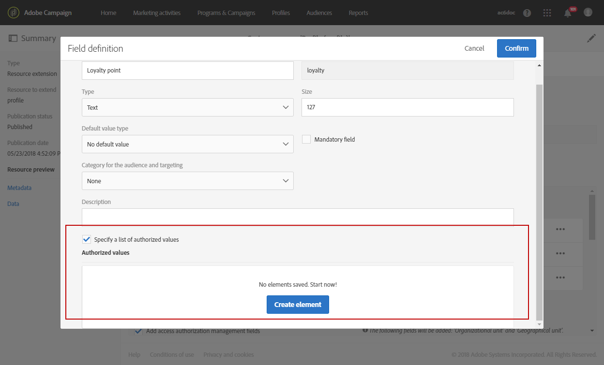

# Creating a custom profile dimension{#creating-a-custom-profile-dimension}

Os relatórios também podem ser criados e gerenciados com base em dados de perfil personalizados criados durante a extensão de recurso personalizado do perfil.

In this example, we want to create the custom profile field **Loyalty programs** which will be divided into three levels: gold, silver and bronze. Esse perfil personalizado será então estendido para ser usado como uma dimensão de perfil personalizada em relatórios dinâmicos.

* [Etapa 1: Criar um novo campo de perfil](../../reporting/using/creating-a-custom-profile-dimension.md#step-1--create-a-new-profile-field)
* [Etapa 2: Estender os registros de envio com o campo de perfil](../../reporting/using/creating-a-custom-profile-dimension.md#step-2--extend-the-sending-logs-with-the-profile-field)
* [Etapa 3: Criar um direcionamento de envio de entrega inscrito no programa de fidelidade](../../reporting/using/creating-a-custom-profile-dimension.md#step-3--create-a-delivery-targeting-recipients-enrolled-in-the-loyalty-program)
* [Etapa 4: Criar um relatório dinâmico para filtrar destinatários com a dimensão personalizada do perfil](../../reporting/using/creating-a-custom-profile-dimension.md#step-4--create-a-dynamic-report-to-filter-recipients-with-the-custom-profile-dimension)

## Step 1: Create a new profile field {#step-1--create-a-new-profile-field}

We first need to create the new profile field **Loyalty program** that will assign loyalty level to our recipients: gold, silver or bronze.

>[!NOTE]
>
>Os recursos personalizados podem ser gerenciados somente por um administrador.

Para fazer isso:

1. From the advanced menu, select **[!UICONTROL Administration]** &gt; **[!UICONTROL Development]** &gt; **[!UICONTROL Custom resources]** then the **[!UICONTROL Profile (profile)]** custom resource.

   

1. From the **[!UICONTROL Data structure]** tab, in the **[!UICONTROL Fields]** category, click the **[!UICONTROL Add field]** button.

   

1. Enter the **[!UICONTROL Label]**, **[!UICONTROL ID]** and select the custom resource **[!UICONTROL Type]**. Here, we selected **[!UICONTROL Text]** since recipients will have the choice between gold, silver and bronze.

   

1. Click the  icon to define your field.

   

1. Here, we need to specify the authorized values by checking **[!UICONTROL Specify a list of authorized valued]** and create each value by clicking **[!UICONTROL Create element]**.

   

1. Enter the **[!UICONTROL Label]** and **[!UICONTROL Value]** then click **[!UICONTROL Add]**. Neste exemplo, é necessário criar o valor gold, silver e bronze. Click **[!UICONTROL Confirm]** when done.

   

1. Select the **[!UICONTROL Screen definition]** tab. In the **[!UICONTROL Detail screen configuration]** drop-down, check **[!UICONTROL Add personalized fields]** section to create a new section in our profile.

   

1. Click the **[!UICONTROL Add an element]** button to create your new section. Select the **[!UICONTROL Type]**: **[!UICONTROL Input field]**, **[!UICONTROL Value]** or **[!UICONTROL List]**, then the field to add in this new section.

   

1. You can also add a title to your section in the field **[!UICONTROL Customize the title of the section where the fields will be displayed]**.

   Click **[!UICONTROL Save]** when the configuration is done.

   

1. From the advanced menu, select **[!UICONTROL Administration]** &gt; **[!UICONTROL Development]** &gt; **[!UICONTROL Publication]** to start publishing your custom resource.
1. Click **[!UICONTROL Prepare publication]** then when the preparation is done, click the **[!UICONTROL Publish]** button.

   

O novo campo de perfil está pronto para ser usado e selecionado pelos seus destinatários.

## Step 2: Extend the sending logs with the profile field {#step-2--extend-the-sending-logs-with-the-profile-field}

Agora que o campo de perfil é criado, é necessário estender o envio de registros com nosso campo de perfil para criar a dimensão personalizada associada ao perfil em relatórios dinâmicos.

Before extending the log with our profile field, make sure that the PII window was accepted to have access to the **[!UICONTROL Sending logs extension]** tab. For more on this, refer to this [page](../../reporting/using/about-dynamic-reports.md#dynamic-reporting-usage-agreement).

>[!NOTE]
>
>Os logs só podem ser estendidos com campos de perfil por administrador.

1. From the advanced menu, select **[!UICONTROL Administration]** &gt; **[!UICONTROL Development]** &gt; **[!UICONTROL Custom resources]** then the **[!UICONTROL Profile (profile)]** custom resource.
1. Open the **[!UICONTROL Sending logs extension]** drop-down.
1. Click the **[!UICONTROL Create element]** button.

   

1. Select your previously created field and click **[!UICONTROL Confirm]**.
1. Check **[!UICONTROL Add this field in Dynamic reporting as a new dimension]** to create your custom profile dimension.

   

   Essa opção só estará disponível se a janela PII tiver sido aceita. For more on this, refer to this [page](../../reporting/using/about-dynamic-reports.md#dynamic-reporting-usage-agreement).

1. Click **[!UICONTROL Add]** then save your custom resource.
1. Como o recurso personalizado foi modificado, é necessário publicá-lo para implementar as novas alterações.

   From the advanced menu, select **[!UICONTROL Administration]** &gt; **[!UICONTROL Development]** &gt; **[!UICONTROL Publication]** to start publishing your custom resource.

1. Click **[!UICONTROL Prepare publication]** then when the preparation is done, click the **[!UICONTROL Publish]** button.

   

Seu perfil personalizado agora está disponível como uma dimensão personalizada de perfil em seus relatórios.

Agora que o campo foi criado e que o envio de logs foi estendido com este campo de perfil, é possível iniciar o direcionamento de destinatários em entregas.

## Step 3: Create a delivery targeting recipients enrolled in the loyalty program {#step-3--create-a-delivery-targeting-recipients-enrolled-in-the-loyalty-program}

Depois que o campo de perfil é publicado, você pode iniciar sua entrega. Neste exemplo, queremos direcionar cada destinatário inscrito no programa de fidelidade.

1. From the **[!UICONTROL Marketing activities]** tab, click **[!UICONTROL Create]** then select **[!UICONTROL Email]**.
1. Choose an **[!UICONTROL Email type]** then enter your email's properties.
1. To target recipient enrolled in the loyalty program, drag and drop the **[!UICONTROL Profiles (attributes)]** activity.
1. Select your previously created field from the **[!UICONTROL Field]** drop-down.

   

1. Select your **[!UICONTROL Filter conditions]**. Aqui, queremos direcionar os destinatários que fazem parte de um dos três níveis do programa de fidelidade.

   

1. Click **[!UICONTROL Confirm]** then when done filtering, click **[!UICONTROL Next]**.
1. Defina e personalize o conteúdo da mensagem, o nome do remetente e o assunto. For more information on email creation refer to this [page](../../designing/using/about-email-content-design.md#about-the-email-designer).

   Then, click **[!UICONTROL Create]**.

1. Quando pronto, você pode visualizar e enviar sua mensagem. For more information on how to prepare and send your message, refer to this [page](../../sending/using/preparing-the-send.md).

Depois que seu e-mail é enviado corretamente para os destinatários selecionados, você pode começar a filtrar seus dados e acompanhar o sucesso da entrega com os relatórios.

## Step 4: Create a dynamic report to filter recipients with the custom profile dimension {#step-4--create-a-dynamic-report-to-filter-recipients-with-the-custom-profile-dimension}

After sending your delivery, you can breakdown reports using your custom profile dimension from the **[!UICONTROL Profile]** table.

1. From the **[!UICONTROL Reports]** tab, select an out-of-the-box report or click the **[!UICONTROL Create]** button to start one from scratch.

   

1. In the **[!UICONTROL Dimensions]** category, click **[!UICONTROL Profile]** then drag and drop your custom **Loyalty program** profile dimension to your freeform table.

   

1. Drag and drop the **[!UICONTROL Processed/Sent]** and **[!UICONTROL Open]** metrics to start filtering your data.

   

1. Arraste e solte uma visualização na área de trabalho, se necessário.

   

