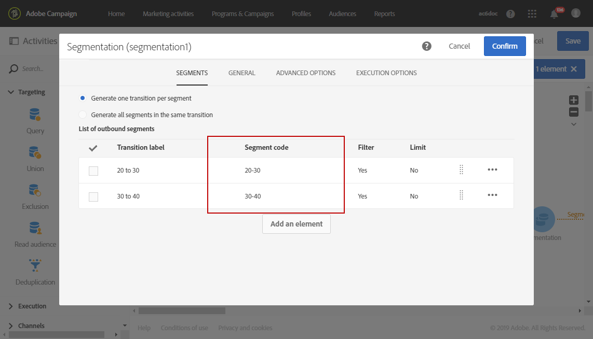
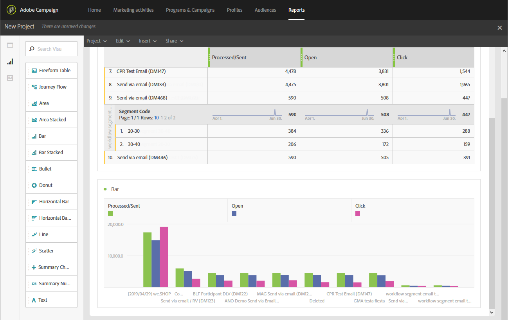

# Criar relatório com base em segmentos de workflow{#creating-a-report-workflow-segment}

Depois de criar um fluxo de trabalho e filtrar sua população em diferentes audiências direcionadas, você pode medir a eficiência de suas campanhas de marketing com base nos segmentos definidos neste fluxo de trabalho de definição de metas.
Para público alvo desses segmentos em seus relatórios:

* [Etapa 1: Atualizar recurso personalizado de Perfis com segmentos](#step-1--update-profiles-custom-resource-segments)
* [Etapa 2: Criar um fluxo de trabalho com segmentos](#step-2--create-a-workflow-segments)
* [Etapa 3: Criar um relatório dinâmico para filtrar segmentos](#step-3--create-a-dynamic-report-filter-segments)

>[!CAUTION]
>O contrato de uso do relatórios dinâmico deve ser aceito para o start coletar esses dados.
>Para obter mais informações sobre este contrato, consulte esta [página](../../reporting/using/about-dynamic-reports.md#dynamic-reporting-usage-agreement).

## Etapa 1: Atualizar recurso personalizado de Perfis com segmentos{#step-1--update-profiles-custom-resource-segments}

Antes do relatórios no código de segmento, é necessário atualizar o recurso personalizado **[!UICONTROL Profiles]** para que os códigos de segmento sejam armazenados.

1. No menu avançado, por meio do logotipo Adobe Campaign, selecione **[!UICONTROL Administration]** > **[!UICONTROL Development]** > **[!UICONTROL Custom resources]** e selecione o recurso **[!UICONTROL Profile (profile)]**.
1. No menu **[!UICONTROL Sending logs extension]** da guia **[!UICONTROL Data structure]**, marque **[!UICONTROL Add segment code]** para permitir o armazenamento de seus códigos de segmento dos workflows de definição de metas e enviá-los para o relatórios dinâmico.

   O **[!UICONTROL Segment code]** estará disponível na seção de dimensão **[!UICONTROL Profile]** do seu relatório.

   

1. Salve o recurso personalizado.

1. Agora você precisa publicar seu recurso personalizado.
No menu avançado, selecione **[!UICONTROL Administration]** > **[!UICONTROL Development]** > **[!UICONTROL Publishing]**.

   

1. Clique em **[!UICONTROL Prepare publication]** e, quando a preparação estiver concluída, clique no botão **[!UICONTROL Publish]**. Para obter mais informações sobre o recurso personalizado, consulte esta [página](../../developing/using/updating-the-database-structure.md).

Agora você pode criar seu fluxo de trabalho com start.

Observe que os códigos de segmento serão coletados assim que você ativar o código de segmento em **[!UICONTROL Sending logs extension]**.

## Etapa 2: Criar um fluxo de trabalho com segmentos {#step-2--create-a-workflow-segments}

>[!NOTE]
>Se a transição de entrada do delivery de email estiver vazia, o Código de segmento da transição anterior será adicionado por padrão.

Primeiro, é necessário criar um fluxo de trabalho com população direcionada diferente. Aqui, queremos enviar um email que será personalizado dependendo da idade da nossa audiência: um delivery para perfis de 20 a 30 anos e outro para perfis de 30 a 40 anos.

1. Crie seu fluxo de trabalho. Para obter mais detalhes sobre como criar seu fluxo de trabalho, consulte esta [página](../../automating/using/building-a-workflow.md).

1. Adicione uma atividade **[!UICONTROL Query]** arrastando-a da paleta e soltando-a no espaço de trabalho.

1. Perfis públicos alvos de 20 a 40 anos para depois segmentá-los em populações mais direcionadas.

   

1. Adicione uma atividade **[!UICONTROL Segmentation]** para dividir os resultados do query em duas populações direcionadas. Para obter mais informações sobre segmentação, consulte esta [página](../../automating/using/segmentation.md).

1. Duplo clique na atividade **[!UICONTROL Segmentation]** para configurá-la. Edite o primeiro segmento clicando em **[!UICONTROL Edit properties]**.

   

1. Perfis de query entre 20 e 30 anos e clique em **[!UICONTROL Confirm]** quando concluído.

   

1. Clique em **[!UICONTROL Add an element]** para criar seu segundo segmento e configurá-lo conforme descrito nas etapas acima para perfis de público alvo entre 30 e 40 anos.

1. Edite **[!UICONTROL Segment code]** para que cada população seja transmitida pelo relatórios dinâmico.

   >[!NOTE]
   >Essa etapa é obrigatória ou você não poderá entender em quais segmentos relatar.

   

1. Arraste e solte uma atividade **[!UICONTROL Email delivery]** após seus segmentos.

   

1. Personalize seus delivery dependendo das diferentes populações-alvo. Para obter mais informações sobre a criação de email, consulte esta [página](../../designing/using/designing-content-in-adobe-campaign.md).

1. Salve o workflow.

1. Clique em **[!UICONTROL Start]** quando seu fluxo de trabalho estiver pronto.

Agora você pode acessar seus relatórios para rastrear seus códigos de segmento.

## Etapa 3: Criar um relatório dinâmico para filtrar segmentos {#step-3--create-a-dynamic-report-filter-segments}

Depois de enviar delivery com seu fluxo de trabalho, você pode detalhar os relatórios usando seus códigos de segmento do fluxo de trabalho.

1. Na guia **[!UICONTROL Reports]**, selecione um relatório predefinido ou clique no botão **[!UICONTROL Create new project]** para start um do zero.

   
1. Arraste e solte a dimensão **[!UICONTROL Delivery]** na tabela de forma livre.

   

1. Arraste e solte métricas diferentes em sua tabela, como as métricas **[!UICONTROL Open]** e **[!UICONTROL Click]** para filtrar seus dados por start.
1. Na categoria **[!UICONTROL Dimensions]**, clique na dimensão **[!UICONTROL Profile]** e arraste e solte a dimensão **[!UICONTROL Segment code]** no delivery do seu fluxo de trabalho para medir o sucesso do delivery de email, dependendo das populações direcionadas.

   

1. Arraste e solte uma visualização no seu espaço de trabalho, se necessário.

   
