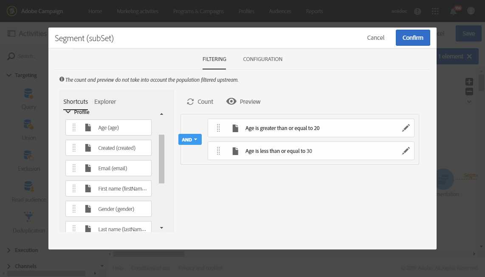

# Criar relatório com base em segmentos de fluxo de trabalho{#creating-a-report-workflow-segment}

>[!CAUTION]
> **[!UICONTROL Segment code]** pode somente direcionar entregas de email e SMS.

Depois de criar um fluxo de trabalho e filtrar sua população em públicos-alvo direcionados diferentes, você pode medir a eficiência de suas campanhas de marketing com base nos segmentos definidos nesse fluxo de trabalho direcionado.
Para direcionar esses segmentos em seus relatórios:

* [Etapa 1: atualizar o recurso personalizado Perfis com segmentos](#step-1--update-profiles-custom-resource-segments)
* [Etapa 2: criar um fluxo de trabalho com segmentos](#step-2--create-a-workflow-segments)
* [Etapa 3: criar um relatório dinâmico para filtrar segmentos](#step-3--create-a-dynamic-report-filter-segments)

>[!CAUTION]
>O contrato de uso de Relatórios dinâmicos deve ser aceito para iniciar a coleta desses dados.
>
>Para obter mais informações sobre este contrato, consulte esta [página](../../reporting/using/about-dynamic-reports.md#dynamic-reporting-usage-agreement).

## Etapa 1: atualizar o recurso personalizado Perfis com segmentos{#step-1--update-profiles-custom-resource-segments}

Antes de relatar o código de segmento, é necessário atualizar o recurso personalizado do **[!UICONTROL Profiles]** para que os códigos de segmento sejam armazenados.

1. No menu avançado, no logotipo do Adobe Campaign, selecione **[!UICONTROL Administration]** > **[!UICONTROL Development]** > **[!UICONTROL Custom resources]** e, em seguida, selecione o recurso **[!UICONTROL Profile (profile)]**.
1. No menu **[!UICONTROL Sending logs extension]**, na guia **[!UICONTROL Data structure]**, marque **[!UICONTROL Add segment code]** para permitir o armazenamento dos códigos de segmento de fluxos de trabalho para construção do target e enviá-los para relatórios dinâmicos.

   O **[!UICONTROL Segment code]** estará disponível na seção de dimensão **[!UICONTROL Profile]** do seu relatório.

   

1. Salve o recurso personalizado.

1. Agora é necessário publicar o recurso personalizado.
No menu avançado, selecione **[!UICONTROL Administration]** > **[!UICONTROL Development]** > **[!UICONTROL Publishing]**.

   

1. Clique em **[!UICONTROL Prepare publication]** e, quando a preparação estiver concluída, clique no botão **[!UICONTROL Publish]**. Para obter mais informações sobre recursos personalizados, consulte esta [página](../../developing/using/updating-the-database-structure.md).

Agora é possível começar a criar o fluxo de trabalho com códigos de segmento.

Observe que os códigos de segmento serão coletados assim que você habilitar o código de segmento no **[!UICONTROL Sending logs extension]**.

## Etapa 2: criar um fluxo de trabalho com segmentos {#step-2--create-a-workflow-segments}

>[!NOTE]
>Se a transição de entrada do delivery de email estiver vazia, o Código de segmento da transição anterior será adicionado por padrão.

Primeiro, é necessário criar um fluxo de trabalho com um público-alvo diferente. Aqui, queremos enviar um email que será personalizado de acordo com a idade do nosso público-alvo: um delivery para perfis de 20 a 30 anos e outro para perfis entre 30 e 40 anos.

1. Crie seu workflow. Para obter mais detalhes sobre como criar seu fluxo de trabalho, consulte esta [página](../../automating/using/building-a-workflow.md).

1. Adicione uma atividade **[!UICONTROL Query]** arrastando-a da paleta e soltando-a no espaço de trabalho.

1. Direcione perfis com idade entre 20 e 40 anos para segmentá-los posteriormente em populações mais direcionadas.

   

1. Adicione uma atividade **[!UICONTROL Segmentation]** para dividir os resultados da consulta em duas populações direcionadas. Para obter mais informações sobre segmentação, consulte esta [página](../../automating/using/segmentation.md).

1. Clique duas vezes na atividade **[!UICONTROL Segmentation]** para configurá-la. Edite o primeiro segmento clicando em **[!UICONTROL Edit properties]**.

   

1. Consulte perfis entre 20 e 30 anos e clique em **[!UICONTROL Confirm]** quando terminar.

   

1. Clique em **[!UICONTROL Add an element]** para criar seu segundo segmento e configurá-lo conforme descrito nas etapas acima para direcionar perfis entre os 30 e os 40 anos.

1. Edite o **[!UICONTROL Segment code]** para cada população a ser transmitida por meio dos relatórios dinâmicos.

   >[!NOTE]
   >Esta etapa é obrigatória ou você não poderá entender sobre quais segmentos relatar.

   

1. Arraste e solte uma atividade **[!UICONTROL Email delivery]** depois dos seus segmentos.

   

1. Personalize seus deliveries dependendo das diferentes populações direcionadas. Para obter mais informações sobre criação de email, consulte esta [página](../../designing/using/designing-content-in-adobe-campaign.md).

1. Salve o workflow.

1. Clique em **[!UICONTROL Start]** quando o fluxo de trabalho estiver pronto.

Agora é possível acessar os relatórios para rastrear os códigos de segmento.

## Etapa 3: criar um relatório dinâmico para filtrar segmentos {#step-3--create-a-dynamic-report-filter-segments}

Depois de enviar deliveries com seu fluxo de trabalho, você pode detalhar os relatórios usando os códigos de segmento do seu fluxo de trabalho.

1. Na guia **[!UICONTROL Reports]**, selecione um relatório pronto para uso ou clique no botão **[!UICONTROL Create new project]** para iniciar um do zero.

   
1. Arraste e solte a dimensão **[!UICONTROL Delivery]** na tabela de forma livre.

   

1. Arraste e solte métricas diferentes na tabela, como as métricas **[!UICONTROL Open]** e **[!UICONTROL Click]**, para começar a filtrar os dados.
1. Na categoria **[!UICONTROL Dimensions]**, clique na dimensão **[!UICONTROL Profile]** e arraste e solte a dimensão **[!UICONTROL Segment code]** na entrega do fluxo de trabalho para medir o sucesso da entrega de email, dependendo das populações direcionadas.

   

1. Arraste e solte uma visualização no seu espaço de trabalho se necessário.

   
