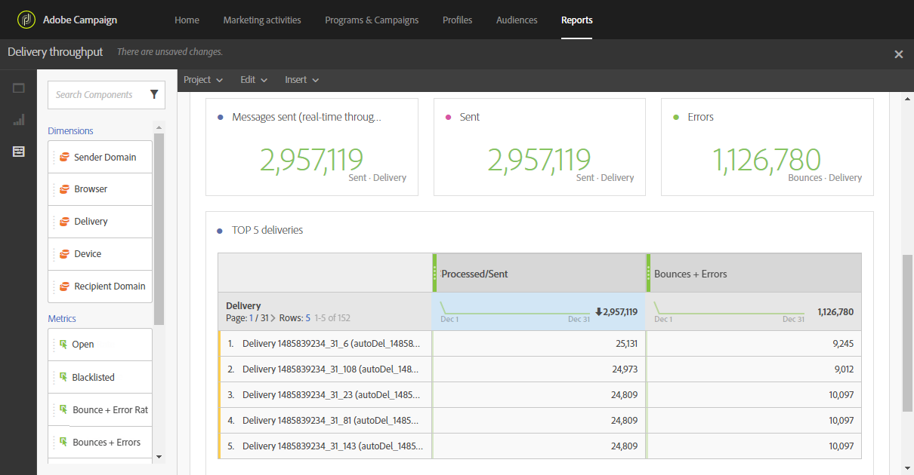

# Taxa de transferência de entrega{#delivery-throughput}

Este relatório contém dados relacionados à taxa de transferência de delivery de um ou vários envios. Ele fornece:

* O número de mensagens processadas por hora
* A tabela **[!UICONTROL Top 5 deliveries]** e os números de resumo complementares que mostram as cinco entregas com melhor ganho em tentativas.

>[!NOTE]
>
>A página **[!UICONTROL Delivery throughput]** exibe a velocidade da taxa de transferência para a retransmissão de suas mensagens do Campaign para o MTA aprimorado do Adobe Campaign (Agente de Transferência de Mensagem).
