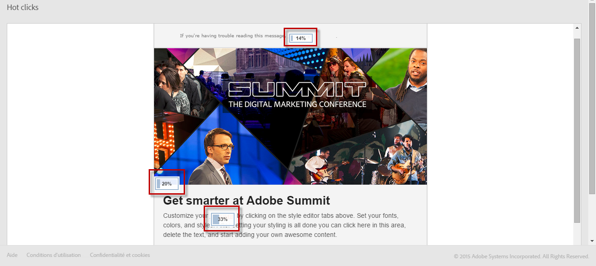

# Hot clicks{#hot-clicks}

Este relatório pode ser acessado pelo botão **[!UICONTROL Reports]** em cada delivery ou mensagem transacional.

Ele apresenta o conteúdo da mensagem (HTML e/ou texto) com a porcentagem de cliques em cada link.

Se você criou conteúdo dinâmico para o delivery, é possível visualizar as porcentagens para cada condição definida. Para obter mais informações sobre como inserir conteúdo condicional em um delivery, consulte [Definição de conteúdo dinâmico](../../designing/using/personalization.md#defining-dynamic-content-in-an-email).

Por exemplo, imagine que você criou um delivery com as seguintes condições:

* O link na imagem principal é diferente se o recipient for um homem ou uma mulher.
* Você também adicionou um link a uma oferta especial que é visível apenas para recipients com mais de 25 anos.

Depois que a mensagem for enviada, selecione **[!UICONTROL Reports]** > **[!UICONTROL Hot clicks]** no painel do delivery.

Por padrão, nenhum perfil é selecionado. Somente os cliques para recipients cujo sexo é desconhecido e para recipients com menos de 25 anos ou cuja idade é desconhecida são exibidos.

Para exibir cliques para mulheres, clique no botão **[!UICONTROL Change profile]** e selecione um perfil de teste feminino. Para exibir cliques para homens, continue de forma semelhante e selecione um perfil de teste masculino.

Para exibir cliques para recipients com mais de 25 anos, clique no botão **[!UICONTROL Change profile]** e selecione um perfil de teste cuja data de nascimento corresponda a essa condição.

Para obter mais informações sobre perfis de teste, consulte [Sobre perfis de teste](../../audiences/using/managing-test-profiles.md).

>[!NOTE]
>
>O número de cliques em um link específico é uma porcentagem do total de cliques para todo conteúdo condicional em um delivery. Portanto, se você definiu conteúdo dinâmico, o total das porcentagens exibidas para um perfil de teste específico pode não ser igual a 100.

Da mesma forma, para entregas recorrentes e mensagens transacionais, é possível selecionar o perfil de teste correspondente ao conteúdo dinâmico que deseja exibir, mas também exibir as porcentagens de clique de acordo com o delivery de execução selecionado.

Um delivery de execução é uma mensagem técnica não acionável e não funcional criada nos seguintes casos:

* Cada vez que um delivery recorrente é executado ou atualizado.

   Por exemplo, se o workflow que gerencia esse delivery for executado uma vez por mês, haverá um delivery de execução por mês. Além disso, cada vez que o conteúdo do delivery é atualizado, um delivery de execução adicional é criado.

   Para obter mais informações sobre deliveries de email recorrentes, consulte [Delivery de email](../../automating/using/email-delivery.md).

* Por padrão, uma vez por mês para mensagens transacionais e sempre que uma mensagem transacional for editada e publicada novamente.

   Para obter mais informações sobre mensagens transacionais, consulte [Introdução a mensagens transacionais](../../channels/using/getting-started-with-transactional-msg.md).

>[!NOTE]
>
>Como as IDs dos URLs rastreados são diferentes para cada execução, os dados de cliques ativos não podem ser agregados para todos os deliveries de execução de uma determinada mensagem. Ele só pode ser exibido para um delivery de execução por vez.

Depois que a mensagem for enviada, selecione **[!UICONTROL Reports]** > **[!UICONTROL Hot clicks]** no painel do delivery.

Por padrão, o delivery da última execução é selecionado. Clique no botão **[!UICONTROL Change execution delivery]** para selecionar outro.

Somente as porcentagens de clique para a execução de delivery selecionada são exibidas.
