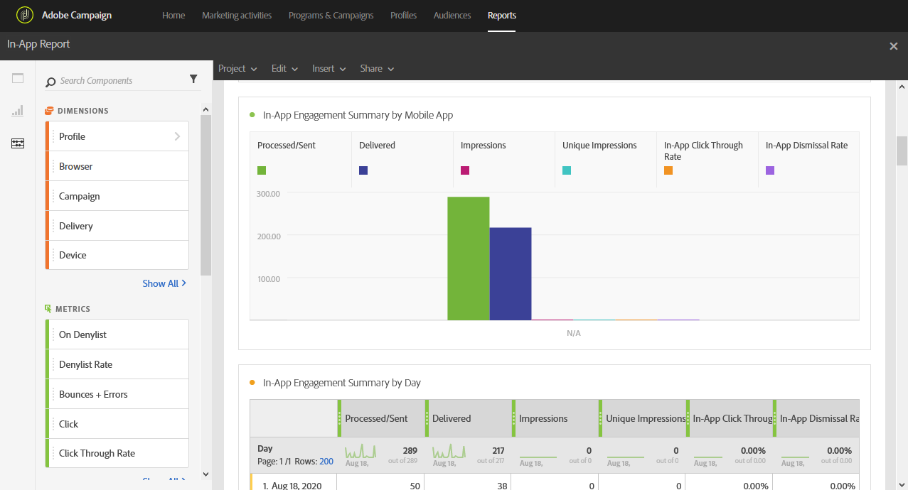
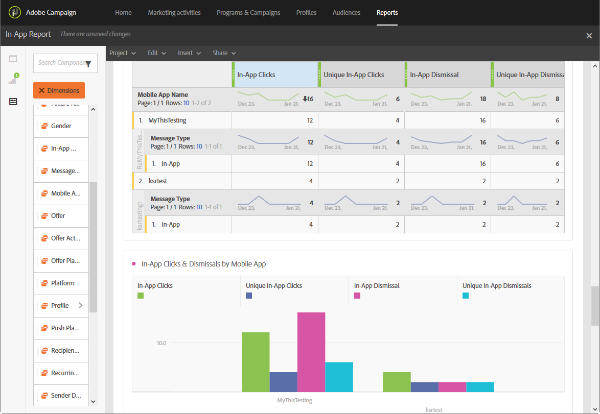

# Relatório no aplicativo{#in-app-report}

>[!CAUTION]
>
>Observe que você deve arrastar e soltar as métricas **[!UICONTROL Message type]** nas tabelas para dividir os dados, dependendo dos tipos de entrega, neste caso, entregas no aplicativo.

O relatório **No aplicativo** fornece detalhes relacionados às entregas no aplicativo.

Cada tabela é representada por números de resumo e gráficos. É possível alterar como os detalhes são mostrados nas respectivas configurações de visualização.

A primeira tabela **Resumo do Envolvimento no Aplicativo** é dividida em três categorias: por dia, por aplicativo móvel e por entrega. Ele contém os dados disponíveis para a reatividade do recipient ao delivery:

* **[!UICONTROL Processed/sent]**: Número total de envios para a entrega no aplicativo.
* **[!UICONTROL Delivered]**: Número de mensagens no aplicativo enviadas com êxito, em relação ao número total de mensagens enviadas.
* **[!UICONTROL Impressions]**: Total de mensagens no aplicativo vistas pelos destinatários, dependendo se o critério do gatilho foi atendido.
* **[!UICONTROL Unique impressions]**: Número de impressões por destinatário.
* **[!UICONTROL In-App click through rate]**: Porcentagem de usuários que clicaram no Botão 1 ou Botão 2 em comparação aos usuários que viram a mensagem.
* **[!UICONTROL In-App dismissal rate]**: Porcentagem de mensagens no aplicativo que os destinatários rejeitaram.

A segunda tabela **Cliques no Aplicativo e Descartes** é dividida em três categorias: por dia, por aplicativo móvel e por entrega. Ele contém os dados disponíveis para o comportamento do recipient por delivery:

* **[!UICONTROL In-App clicks]**: Número total de destinatários que clicaram no Botão 1 ou Botão 2.
* **[!UICONTROL Unique In-App clicks]**: Número de vezes que os destinatários clicaram no Botão 1 ou Botão 2.
* **[!UICONTROL In-App dismissal]**: Número total de mensagens que os destinatários rejeitaram clicando no botão Fechar ou descartando automaticamente.
* **[!UICONTROL Unique In-App dismissal]**: Número de vezes que os destinatários rejeitaram uma mensagem no aplicativo.
