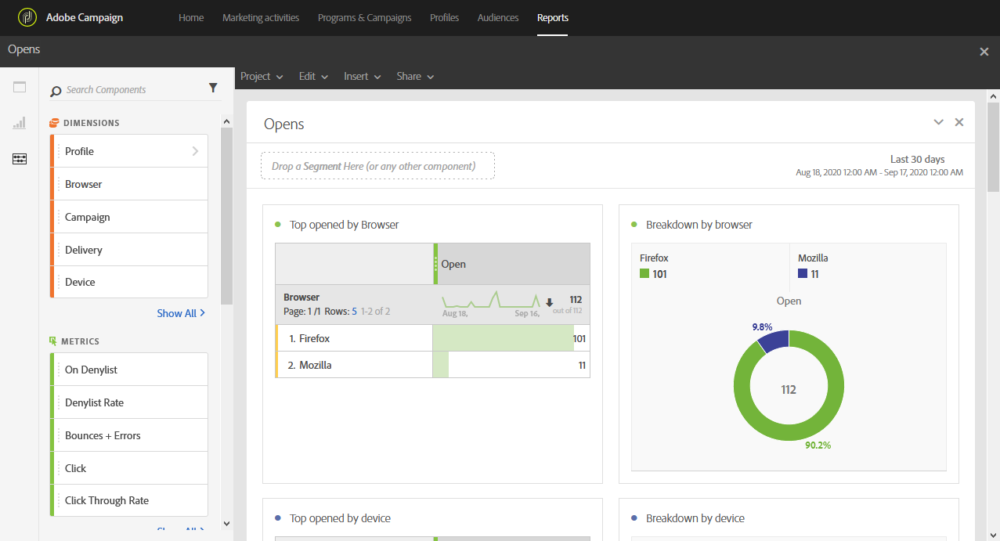

# Aberturas{#opens}

O relatório **[!UICONTROL Opens]** identifica as entregas que foram mais vistas pelos destinatários.

Quatro tabelas e gráficos detalham o número total de recipients que abriram um email com base em:

* Navegador
* Dispositivo
* Plataforma
* Domínio

A tabela e o gráfico **[!UICONTROL TOP 5]** exibem as entregas com o maior número de mensagens entregues.
