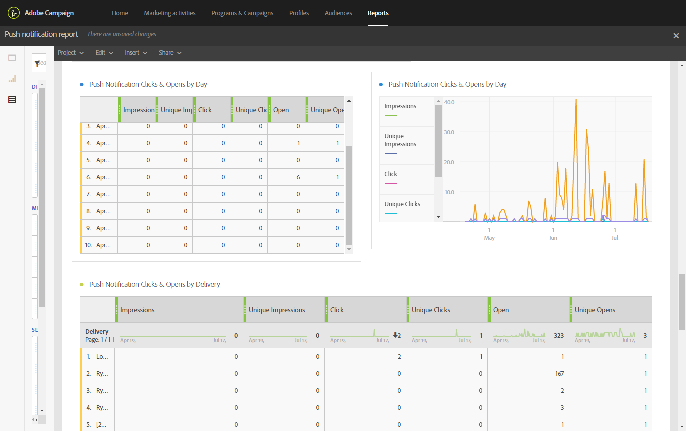

# Relatório de notificação por push{#push-notification-report}

>[!CAUTION]
>
>Observe que você deve arrastar e soltar as métricas **[!UICONTROL Message type]** em suas tabelas para dividir seus dados, dependendo de seus tipos de entrega, neste caso entregas de notificação por push.

O relatório **Notificação por push** fornece detalhes sobre o desempenho de marketing das notificações por push no Adobe Campaign. Esse relatório pronto para uso ajuda você a entender como os usuários interagem com notificações por push, aplicativos móveis e deliveries.

Alguma configuração é necessária no aplicativo móvel para implementar o rastreamento de push. Consulte esta [página](../../administration/using/push-tracking.md) para obter as etapas detalhadas.

Cada tabela é representada por números de resumo e gráficos. É possível alterar como os detalhes são mostrados nas respectivas configurações de visualização.

A primeira tabela **Resumo de Envolvimento de notificação por push** está dividida em três categorias: por dia, por aplicativo móvel e por entrega. Ele contém os dados disponíveis para a reatividade do recipient ao delivery:

* **[!UICONTROL Processed/sent]**: Número total de notificações por push enviadas.
* **[!UICONTROL Delivered]**: Número de notificações por push enviadas com êxito em relação ao número total de notificações por push enviadas.
* **[!UICONTROL Impressions]**: Número de vezes que uma notificação por push foi entregue ao dispositivo e deixada intocada na central de notificações. Na maioria dos casos, o número de impressões deve ser semelhante ao número entregue. Isso garante que o dispositivo recebeu a mensagem e transmitiu essas informações de volta ao servidor.
* **[!UICONTROL Unique impressions]**: Número de impressões por destinatário.
* **[!UICONTROL Click through rate]**: Porcentagem de usuários que interagiram com a notificação por push.
* **[!UICONTROL Open rate]**: Porcentagem de notificações por push abertas.

A segunda tabela **Cliques e aberturas por notificação por push** é dividida em três categorias: por dia, por aplicativo móvel e por entrega. Ele contém os dados disponíveis para o comportamento do recipient por delivery:

* **[!UICONTROL Impressions]**: Total de notificações por push vistas pelos destinatários.
* **[!UICONTROL Unique impressions]**: Número de impressões por destinatário.
* **[!UICONTROL Click]**: Número de vezes que uma notificação por push foi entregue ao dispositivo e clicada pelo usuário. O usuário queria visualizar a notificação, que será movida para o rastreamento de Abertura por push ou a descartará.
* **[!UICONTROL Unique clicks]**: Número de vezes que um usuário único interage com a notificação por push, por exemplo, cliques na notificação ou no botão.
* **[!UICONTROL Open]**: Número total de notificações por push entregues ao dispositivo e clicadas pelos usuários, abrindo o aplicativo. Isso é semelhante ao clique por push, exceto que uma abertura por push não será acionada se a notificação tiver sido descartada.
* **[!UICONTROL Unique Opens]**: Número de destinatários que abriram a entrega.
