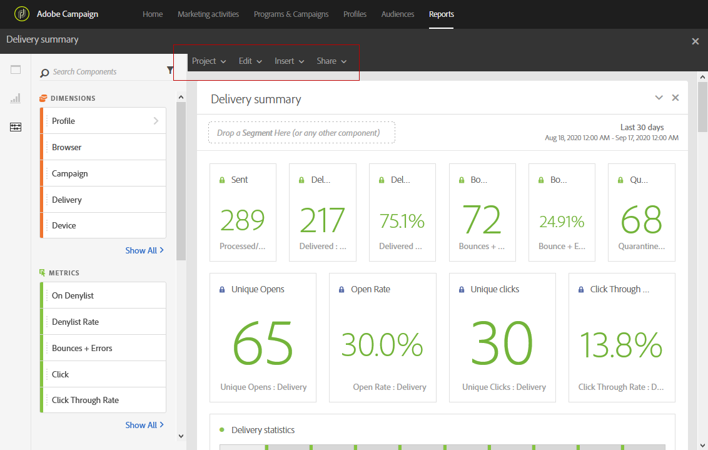

# Reporting interface{#reporting-interface}

A barra de ferramentas superior permite, por exemplo, modificar, salvar ou imprimir seu relatório.

Use the **Project** tab to:

* **Abrir…**: Abre um relatório criado anteriormente ou um modelo.
* **Salvar como…**: Duplica os modelos para modificá-los.
* **Atualizar projeto**: Atualiza seu relatório com base em novos dados e alterações em filtros.
* **Baixar CSV**: Exporta seus relatórios para um arquivo CSV.

The **Edit** tab allows you to:

* **Desfazer**: Cancela sua última ação no painel.
* **Limpar todos**: Exclui cada painel do painel.

The **Insert** table lets you customize your reports by adding graphs and tables to your dashboard:

* **Novo painel em branco**: Adiciona um novo painel em branco ao seu painel.
* **Novo forma livre**: Adiciona uma nova tabela de forma livre ao painel.
* **Nova linha**: Adiciona um novo gráfico de linha ao seu painel.
* **Nova barra**: Adiciona um novo gráfico de barras ao painel.

**Tópicos relacionados:**

* [Adicionar painéis](../../reporting/using/adding-panels.md)
* [Adicionar visualizações](../../reporting/using/adding-visualizations.md)
* [Adicionar componentes](../../reporting/using/adding-components.md)

## Tabs {#tabs}

As guias à esquerda permitem criar seu relatório e filtrar seus dados conforme necessário.

Essas guias fornecem acesso aos seguintes itens:

* **[!UICONTROL Panels]**: adicionar um painel em branco ou forma livre ao seu relatório para começar a filtrar seus dados. Para obter mais informações sobre isso, consulte a seção Adicionar painéis
* **[!UICONTROL Visualizations]**: arraste e solte uma seleção de itens de visualização para dar ao seu relatório uma dimensão gráfica. Para obter mais informações sobre isso, consulte a seção Adicionar visualizações.
* **[!UICONTROL Components]**: personalize seus relatórios com diferentes dimensões, métricas, segmentos e períodos de tempo.

## Toolbar {#toolbar}

A barra de ferramentas pode ser encontrada acima da área de trabalho. Composto de guias diferentes, permite, por exemplo, modificar, salvar, compartilhar ou imprimir seu relatório.

**Tópicos relacionados:**

* [Adicionar painéis](../../reporting/using/adding-panels.md)
* [Adicionar visualizações](../../reporting/using/adding-visualizations.md)
* [Adicionar componentes](../../reporting/using/adding-components.md)

### Project tab {#project-tab}

Use the **Project** tab to:

* **Abrir…**: Abre um relatório criado anteriormente ou um modelo.
* **Salvar como…**: Duplica os modelos para modificá-los.
* **Atualizar projeto**: Atualiza seu relatório com base em novos dados e alterações em filtros.
* **Baixar CSV**: Exporta seus relatórios para um arquivo CSV.
* **[!UICONTROL Print]**: Imprima seu relatório.

### Edit tab {#edit-tab}

The **Edit** tab allows you to:

* **Desfazer**: Cancela sua última ação no painel.
* **Limpar todos**: Exclui cada painel do painel.

### Insert tab {#insert-tab}

The **Insert** tab lets you customize your reports by adding graphs and tables to your dashboard:

* **Novo painel em branco**: Adiciona um novo painel em branco ao seu painel.
* **Novo forma livre**: Adiciona uma nova tabela de forma livre ao painel.
* **Nova linha**: Adiciona um novo gráfico de linha ao seu painel.
* **Nova barra**: Adiciona um novo gráfico de barras ao painel.

### Share tab {#share-tab}

The **[!UICONTROL Share]** tab allows you to send your reports with Adobe Campaign users through one-shot or recurrent emails. Os usuários direcionados receberão um email com o seu relatório anexado.

* **[!UICONTROL Send report now]**: Envie seu relatório para uma lista de destinatários escolhidos por meio de um e-mail de uma única captura.

   1. In the **[!UICONTROL Send report]** window, add a description if needed.

      

   1. Selecione os destinatários ao seu email clicando no campo e selecionando-os no menu suspenso ou digitando seus endereços de e-mail.
   1. Check **[!UICONTROL Show scheduling options]** if you want to send recurring emails. This can also be done by selecting **[!UICONTROL Send Report on schedule]** in the **[!UICONTROL Share]** tab.
   1. Click **[!UICONTROL Send now]**. Os destinatários receberão um email com seu relatório anexado.

* **[!UICONTROL Send report on schedule]**: Agende seu relatório e envie emails recorrentes aos seus destinatários.

   1. In the **[!UICONTROL Send report]** window, add a description if needed.
   1. Selecione os destinatários ao seu email clicando no campo e selecionando-os no menu suspenso ou digitando seus endereços de e-mail.

      

   1. Select your starting and ending date to configure your email validity in the **[!UICONTROL Starting on]** and **[!UICONTROL Ending on]** fields.
   1. Escolha em qual frequência seu e-mail será enviado.

      

   1. Click **[!UICONTROL Send on schedule]**, your recipients will receive your recurring email depending on the chosen frequency.

* **[!UICONTROL Scheduled reports]**: Localize e configure todo o seu relatório agendado.

   1. In the **[!UICONTROL Scheduled reports]** window, find all your recurring sent reports.

      

   1. If you need to delete one of your scheduled report, select the scheduled report you want to delete then click **[!UICONTROL Delete the section]**.
   1. Para configurar ou verificar seus relatórios programados, clique diretamente no relatório que você precisa alterar.
   1. The **[!UICONTROL Edit scheduled report]** window appears, you can now change the recipients or frequency of your email if needed.

Os usuários direcionados receberão um email com o seu relatório anexado diretamente em suas caixas de entrada. Os usuários sempre podem decidir parar de receber emails recorrentes usando um link de cancelamento de assinatura disponível em cada email recorrente.
