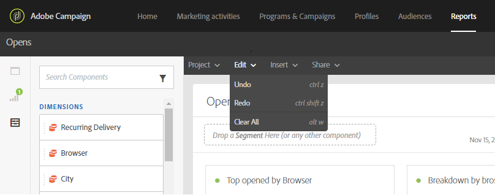

# Interface de relatórios{#reporting-interface}

A barra de ferramentas superior permite, por exemplo, modificar, salvar ou imprimir o relatório.

Use a guia **Projeto** para:

* **Abrir...**: abre um relatório criado anteriormente ou um modelo.
* **Salvar como...**: duplica os modelos para poder modificá-los.
* **Atualizar projeto**: atualiza seu relatório com base em novos dados e alterações em filtros.
* **Baixar CSV**: exporta seus relatórios para um arquivo CSV.

A guia **Editar** permite:

* **Desfazer**: cancela sua última ação no painel.
* **Limpar tudo**: exclui todos os painéis do painel.

A tabela **Insert** permite personalizar seus relatórios adicionando gráficos e tabelas ao painel:

* **Novo painel em branco**: adiciona um novo painel em branco ao painel.
* **Nova Forma livre**: adiciona uma nova tabela de forma livre ao painel.
* **Nova linha**: adiciona um novo gráfico de linhas ao seu painel.
* **Nova barra**: adiciona um novo gráfico de barras ao painel.

**Tópicos relacionados:**

* [Adicionar painéis](../../reporting/using/adding-panels.md)
* [Adicionar visualizações](../../reporting/using/adding-visualizations.md)
* [Adição de componentes](../../reporting/using/adding-components.md)
* [Compartilhamento automático de relatórios com participantes por email](https://helpx.adobe.com/campaign/kb/simplify-campaign-management.html#Reportandshareinsightswithallstakeholders)

## Guias {#tabs}

As guias à esquerda permitem criar o relatório e filtrar os dados conforme necessário.

Essas guias fornecem acesso aos seguintes itens:

* **[!UICONTROL Panels]**: adicione um painel ou formato livre em branco ao relatório para começar a filtrar seus dados. Para obter mais informações, consulte a seção Adição de painéis
* **[!UICONTROL Visualizations]**: arraste e solte uma seleção de itens de visualização para dar ao seu relatório uma dimensão gráfica. Para obter mais informações, consulte a seção Adição de visualizações.
* **[!UICONTROL Components]**: personalize seus relatórios com diferentes dimensões, métricas, segmentos e períodos.

## Barra de ferramentas {#toolbar}

A barra de ferramentas pode ser encontrada acima do seu espaço de trabalho. Composto por diferentes guias, permite, por exemplo, modificar, salvar, compartilhar ou imprimir seu relatório.

**Tópicos relacionados:**

* [Adicionar painéis](../../reporting/using/adding-panels.md)
* [Adicionar visualizações](../../reporting/using/adding-visualizations.md)
* [Adição de componentes](../../reporting/using/adding-components.md)

### Guia Projeto {#project-tab}

Use a guia **Projeto** para:

* **Abrir...**: abre um relatório criado anteriormente ou um modelo.
* **Salvar como...**: duplica os modelos para poder modificá-los.
* **Atualizar projeto**: atualiza seu relatório com base em novos dados e alterações em filtros.
* **Baixar CSV**: exporta seus relatórios para um arquivo CSV.
* **[!UICONTROL Print]**: Imprima seu relatório.

### Guia Editar {#edit-tab}

A guia **Editar** permite:

* **Desfazer**: cancela sua última ação no painel.
* **Limpar tudo**: exclui todos os painéis do painel.

### Guia Inserir {#insert-tab}

A guia **Insert** permite personalizar seus relatórios adicionando gráficos e tabelas ao painel:

* **Novo painel em branco**: adiciona um novo painel em branco ao painel.
* **Nova Forma livre**: adiciona uma nova tabela de forma livre ao painel.
* **Nova linha**: adiciona um novo gráfico de linhas ao seu painel.
* **Nova barra**: adiciona um novo gráfico de barras ao painel.

### Guia Compartilhar {#share-tab}

A guia **[!UICONTROL Share]** permite enviar seus relatórios com usuários do Adobe Campaign por emails recorrentes ou de uma só vez. Os usuários direcionados receberão um email com o relatório anexado.

* **[!UICONTROL Send report now]**: Envie seu relatório para uma lista de destinatários escolhidos por meio de um email único.

   1. Na janela **[!UICONTROL Send report]**, adicione uma descrição, se necessário.

      

   1. Selecione os recipients no menu suspenso. Observe que não é possível selecionar usuários fora da organização.
   1. Marque **[!UICONTROL Show scheduling options]** se desejar enviar emails recorrentes. Isso também pode ser feito selecionando **[!UICONTROL Send Report on schedule]** na guia **[!UICONTROL Share]**.
   1. Clique em **[!UICONTROL Send now]**. Os recipients receberão um email com o relatório em anexo.

* **[!UICONTROL Send report on schedule]**: agende seu relatório e envie emails recorrentes para seus destinatários.

   1. Na janela **[!UICONTROL Send report]**, adicione uma descrição, se necessário.
   1. Selecione os recipients no menu suspenso. Observe que não é possível selecionar usuários fora da organização.

      

   1. Selecione a data de início e término para configurar a validade do email nos campos **[!UICONTROL Starting on]** e **[!UICONTROL Ending on]**.
   1. Escolha a frequência com que seu email será enviado.

      

   1. Clique em **[!UICONTROL Send on schedule]**. Os destinatários receberão seu email recorrente, dependendo da frequência escolhida.

* **[!UICONTROL Scheduled reports]**: encontre e configure todos os seus relatórios agendados.

   1. Na janela **[!UICONTROL Scheduled reports]**, encontre todos os relatórios recorrentes enviados.

      

   1. Se precisar excluir um de seus relatórios agendados, selecione o relatório agendado que deseja excluir e clique em **[!UICONTROL Delete the section]**.
   1. Para configurar ou verificar seus relatórios agendados, clique diretamente no relatório que precisa ser alterado.
   1. A janela **[!UICONTROL Edit scheduled report]** é exibida. Agora é possível alterar os destinatários ou a frequência do email, se necessário.

Os usuários direcionados receberão um email com seu relatório anexado diretamente nas caixas de entrada. Os usuários sempre podem decidir parar de receber emails recorrentes usando um link de unsubscription disponível em cada email recorrente.

**Tópicos relacionados:**

* [Compartilhamento automático de relatórios com participantes por email](https://helpx.adobe.com/campaign/kb/simplify-campaign-management.html#Reportandshareinsightswithallstakeholders)
