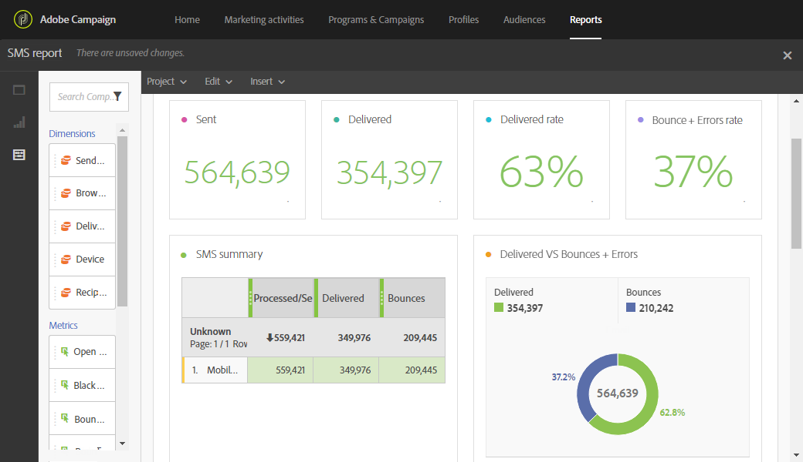

# Relatório de SMS{#sms-report}

O relatório **SMS** fornece detalhes sobre entregas de SMS, como taxas de entrega e rejeição.

A tabela de **resumo de SMS**, os gráficos e os números de resumo contêm dados disponíveis para as entregas de SMS que foram enviadas.

* **Processado/enviado**: o número de SMS enviados.
* **Entregue**: o número de SMS entregue.
* **Rejeições + Erros**: o número de mensagens que não puderam ser entregues.
