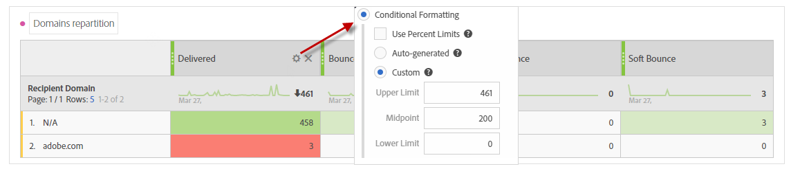

# Solução de problemas{#troubleshooting}

Nesta seção, você pode encontrar perguntas comuns relacionadas aos Relatórios dinâmicos.

## Para aberturas exclusivas e cliques exclusivos, a contagem na linha de agregação não corresponde àquelas em linhas individuais {#unique-open-clicks-no-match}

Esse é um comportamento esperado.
Podemos usar o exemplo a seguir para explicar esse comportamento.

Um email é enviado para os perfis P1 e P2.

P1 abre o email duas vezes no primeiro dia e três vezes no segundo dia.

Enquanto isso, o P2 abre o email uma vez no primeiro dia e não o abre novamente nos dias seguintes.
Esta é uma representação visual da interação dos perfis com o email enviado:

<table> 
 <thead> 
  <tr> 
   <th align="center"> <strong>Day</strong>   </th> 
   <th align="center"> <strong>Aberturas</strong>   </th> 
   <th align="center"> <strong>Aberturas exclusivas</strong>   </th> 
  </tr> 
 </thead> 
 <tbody> 
  <tr> 
   <td align="center"> Dia 1  </td> 
   <td align="center"> 2 + 1 = 3  </td> 
   <td align="center"> 1 + 1 = 2  </td> 
  </tr> 
  <tr> 
   <td align="center"> Dia 2  </td> 
   <td align="center"> 3 + 0 = 3  </td> 
   <td align="center"> 1 + 0 = 1  </td> 
  </tr>
 </tbody> 
</table>

Para entender o número geral de aberturas exclusivas, precisamos somar as contagens de linha de **[!UICONTROL Unique Opens]** que nos fornece o valor 3. Mas como o email foi direcionado para apenas 2 perfis, a taxa de abertura deve mostrar 150%.

Para não obter uma porcentagem superior a 100, a definição de **[!UICONTROL Unique Opens]** é mantida para ser o número de broadlogs exclusivos que foram abertos. Nesse caso, mesmo se P1 tiver aberto o email no Dia 1 e no Dia 2, suas aberturas exclusivas ainda serão 1.

Isso resultará na seguinte tabela:

<table> 
 <thead> 
  <tr> 
   <th align="center"> <strong>Dia</strong>   </th> 
   <th align="center"> <strong>Aberturas</strong>   </th> 
   <th align="center"> <strong>Aberturas exclusivas</strong>   </th> 
  </tr> 
 </thead> 
 <tbody> 
  <tr> 
   <td align="center"> Dia 1  </td> 
   <td align="center"> 6  </td> 
   <td align="center"> 2  </td>
  </tr> 
  <tr> 
   <td align="center"> Dia 2  </td> 
   <td align="center"> 3  </td> 
   <td align="center"> 2  </td> 
  </tr> 
 </tbody> 
</table>

>[!NOTE]
>
>As contagens exclusivas são baseadas em um rascunho baseado em HLL, isso pode causar pequenas imprecisões em contagens grandes.

## Contagens abertas não correspondem à contagem do Banco de Dados {#open-counts-no-match-database}

Isso pode ser devido ao fato de que as heurísticas são usadas no Dynamic Reporting para rastrear aberturas mesmo quando não podemos rastrear a ação **[!UICONTROL Open]**.

Por exemplo, se um usuário desabilitou imagens em seu cliente e clicar em um link no email, o **[!UICONTROL Open]** pode não ser rastreado pelo banco de dados, mas o **[!UICONTROL Click]** será.

Portanto, as contagens dos logs de rastreamento **[!UICONTROL Open]** podem não ter a mesma contagem no banco de dados.

Essas ocorrências são adicionadas como **&quot;um clique de email implica uma abertura de email&quot;**.

>[!NOTE]
>
>Como as contagens únicas são baseadas em um rascunho baseado em HLL, podem ocorrer pequenas inconsistências entre as contagens.

## Como as contagens de deliveries recorrentes/transacionais são calculadas? {#counts-recurring-deliveries}

Ao trabalhar com deliveries recorrentes e transacionais, as contagens serão atribuídas aos deliveries pai e filho.
Podemos ver o exemplo de um delivery recorrente chamado **R1** definido para ser executado todos os dias no dia 1 (RC1), no dia 2 (RC2) e no dia 3 (RC3).
Vamos supor que apenas uma única pessoa abriu todas as entregas secundárias várias vezes. Nesse caso, os deliveries secundários recorrentes individuais mostrarão a contagem **[!UICONTROL Open]** como 1 para cada um.
No entanto, como a mesma pessoa clicou em todos os deliveries, o delivery recorrente pai também terá **[!UICONTROL Unique open]** como 1.

Os relatórios devem ter a seguinte aparência:

<table> 
 <thead> 
  <tr> 
   <th align="center"> <strong>Delivery</strong>   </th> 
   <th align="center"> <strong>Sent</strong>   </th> 
   <th align="center"> <strong>Entregue</strong>   </th>
   <th align="center"> <strong>Aberturas</strong>   </th> 
   <th align="center"> <strong>Aberturas exclusivas</strong>   </th>
  </tr> 
 </thead> 
 <tbody> 
  <tr> 
   <td align="center"> <strong>R1  </td> 
   <td align="center"> <strong>100  </td> 
   <td align="center"> <strong>90º  </td> 
   <td align="center"> <strong>10º  </td> 
   <td align="center"> <strong>3  </td> 
  </tr> 
  <tr> 
   <td align="center"> RC1  </td> 
   <td align="center"> 20  </td> 
   <td align="center"> 20  </td> 
   <td align="center"> 6  </td> 
   <td align="center"> 1  </td> 
  </tr>
    <tr> 
   <td align="center"> RC2  </td> 
   <td align="center"> 40  </td> 
   <td align="center"> 30  </td> 
   <td align="center"> 2  </td> 
   <td align="center"> 1  </td> 
  </tr> 
    <tr> 
   <td align="center"> RC3  </td> 
   <td align="center"> 40  </td> 
   <td align="center"> 40  </td> 
   <td align="center"> 2  </td> 
   <td align="center"> 1  </td> 
  </tr> 
 </tbody> 
</table>

## Qual é o significado das cores na tabela dos meus relatórios? {#reports-color-signification}

As cores exibidas em seus relatórios são aleatorizadas e não podem ser personalizadas. Elas representam uma barra de progresso e são exibidas para ajudá-lo a destacar melhor o valor máximo atingido em seus relatórios.

No exemplo abaixo, a célula é da mesma cor, pois seu valor é 100%.

Se você alterar o **[!UICONTROL Conditional formatting]** para personalizado, quando o valor atingir o limite superior, a célula ficará mais verde. Enquanto que, se atingir o limite inferior, ficará mais vermelho.

Por exemplo, aqui, definimos **[!UICONTROL Upper limit]** como 500 e **[!UICONTROL Lower limit]** como 0.

## Por que o valor N/A aparece nos meus relatórios?

O valor **N/A** pode, às vezes, aparecer em seus relatórios dinâmicos. Isso pode ser exibido por dois motivos:

* O delivery foi excluído e é mostrado aqui como **N/A** para não causar discrepância nos resultados.
* Ao arrastar e soltar a dimensão **[!UICONTROL Transactional Delivery]** em seus relatórios, o valor **N/A** pode aparecer como resultado. Isso acontece porque o relatório dinâmico obtém cada delivery mesmo que não seja transacional.
Isso também pode acontecer ao arrastar e soltar a dimensão **[!UICONTROL Delivery]** no relatório, mas nesse caso, o valor **N/A** representará deliveries transacionais.
