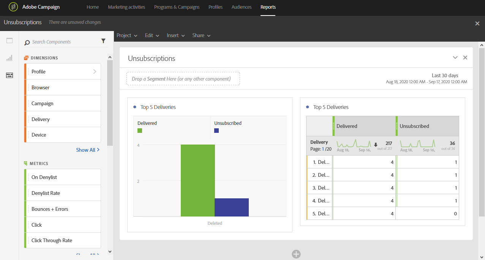

# Unsubscriptions{#unsubscriptions}

O relatório **[!UICONTROL Unsubscriptions]** identifica as entregas com mais cancelamentos.

A tabela e o gráfico **[!UICONTROL TOP 5 deliveries]** exibe as cinco principais entregas com o maior número de mensagens entregues e o número de destinatários que cancelaram a inscrição. Os dados listados aqui são baseados no número de cliques no link de unsubscription da mensagem.
