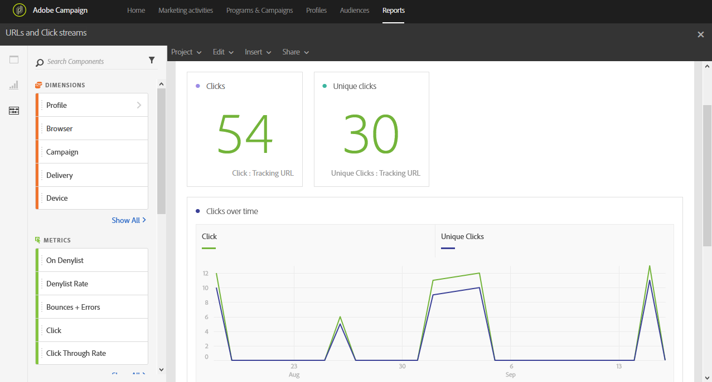

# Fluxos de clique e URLs{#urls-and-click-streams}

Os **Fluxos de clique e URLs** mostram os URLs que foram mais clicados durante uma entrega ou várias entregas se estiverem vinculados a uma campanha ou programa.

Cada tabela é representada por números de resumo e gráficos. É possível alterar como os detalhes são mostrados nas respectivas configurações de visualização.

A tabela **Links mais visitados** contém os dados disponíveis para o comportamento do destinatário por entrega, como:

* **Clique**: o número de vezes que o conteúdo foi clicado em uma entrega.
* **Cliques únicos**: o número de destinatários que clicaram no conteúdo em uma entrega.
